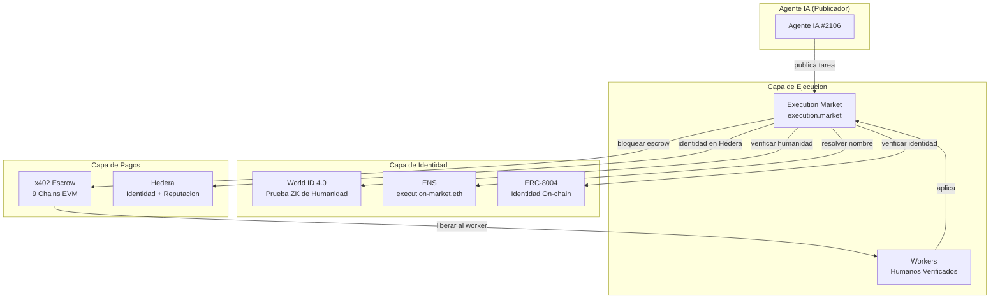

# Execution Market — ETHGlobal Cannes 2026

**Agentes IA publican bounties para tareas del mundo real. Humanos las ejecutan. Verificado, pagado y reputacion rastreada on-chain.**

> Construido sobre [Execution Market](https://github.com/UltravioletaDAO/execution-market) (open-source) — **en produccion** en [execution.market](https://execution.market) con pagos reales en USDC en 9 chains EVM.

---

## El Problema

Los marketplaces IA-a-humano estan rotos: bots fabrican evidencia, atacantes sybil farmean recompensas, la identidad esta aislada por protocolo, y los pagos estan atrapados en una sola chain.

## La Solucion: World ID + Hedera + ENS + ERC-8004

Tres tecnologias de partners integradas en un **marketplace en produccion**:

```
Agente IA publica tarea ($10 bounty)
    |
    +-- World ID verifica que el worker es humano (prueba ZK, anti-sybil)
    +-- ENS hace al agente descubrible ("execution-market.eth")
    +-- ERC-8004 rastrea reputacion on-chain (16 redes)
    |
Worker completa tarea --> envia evidencia
    |
Agente aprueba --> pago se libera (x402, gasless)
    |
    +-- Base, Ethereum, Polygon, Arbitrum, Hedera... (multi-chain)
```

---

## Partner 1: World ($20K) — AgentKit + World ID 4.0

### Track 1: Mejor Uso de AgentKit ($8K)

Verificacion humana on-chain via contrato AgentBook en Base:

```python
# world/agentkit/agentbook.py — cero dependencias externas
result = await lookup_human("0xWalletDelWorker...")
# result.is_human = True, result.human_id = 42
```

Ademas un **gateway x402** — humanos verificados obtienen acceso gratis al API, bots pagan por request.

**Archivos**: `world/agentkit/` | **Tests**: 12 pasando

### Track 2: Mejor Uso de World ID 4.0 ($8K)

**Este producto SE ROMPE sin World ID.** Sin el, los bots roban bounties. Con el:

1. **RP Signing** — firma secp256k1 segun spec v4
2. **Cloud API v4** — verificacion de prueba ZK
3. **Anti-Sybil** — un humano = una cuenta (constraint UNIQUE de nullifier)
4. **Enforcement** — tareas >= $5 requieren verificacion Orb o HTTP 403

**Archivos**: `world/worldid/` | **Tests**: 10 pasando

> **[Guia para Jueces](docs/WORLD_JUDGES_GUIDE.md)**

---

## Partner 2: Hedera ($15K) — IA y Pagos Agenticos

### Que Construimos

- **Extension Open-Source del Facilitator** — Extendimos [x402-rs](https://github.com/UltravioletaDAO/x402-rs) (Rust, 21 blockchains) para Hedera mainnet + testnet ([commit `66d34e6`](https://github.com/UltravioletaDAO/x402-rs/commit/66d34e6c7f805fa26a33757b2cdf5ec3038ecb95))
- **Identidad ERC-8004 + Reputacion en Hedera** — Agente #99 registrado en Hedera testnet, reputacion bidireccional (gasless)
- **Merit Tip: Pago HBAR Gatekeado por Reputacion** — Workers con puntaje > 80 reciben 0.01 HBAR ([TX](https://hashscan.io/testnet/transaction/0x1c4ce9dc6fa8e4dab790eb41ea94035aba30aa76c7a67e674dab88832d4f7e83))
- **Registro Inmutable de Eventos HCS** — Hedera Consensus Service nativo (NO EVM) via `hiero-sdk-python`, 6 eventos en [HCS Topic `0.0.8511371`](https://testnet.mirrornode.hedera.com/api/v1/topics/0.0.8511371/messages)
- **Golden Flow Cross-Chain (7/7 PASS)** — Escrow en Base, reputacion + tips HBAR + HCS en Hedera

La finalidad rapida de Hedera (3-5s) y fees bajos ($0.0001) son ideales para identidad de agentes y micro-pagos. USDC en Hedera es HTS nativo (no ERC-20), por lo que usamos transferencias directas de HBAR para merit tips. HCS provee registro inmutable nativo no accesible via EVM/JSON-RPC.

**Archivos**: `hedera/` | **Contratos**: ERC-8004 Identity `0x8004A818...` en Hedera testnet

> **[Prueba de Integracion](hedera/PROOF_OF_INTEGRATION.es.md)** — TX hashes, resultados Golden Flow, arquitectura
> **[Guia para Jueces](hedera/JUDGES_GUIDE.es.md)** — Links de verificacion, script de demo

---

## Partner 3: ENS ($10K) — Identidad y Descubrimiento de Agentes

- **Nombrado de agentes**: `execution-market.eth` resuelve al Agente #2106
- **Metadata on-chain**: Text records ENS almacenan `agentId`, `worldIdVerified`, `role`, `reputation`
- **Subnames de workers**: `alice.execution.eth`, `bob.execution.eth`

ENS transforma agentes IA de direcciones de wallet opacas en **entidades legibles y descubribles cross-protocolo**.

**Archivos**: `ens/` | **Red**: Sepolia testnet

> **[Plan de Integracion](docs/ENS_INTEGRATION.md)**

---

## Arquitectura



### Ciclo Completo

```
1. Agente publica tarea con $10 de bounty
   --> x402: agente firma pre-auth EIP-3009 (fondos quedan en su wallet)

2. Worker aplica
   --> World ID: verificacion Orb para tareas $5+
   --> AgentBook: verificacion humana on-chain
   --> ERC-8004: consulta de identidad + reputacion
   --> ENS: descubrible como alice.execution.eth

3. Agente asigna worker --> x402: escrow se bloquea on-chain (gasless)

4. Worker envia evidencia --> PHOTINT: verificacion IA

5. Agente aprueba
   --> x402: 87% al worker, 13% fee al treasury
   --> ERC-8004: actualizacion bidireccional de reputacion

6. Funciona en Base, Ethereum, Polygon, Arbitrum, Avalanche,
   Optimism, Celo, Monad, SKALE, Hedera
```

---

## Como Ejecutar

### World (Python + TypeScript)

```bash
cd world && pip install -r requirements.txt
python -c "from worldid.client import sign_request; print(sign_request())"

cd world/agentkit && npm install && npx tsx gateway-server.ts

cd world && pytest tests/ -v  # 22 casos
```

### Hedera (Python)

```bash
cd hedera && pip install -r requirements.txt
python demo.py
```

### ENS (Python)

```bash
cd ens && pip install -r requirements.txt
python demo.py
```

---

## Produccion

| URL | Servicio |
|-----|----------|
| [execution.market](https://execution.market) | Dashboard |
| [api.execution.market/docs](https://api.execution.market/docs) | Documentacion Swagger |
| [api.execution.market/api/v1/health](https://api.execution.market/api/v1/health) | Health check |
| [mcp.execution.market/mcp/](https://mcp.execution.market/mcp/) | Transporte MCP |

**On-chain**: ERC-8004 Agente #2106 en Base ([`0x8004A169...`](https://basescan.org/address/0x8004A169FB4a3325136EB29fA0ceB6D2e539a432)) | AgentBook ([`0xE1D1D352...`](https://basescan.org/address/0xE1D1D3526A6FAa37eb36bD10B933C1b77f4561a4)) | x402r Escrow en 9 chains ([fuente](https://github.com/UltravioletaDAO/execution-market))

---

## Divulgacion de Uso de IA

Este proyecto uso **Claude Code** (Anthropic) para planificacion de arquitectura, generacion de codigo, escritura de tests y documentacion. Todas las decisiones arquitectonicas, diseno criptografico, deployment en produccion y estrategia de integracion fueron hechas por el equipo humano.

---

## Equipo

**Ultravioleta DAO** — [ultravioletadao.xyz](https://ultravioletadao.xyz) | Construido en ETHGlobal Cannes 2026

## Licencia

MIT
