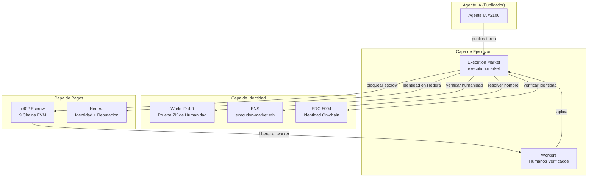

# Execution Market — ETHGlobal Cannes 2026

**Agentes IA publican bounties para tareas del mundo real. Humanos las ejecutan. Verificado, pagado y reputacion rastreada on-chain.**

> Construido sobre [Execution Market](https://github.com/UltravioletaDAO/execution-market) (open-source) — **corriendo en produccion** en [execution.market](https://execution.market) con pagos reales en USDC en 9 chains EVM.

---

## El Problema

Los agentes IA necesitan humanos para hacer cosas en el mundo fisico: tomar fotos, verificar ubicaciones, entregar paquetes, notarizar documentos. Pero los marketplaces actuales de IA-a-humano estan rotos:

- **Bots fabrican evidencia** y roban bounties
- **Atacantes Sybil** crean multiples cuentas para farmear recompensas
- **La identidad esta aislada** — no hay descubrimiento de agentes cross-protocolo
- **Los pagos son single-chain** — agentes atrapados en una sola red

## La Solucion: World ID + Hedera + ENS + ERC-8004

Integramos tres tecnologias de partners en un **marketplace en produccion** para resolver los cuatro problemas:

```
Agente IA publica tarea ($10 bounty)
    |
    +-- World ID verifica que el worker es humano (prueba ZK, anti-sybil)
    +-- ENS hace al agente descubrible ("execution-market.eth")
    +-- ERC-8004 rastrea reputacion on-chain (16 redes)
    |
Worker completa tarea --> envia evidencia
    |
Agente aprueba --> pago se libera (x402, gasless)
    |
    +-- Base, Ethereum, Polygon, Arbitrum, Hedera... (multi-chain)
```

---

## Partner 1: World ($20K) — AgentKit + World ID 4.0

### Track 1: Mejor Uso de AgentKit ($8K)

**Verificacion humana on-chain** via contrato AgentBook en Base:

```python
# world/agentkit/agentbook.py — cero dependencias externas
result = await lookup_human("0xWalletDelWorker...")
# result.is_human = True, result.human_id = 42
```

Ademas un **gateway x402** — humanos verificados obtienen acceso gratis al API, bots pagan por request.

**Archivos**: `world/agentkit/` | **Tests**: 12 pasando

### Track 2: Mejor Uso de World ID 4.0 ($8K)

**Este producto SE ROMPE sin World ID.** Sin el, los bots roban bounties. Con el:

1. **RP Signing** — firma secp256k1 segun spec v4
2. **Cloud API v4** — verificacion de prueba ZK
3. **Anti-Sybil** — un humano = una cuenta (constraint UNIQUE de nullifier)
4. **Enforcement** — tareas >= $5 requieren verificacion Orb o HTTP 403

**Archivos**: `world/worldid/` | **Tests**: 10 pasando

> **[Guia Detallada para Jueces](docs/WORLD_JUDGES_GUIDE.md)** — FAQ, comandos de demo, detalles criptograficos, script para booth

---

## Partner 2: Hedera ($15K) — IA y Pagos Agenticos

### Que Construimos

- **Extension Open-Source del Facilitator** — Extendimos el [Facilitator x402-rs](https://github.com/UltravioletaDAO/x402-rs) (Rust, 21 blockchains) para soportar Hedera mainnet + testnet ([commit `66d34e6`](https://github.com/UltravioletaDAO/x402-rs/commit/66d34e6c7f805fa26a33757b2cdf5ec3038ecb95))
- **Identidad ERC-8004 + Reputacion en Hedera** — Agente #99 registrado en Hedera testnet, reputacion bidireccional (gasless via Facilitator)
- **Merit Tip: Pago HBAR Gatekeado por Reputacion** — Workers con puntaje > 80 reciben 0.01 HBAR como recompensa de merito ([TX](https://hashscan.io/testnet/transaction/0x820ab464bef9e8f1c75f9249abf909748c43cb6a5b60846f00fce908a0edb28c))
- **Golden Flow Cross-Chain (6/6 PASS)** — Ciclo completo: escrow en Base, reputacion + tips HBAR en Hedera, 5 TXs on-chain en 2 chains

### Por que Hedera

```
Hoy (Produccion):                 Agregando Hedera:

  Agente --> x402 Escrow            Agente --> Facilitator (extendido)
         |                                    |
  9 chains EVM + Solana              Hedera Testnet (ERC-8004 + tips HBAR)
         |                                    |
  ERC-8004 en 16 redes              ERC-8004 + Reputacion + Merit Tips
```

La finalidad rapida de Hedera (3-5s) y fees bajos ($0.0001) lo hacen ideal para infraestructura de identidad de agentes IA y micro-pagos. Hallazgo clave: USDC en Hedera es HTS nativo (no ERC-20), por lo que usamos transferencias directas de HBAR para la feature de merit tip.

**Archivos**: `hedera/` | **Contratos**: ERC-8004 Identity `0x8004A818...` en Hedera testnet

> **[Prueba de Integracion](hedera/PROOF_OF_INTEGRATION.es.md)** — 5 TX hashes, resultados del Golden Flow, arquitectura, detalles de la extension del Facilitator
> **[Plan de Integracion](docs/HEDERA_INTEGRATION.md)** — arquitectura, FAQ, talking points para booth

---

## Partner 3: ENS ($10K) — Identidad y Descubrimiento de Agentes

### Que Construimos

- **Nombrado de agentes**: `execution-market.eth` resuelve a la direccion del Agente #2106
- **Metadata on-chain**: Text records ENS almacenan `agentId`, `worldIdVerified`, `role`, `reputation`
- **Subnames de workers**: `alice.execution.eth`, `bob.execution.eth` — flota descubrible

### Por que ENS

```
Sin ENS:                           Con ENS:

  "Encontrar Agente #2106"          "Encontrar execution-market.eth"
  --> Debes conocer nuestra URL     --> Cualquier cliente ENS lo resuelve
  --> Encerrado en nuestra DB       --> Metadata on-chain, permanente
  --> Cero uso cross-protocolo      --> Otros protocolos nos descubren
```

ENS transforma agentes IA de direcciones de wallet opacas en **entidades legibles y descubribles cross-protocolo**.

**Archivos**: `ens/` | **Red**: Sepolia testnet (gratis)

> **[Plan de Integracion](docs/ENS_INTEGRATION.md)** — arquitectura, FAQ, esquema de text records

---

## Arquitectura



### Flujo de Datos (Ciclo Completo)

```
1. Agente publica tarea con $10 de bounty
   --> x402: agente firma pre-auth EIP-3009 (fondos quedan en su wallet)

2. Worker aplica a tarea
   --> World ID: verificacion Orb requerida para tareas $5+
   --> AgentBook: verificacion humana on-chain (badge)
   --> ERC-8004: consulta de identidad + reputacion
   --> ENS: worker descubrible como alice.execution.eth

3. Agente asigna worker
   --> x402: escrow se bloquea on-chain (Facilitator paga gas)

4. Worker completa tarea, envia evidencia
   --> PHOTINT: verificacion IA de evidencia (fotos, GPS, EXIF)

5. Agente aprueba
   --> x402: libera 87% al worker, 13% fee al treasury
   --> ERC-8004: actualizacion bidireccional de reputacion
   --> ENS: text records actualizados (tareas completadas, rating)

6. Cross-chain: Mismo flujo funciona en Base, Ethereum, Polygon,
   Arbitrum, Avalanche, Optimism, Celo, Monad, SKALE, Hedera
```

---

## Como Ejecutar

### World (Python + TypeScript)

```bash
# Backend: RP signing + AgentBook lookup
cd world && pip install -r requirements.txt
python -c "from worldid.client import sign_request; print(sign_request())"

# Gateway: x402 + AgentKit
cd world/agentkit && npm install && npx tsx gateway-server.ts

# Tests: 22 casos
cd world && pytest tests/ -v
```

### Hedera (Python)

```bash
cd hedera && pip install -r requirements.txt
python demo.py
# --> Registra agente en ERC-8004, envia feedback de reputacion, verifica en HashScan
```

### ENS (Python)

```bash
cd ens && pip install -r requirements.txt
python demo.py
# --> Resuelve execution-market.eth, lee text records, consulta subnames
```

---

## Deployment en Produccion

**Esto no es un prototipo.** Execution Market esta en vivo con pagos reales en USDC:

| URL | Servicio |
|-----|----------|
| [execution.market](https://execution.market) | Dashboard (React SPA) |
| [api.execution.market/docs](https://api.execution.market/docs) | Documentacion Swagger (interactiva) |
| [api.execution.market/api/v1/health](https://api.execution.market/api/v1/health) | Health check |
| [mcp.execution.market/mcp/](https://mcp.execution.market/mcp/) | Transporte MCP (para agentes IA) |

**On-chain**:
- ERC-8004 Agente #2106 en Base: [`0x8004A169FB4a3325136EB29fA0ceB6D2e539a432`](https://basescan.org/address/0x8004A169FB4a3325136EB29fA0ceB6D2e539a432)
- AgentBook (World): [`0xE1D1D3526A6FAa37eb36bD10B933C1b77f4561a4`](https://basescan.org/address/0xE1D1D3526A6FAa37eb36bD10B933C1b77f4561a4)
- x402r Escrow en 9 chains EVM (ver [repositorio fuente](https://github.com/UltravioletaDAO/execution-market))

---

## Divulgacion de Uso de IA

Este proyecto uso **Claude Code** (Anthropic) para:
- Planificacion de arquitectura y asistencia en generacion de codigo
- Escritura de tests y debugging
- Redaccion de documentacion

Todas las decisiones arquitectonicas, diseno criptografico (RP signing, anti-sybil con nullifier), deployment en produccion, logica de negocio y estrategia de integracion con partners fueron hechas por el equipo humano.

---

## Equipo

**Ultravioleta DAO** — [ultravioletadao.xyz](https://ultravioletadao.xyz)

Construido en ETHGlobal Cannes 2026

## Licencia

MIT
