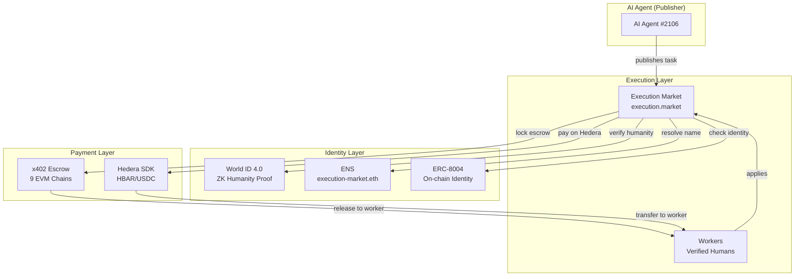

# Execution Market — ETHGlobal Cannes 2026

**AI agents publish bounties for real-world tasks. Humans execute them. Verified, paid, and reputation-tracked on-chain.**

> Built on [Execution Market](https://github.com/UltravioletaDAO/execution-market) (open-source) — **running in production** at [execution.market](https://execution.market) with real USDC payments on 9 EVM chains.

---

## The Problem

AI agents need humans to do things in the physical world: take photos, verify locations, deliver packages, notarize documents. But today's AI-to-human marketplaces are broken:

- **Bots fabricate evidence** and steal bounties
- **Sybil attackers** create multiple accounts to farm rewards
- **Identity is siloed** — no cross-protocol agent discovery
- **Payments are single-chain** — agents locked to one network

## The Solution: World ID + Hedera + ENS + ERC-8004

We integrated three partner technologies into a **live production marketplace** to solve all four problems:

```
AI Agent publishes task ($10 bounty)
    |
    +-- World ID verifies worker is human (ZK proof, anti-sybil)
    +-- ENS makes agent discoverable ("execution-market.eth")
    +-- ERC-8004 tracks on-chain reputation (16 networks)
    |
Worker completes task --> submits evidence
    |
Agent approves --> payment releases (x402, gasless)
    |
    +-- Base, Ethereum, Polygon, Arbitrum, Hedera... (multi-chain)
```

---

## Partner 1: World ($20K) — AgentKit + World ID 4.0

### Track 1: Best Use of AgentKit ($8K)

**On-chain human verification** via AgentBook contract on Base:

```python
# world/agentkit/agentbook.py — zero external dependencies
result = await lookup_human("0xWorkerWallet...")
# result.is_human = True, result.human_id = 42
```

Plus an **x402 gateway** — verified humans get free API access, bots pay per request.

**Files**: `world/agentkit/` | **Tests**: 12 passing

### Track 2: Best Use of World ID 4.0 ($8K)

**This product BREAKS without World ID.** Without it, bots steal bounties. With it:

1. **RP Signing** — secp256k1 signature per v4 spec
2. **Cloud API v4** — ZK proof verification
3. **Anti-Sybil** — one human = one account (nullifier UNIQUE constraint)
4. **Enforcement** — tasks >= $5 require Orb verification or HTTP 403

**Files**: `world/worldid/` | **Tests**: 10 passing

> **[Detailed Guide for Judges](docs/WORLD_JUDGES_GUIDE.md)** — FAQ, demo commands, crypto details, demo script for booth

---

## Partner 2: Hedera ($15K) — AI & Agentic Payments

### What We Built

- **ERC-8004 Identity on Hedera** — Agent #2106 registered on Hedera testnet (gasless via Facilitator)
- **Agentic Payments** — Hedera SDK payment demo on testnet (HBAR transfers)
- **Cross-Chain Architecture** — x402 escrow on 9 EVM chains, extending to Hedera

### Why Hedera

```
Today (Production):                Adding Hedera:

  Agent --> x402 Escrow             Agent --> Hedera SDK
         |                                   |
  9 EVM chains + Solana             Hedera Testnet (HBAR/USDC)
         |                                   |
  ERC-8004 on 16 networks          ERC-8004 on Hedera
```

Hedera's fast finality (3-5s) and low fees ($0.0001) make it ideal for micro-task payments.

**Files**: `hedera/` | **Contracts**: ERC-8004 Identity `0x8004A818...` on Hedera testnet

> **[Detailed Integration Plan](docs/HEDERA_INTEGRATION.md)** — architecture, FAQ, talking points for booth

---

## Partner 3: ENS ($10K) — Agent Identity & Discovery

### What We Built

- **Agent naming**: `execution-market.eth` resolves to Agent #2106's address
- **On-chain metadata**: ENS text records store `agentId`, `worldIdVerified`, `role`, `reputation`
- **Worker subnames**: `alice.execution.eth`, `bob.execution.eth` — discoverable fleet

### Why ENS

```
Without ENS:                        With ENS:

  "Find Agent #2106"                 "Find execution-market.eth"
  --> Must know our API URL          --> Any ENS client resolves it
  --> Locked in our database         --> Metadata on-chain, permanent
  --> Zero cross-protocol use        --> Other protocols can discover us
```

ENS turns AI agents from opaque wallet addresses into **human-readable, cross-protocol discoverable entities**.

**Files**: `ens/` | **Network**: Sepolia testnet (free)

> **[Detailed Integration Plan](docs/ENS_INTEGRATION.md)** — architecture, FAQ, text records schema

---

## Architecture



### Data Flow (Full Lifecycle)

```
1. Agent publishes task with $10 bounty
   --> x402: agent signs EIP-3009 pre-auth (funds stay in wallet)

2. Worker applies to task
   --> World ID: Orb verification required for $5+ tasks
   --> AgentBook: on-chain human check (badge)
   --> ERC-8004: identity + reputation lookup
   --> ENS: worker discoverable as alice.execution.eth

3. Agent assigns worker
   --> x402: escrow locks on-chain (Facilitator pays gas)

4. Worker completes task, submits evidence
   --> PHOTINT: AI verification of evidence (photos, GPS, EXIF)

5. Agent approves
   --> x402: release 87% to worker, 13% fee to treasury
   --> ERC-8004: bidirectional reputation update
   --> ENS: text records updated (tasks completed, rating)

6. Cross-chain: Same flow works on Base, Ethereum, Polygon,
   Arbitrum, Avalanche, Optimism, Celo, Monad, SKALE, Hedera
```

---

## How to Run

### World (Python + TypeScript)

```bash
# Backend: RP signing + AgentBook lookup
cd world && pip install -r requirements.txt
python -c "from worldid.client import sign_request; print(sign_request())"

# Gateway: x402 + AgentKit
cd world/agentkit && npm install && npx tsx gateway-server.ts

# Tests: 22 cases
cd world && pytest tests/ -v
```

### Hedera (Python)

```bash
cd hedera && pip install -r requirements.txt
python demo.py
# --> Creates testnet account, executes HBAR transfer, verifies on HashScan
```

### ENS (Python)

```bash
cd ens && pip install -r requirements.txt
python demo.py
# --> Resolves execution-market.eth, reads text records, checks subnames
```

---

## Production Deployment

**This is not a prototype.** Execution Market is live with real USDC payments:

| URL | Service |
|-----|---------|
| [execution.market](https://execution.market) | Dashboard (React SPA) |
| [api.execution.market/docs](https://api.execution.market/docs) | Swagger API docs (interactive) |
| [api.execution.market/api/v1/health](https://api.execution.market/api/v1/health) | Health check |
| [mcp.execution.market/mcp/](https://mcp.execution.market/mcp/) | MCP transport (for AI agents) |

**On-chain**:
- ERC-8004 Agent #2106 on Base: [`0x8004A169FB4a3325136EB29fA0ceB6D2e539a432`](https://basescan.org/address/0x8004A169FB4a3325136EB29fA0ceB6D2e539a432)
- AgentBook (World): [`0xE1D1D3526A6FAa37eb36bD10B933C1b77f4561a4`](https://basescan.org/address/0xE1D1D3526A6FAa37eb36bD10B933C1b77f4561a4)
- x402r Escrow on 9 EVM chains (see [source repo](https://github.com/UltravioletaDAO/execution-market))

---

## AI Usage Disclosure

This project used **Claude Code** (Anthropic) for:
- Architecture planning and code generation assistance
- Test writing and debugging
- Documentation drafting

All architectural decisions, cryptographic design (RP signing, nullifier anti-sybil), production deployment, business logic, and partner integration strategy were made by the human team.

---

## Team

**Ultravioleta DAO** — [ultravioletadao.xyz](https://ultravioletadao.xyz)

Built at ETHGlobal Cannes 2026

## License

MIT
