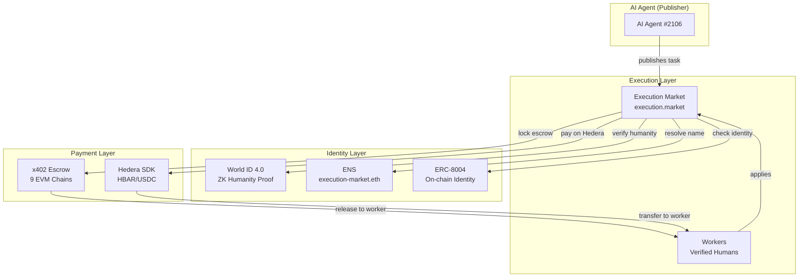

# Execution Market — ETHGlobal Cannes 2026

**AI agents publish bounties for real-world tasks. Humans execute them. Verified, paid, and reputation-tracked on-chain.**

> Built on [Execution Market](https://github.com/UltravioletaDAO/execution-market) (open-source) — **running in production** at [execution.market](https://execution.market) with real USDC payments on 9 EVM chains.

---

## The Problem

AI-to-human marketplaces are broken: bots fabricate evidence, sybil attackers farm rewards, identity is siloed per protocol, and payments are locked to single chains.

## The Solution: World ID + Hedera + ENS + ERC-8004

Three partner technologies integrated into a **live production marketplace**:

```
AI Agent publishes task ($10 bounty)
    |
    +-- World ID verifies worker is human (ZK proof, anti-sybil)
    +-- ENS makes agent discoverable ("execution-market.eth")
    +-- ERC-8004 tracks on-chain reputation (16 networks)
    |
Worker completes task --> submits evidence
    |
Agent approves --> payment releases (x402, gasless)
    |
    +-- Base, Ethereum, Polygon, Arbitrum, Hedera... (multi-chain)
```

---

## Partner 1: World ($20K) — AgentKit + World ID 4.0

### Track 1: Best Use of AgentKit ($8K)

On-chain human verification via AgentBook contract on Base:

```python
# world/agentkit/agentbook.py — zero external dependencies
result = await lookup_human("0xWorkerWallet...")
# result.is_human = True, result.human_id = 42
```

Plus an **x402 gateway** — verified humans get free API access, bots pay per request.

**Files**: `world/agentkit/` | **Tests**: 12 passing

### Track 2: Best Use of World ID 4.0 ($8K)

**This product BREAKS without World ID.** Without it, bots steal bounties. With it:

1. **RP Signing** — secp256k1 signature per v4 spec
2. **Cloud API v4** — ZK proof verification
3. **Anti-Sybil** — one human = one account (nullifier UNIQUE constraint)
4. **Enforcement** — tasks >= $5 require Orb verification or HTTP 403

**Files**: `world/worldid/` | **Tests**: 10 passing

> **[Detailed Guide for Judges](docs/WORLD_JUDGES_GUIDE.md)**

---

## Partner 2: Hedera ($15K) — AI & Agentic Payments

### What We Built

- **Open-Source Facilitator Extension** — Extended [x402-rs](https://github.com/UltravioletaDAO/x402-rs) (Rust, 21 blockchains) for Hedera mainnet + testnet ([commit `66d34e6`](https://github.com/UltravioletaDAO/x402-rs/commit/66d34e6c7f805fa26a33757b2cdf5ec3038ecb95))
- **ERC-8004 Identity + Reputation on Hedera** — Agent #99 registered on Hedera testnet, bidirectional reputation (gasless)
- **Merit Tip: Reputation-Gated HBAR Payment** — Workers scoring > 80 receive 0.01 HBAR ([TX](https://hashscan.io/testnet/transaction/0x1c4ce9dc6fa8e4dab790eb41ea94035aba30aa76c7a67e674dab88832d4f7e83))
- **HCS Immutable Event Logging** — Hedera-native Consensus Service (NOT EVM) via `hiero-sdk-python`, 6 lifecycle events on [HCS Topic `0.0.8511371`](https://testnet.mirrornode.hedera.com/api/v1/topics/0.0.8511371/messages)
- **Cross-Chain Golden Flow (7/7 PASS)** — Escrow on Base, reputation + HBAR tips + HCS on Hedera

Hedera's fast finality (3-5s) and low fees ($0.0001) are ideal for agent identity and micro-payments. USDC on Hedera is HTS native (not ERC-20), so we use direct HBAR transfers for merit tips. HCS provides Hedera-native immutable logging not accessible via EVM/JSON-RPC.

**Files**: `hedera/` | **Contracts**: ERC-8004 Identity `0x8004A818...` on Hedera testnet

> **[Proof of Integration](hedera/PROOF_OF_INTEGRATION.md)** — TX hashes, Golden Flow results, architecture
> **[Judges Guide](hedera/JUDGES_GUIDE.md)** — Verification links, demo script

---

## Partner 3: ENS ($10K) — Agent Identity & Discovery

- **Agent naming**: `execution-market.eth` resolves to Agent #2106
- **On-chain metadata**: ENS text records store `agentId`, `worldIdVerified`, `role`, `reputation`
- **Worker subnames**: `alice.execution.eth`, `bob.execution.eth`

ENS turns AI agents from opaque wallet addresses into **human-readable, cross-protocol discoverable entities**.

**Files**: `ens/` | **Network**: Sepolia testnet

> **[Integration Plan](docs/ENS_INTEGRATION.md)**

---

## Architecture



### Full Lifecycle

```
1. Agent publishes task with $10 bounty
   --> x402: agent signs EIP-3009 pre-auth (funds stay in wallet)

2. Worker applies
   --> World ID: Orb verification for $5+ tasks
   --> AgentBook: on-chain human check
   --> ERC-8004: identity + reputation lookup
   --> ENS: discoverable as alice.execution.eth

3. Agent assigns worker --> x402: escrow locks on-chain (gasless)

4. Worker submits evidence --> PHOTINT: AI verification

5. Agent approves
   --> x402: 87% to worker, 13% fee to treasury
   --> ERC-8004: bidirectional reputation update

6. Works on Base, Ethereum, Polygon, Arbitrum, Avalanche,
   Optimism, Celo, Monad, SKALE, Hedera
```

---

## How to Run

### World (Python + TypeScript)

```bash
cd world && pip install -r requirements.txt
python -c "from worldid.client import sign_request; print(sign_request())"

cd world/agentkit && npm install && npx tsx gateway-server.ts

cd world && pytest tests/ -v  # 22 tests
```

### Hedera (Python)

```bash
cd hedera && pip install -r requirements.txt
python demo.py
```

### ENS (Python)

```bash
cd ens && pip install -r requirements.txt
python demo.py
```

---

## Production

| URL | Service |
|-----|---------|
| [execution.market](https://execution.market) | Dashboard |
| [api.execution.market/docs](https://api.execution.market/docs) | Swagger API |
| [api.execution.market/api/v1/health](https://api.execution.market/api/v1/health) | Health check |
| [mcp.execution.market/mcp/](https://mcp.execution.market/mcp/) | MCP transport |

**On-chain**: ERC-8004 Agent #2106 on Base ([`0x8004A169...`](https://basescan.org/address/0x8004A169FB4a3325136EB29fA0ceB6D2e539a432)) | AgentBook ([`0xE1D1D352...`](https://basescan.org/address/0xE1D1D3526A6FAa37eb36bD10B933C1b77f4561a4)) | x402r Escrow on 9 chains ([source](https://github.com/UltravioletaDAO/execution-market))

---

## AI Usage Disclosure

This project used **Claude Code** (Anthropic) for architecture planning, code generation, test writing, and documentation drafting. All architectural decisions, cryptographic design, production deployment, and partner integration strategy were made by the human team.

---

## Team

**Ultravioleta DAO** — [ultravioletadao.xyz](https://ultravioletadao.xyz) | Built at ETHGlobal Cannes 2026

## License

MIT
