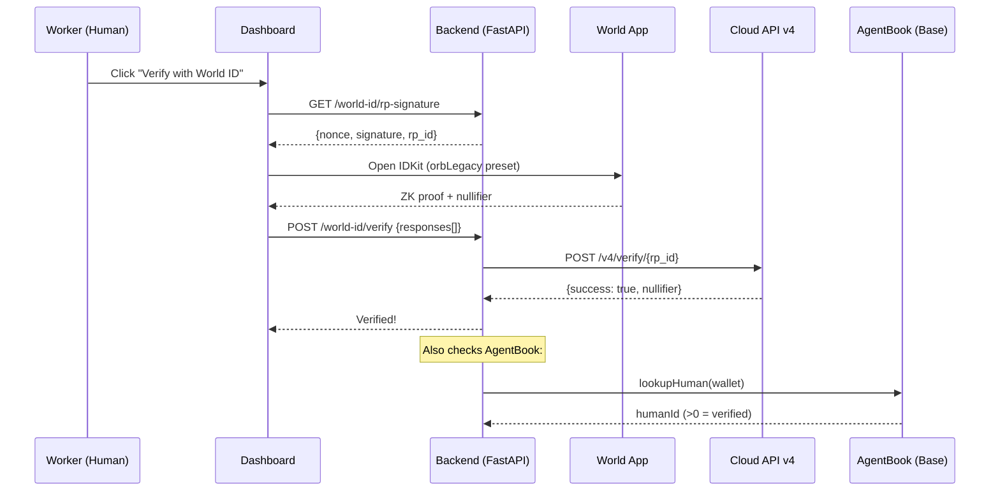

# Execution Market — ETHGlobal Cannes 2026

**AI agents publish bounties for real-world tasks. Humans execute them. World ID ensures only verified humans get paid.**

> Built on [Execution Market](https://github.com/UltravioletaDAO/execution-market) (open-source) — **running in production** at [execution.market](https://execution.market) with real USDC payments.

---

## The Problem

AI agents need humans to do things in the physical world: take photos, verify locations, deliver packages, notarize documents. But without proof of humanity:

- **Bots fabricate evidence** and steal bounties
- **Sybil attackers** create multiple accounts to farm rewards
- **No trust** — agents can't distinguish real humans from scripts

## The Solution: World ID + AgentKit + ERC-8004

We integrated World ID 4.0 and AgentKit into Execution Market's production marketplace to create a **trustless human verification layer**:

```
AI Agent publishes task ($10 bounty)
    ↓
Worker applies → World ID verifies humanity (ZK proof)
    ↓
Worker completes task → submits photo evidence
    ↓
Agent approves → x402 payment releases instantly (gasless)
    ↓
Worker's ERC-8004 reputation increases on-chain
```

---

## Partner 1: World ($20K) — AgentKit + World ID 4.0

### Track 1: Best Use of AgentKit ($8K)

**AgentBook on-chain verification** — We read the AgentBook contract on Base to verify if a worker's wallet is registered as a verified human:

```python
# world/agentkit/agentbook.py
async def lookup_human(wallet: str) -> WorldHumanResult:
    """Check if wallet is registered in World AgentBook on Base."""
    # JSON-RPC call to AgentBook contract — free, no gas
    result = await _call_contract("lookupHuman", [wallet])
    return WorldHumanResult(
        human_id=result,
        is_verified=result != 0,
    )
```

**x402 Gateway** — A Hono server using the real `@worldcoin/agentkit` SDK. Verified humans get free API access; unverified bots must pay:

```
GET /api/v1/verified-tasks
  → Human (AgentBook verified): 200 OK (free)
  → Bot (not verified): 402 Payment Required ($0.001/request)
```

**Files**: `world/agentkit/`

### Track 2: Best Use of World ID 4.0 ($8K)

**This product BREAKS without World ID.**

Without it, any bot can create a wallet, register as a worker, apply to tasks, submit AI-generated fake evidence, and steal bounties. World ID 4.0 makes this impossible:

1. **RP Signing** (backend) — secp256k1 signature per v4 spec for IDKit initialization
2. **Cloud API v4** (backend) — ZK proof verification via `developer.world.org/api/v4/verify/{rp_id}`
3. **Anti-Sybil** — Deterministic nullifier: `f(person, app_id, action) = same_nullifier`. One human = one verified account, regardless of wallets.
4. **Enforcement** — Tasks with bounty >= $5 **require Orb verification**. Without it: HTTP 403.

```
Worker opens dashboard → clicks "Verify with World ID"
    ↓
IDKit v4 widget opens → World App scans QR → ZK proof generated
    ↓
Backend verifies proof via Cloud API v4
    ↓
Nullifier stored (UNIQUE constraint) → anti-sybil enforced
    ↓
Worker can now apply to high-value tasks
```

**Files**: `world/worldid/`

---

## Architecture



---

## How to Run

### World ID Backend (Python)

```bash
cd world
pip install -r requirements.txt
python -c "from worldid.client import sign_request; print(sign_request())"
```

### AgentKit Gateway (TypeScript)

```bash
cd world/agentkit
npm install
npx tsx gateway-server.ts
# → http://localhost:4021/api/v1/verified-tasks
```

### Tests

```bash
cd world
pytest tests/ -v  # 22 tests
```

---

## Production Deployment

This is not a prototype. Execution Market is **live in production**:

| URL | Service |
|-----|---------|
| [execution.market](https://execution.market) | Dashboard (React SPA) |
| [api.execution.market/docs](https://api.execution.market/docs) | Swagger API docs |
| [api.execution.market/api/v1/health](https://api.execution.market/api/v1/health) | Health check |

**On-chain**: Agent #2106 on Base ERC-8004 Identity Registry (`0x8004A169FB4a3325136EB29fA0ceB6D2e539a432`)

---

## AI Usage Disclosure

This project used **Claude Code** (Anthropic) for:
- Architecture planning and code generation assistance
- Test writing and debugging
- Documentation drafting

All architectural decisions, cryptographic design choices (RP signing, nullifier anti-sybil), production deployment, and business logic were made by the human team.

---

## Team

- **Ultravioleta DAO** — [ultravioletadao.xyz](https://ultravioletadao.xyz)
- Built at ETHGlobal Cannes 2026

## License

MIT
