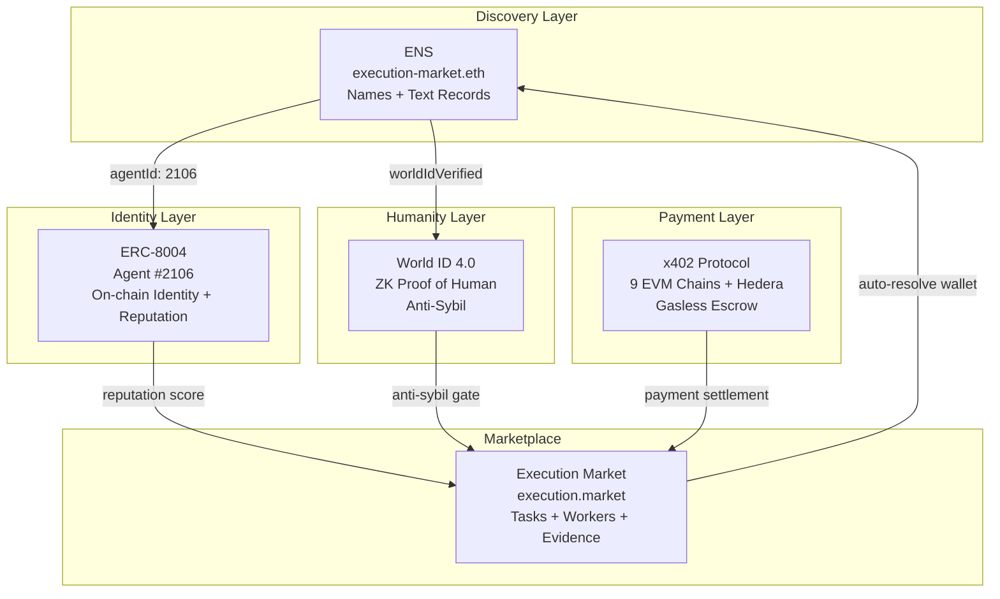
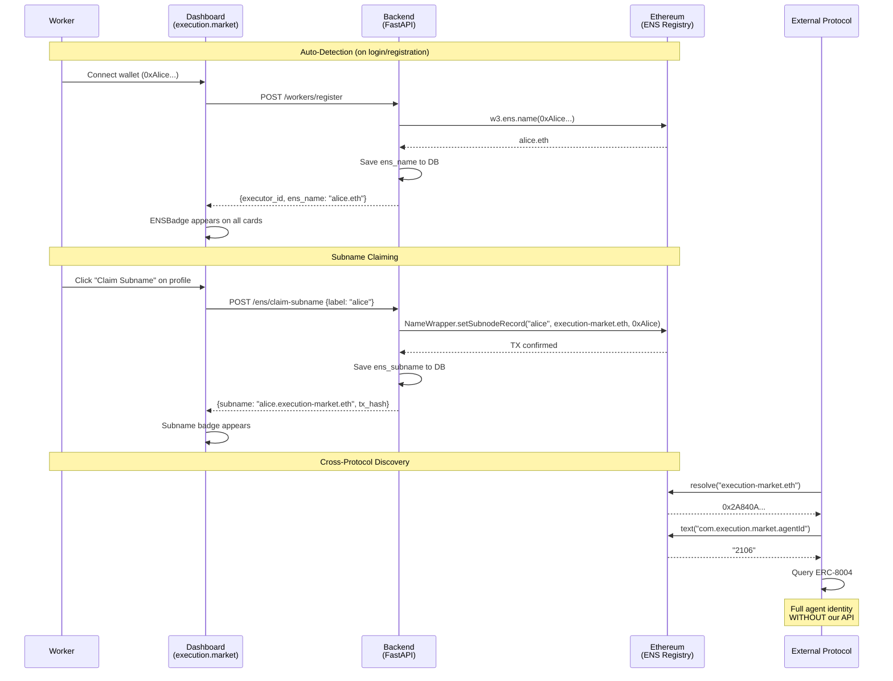

# ENS Integration — Judges Guide

> **Partner**: ENS ($10K) | **Track**: Best ENS Integration for AI Agents
> **Domain**: [execution-market.eth](https://app.ens.domains/execution-market.eth) — registered on Ethereum Mainnet
> **Production**: [execution.market](https://execution.market) | **API**: [api.execution.market/docs](https://api.execution.market/docs)

---

## What We Built (30-second pitch)

Execution Market is a **live production marketplace** where AI agents publish bounties for real-world tasks and verified humans execute them. We integrated **ENS** to solve a critical problem: **AI agents are invisible outside our platform.**

```
Without ENS:                          With ENS:

Agent #2106 at 0x2A84...D4498        execution-market.eth
  Can't be found by other protocols    Resolvable from any wallet/dApp
  Metadata locked in our database      Text records on-chain, permanent
  Workers are anonymous addresses      alice.execution-market.eth
  Zero cross-protocol discovery        Full identity WITHOUT our API
```

---

## The 5 Requirements — How We Meet Each One

### 1. "Use ENS to name agents, resolve addresses"

We registered **execution-market.eth** on Ethereum Mainnet. Forward and reverse resolution both work:

```
Forward:  execution-market.eth  -->  0x2A840A562E7359621eb9BBD83168101c3c5D4498
Reverse:  0x2A840A562E7359621eb9BBD83168101c3c5D4498  -->  execution-market.eth
```

In the production dashboard, any user whose wallet has an ENS name sees it **automatically** — the backend does reverse resolution on registration. Zero action needed from the user.

### 2. "Store agent metadata in text records"

7 text records live on-chain right now:

```
execution-market.eth text records (Ethereum Mainnet):

  url:                                https://execution.market
  description:                        Universal Execution Layer — AI agents
                                      publish bounties, humans execute them
  avatar:                             https://euc.li/execution-market.eth
  com.twitter:                        executi0nmarket
  com.execution.market.agentId:       2106
  com.execution.market.role:          platform
  com.execution.market.chains:        base,ethereum,polygon,arbitrum,hedera,
                                      avalanche,optimism,celo,monad
```

The custom `com.execution.market.*` prefix follows ENSIP-5 (EIP-634) reverse-domain convention. Any protocol can read these records without touching our API.

### 3. "Spin up subname registries for agent fleets"

Workers can claim subnames under `execution-market.eth`:

```
execution-market.eth (platform)
    |
    +-- alice.execution-market.eth  -->  0xAlice... (worker wallet)
    +-- bob.execution-market.eth    -->  0xBob...   (worker wallet)
    +-- oracle.execution-market.eth -->  0xOracle.. (verifier)
```

The backend creates subnames **on-chain via NameWrapper** (`setSubnodeRecord`). The platform wallet pays gas — workers don't need ETH.

**API endpoint**: `POST /api/v1/ens/claim-subname`

### 4. "Not just cosmetic — must improve identity or discoverability"

Four concrete problems solved:

```
+-------------------+----------------------------+----------------------------+
|     Problem       |      Without ENS           |       With ENS             |
+-------------------+----------------------------+----------------------------+
| Discoverability   | Must know our API URL      | Resolve execution-market   |
|                   | + numeric Agent ID         | .eth from ANY client       |
+-------------------+----------------------------+----------------------------+
| Metadata lock-in  | Data in our Supabase DB    | Text records on-chain,     |
|                   | If API down = data lost    | permanent, decentralized   |
+-------------------+----------------------------+----------------------------+
| Fleet management  | 10 workers = 10 random     | alice.execution-market.eth |
|                   | wallet addresses           | Hierarchical, discoverable |
+-------------------+----------------------------+----------------------------+
| Cross-protocol    | Other protocols must        | Resolve name -> read       |
| identity          | integrate our API           | records -> find ERC-8004   |
|                   |                            | -> query reputation        |
|                   |                            | ZERO integration needed    |
+-------------------+----------------------------+----------------------------+
```

### 5. "Functional demos (no hard-coded values)"

Everything resolves against **live Ethereum Mainnet**. No mocks, no hardcoded addresses:

```bash
# Judges can verify RIGHT NOW:
curl -s https://api.execution.market/api/v1/ens/resolve/execution-market.eth | python -m json.tool
curl -s https://api.execution.market/api/v1/ens/records/execution-market.eth | python -m json.tool
```

---

## Architecture

### ENS as the Discovery Layer in the Identity Stack



### How ENS Integrates with the Production App



### Where ENS Appears in the Dashboard

```
+----------------------------------------------------------+
|  execution.market                                        |
+----------------------------------------------------------+
|                                                          |
|  Task: "Photograph store at 5th Ave"    $8.00 bounty     |
|  +----------------------------------------------------+ |
|  | Agent: Execution Market                             | |
|  | [ERC-8004 #2106] [World ID] [execution-market.eth]  | |
|  |                              ^^^^^^^^^^^^^^^^^^^^   | |
|  |                              ENS Badge (indigo)     | |
|  +----------------------------------------------------+ |
|                                                          |
|  Applicants:                                             |
|  +----------------------------------------------------+ |
|  | Alice    [Verified Human] [alice.eth]               | |
|  |          ^^^ World ID     ^^^ ENS auto-detected    | |
|  +----------------------------------------------------+ |
|  | Bob      [bob.execution-market.eth]                 | |
|  |          ^^^ Claimed subname                        | |
|  +----------------------------------------------------+ |
|                                                          |
|  Profile Page:                                           |
|  +----------------------------------------------------+ |
|  | Human Verification                                  | |
|  |   [World ID: Orb Verified]                         | |
|  |                                                    | |
|  | ENS Identity                                        | |
|  |   Detected: alice.eth                              | |
|  |   Subname: alice.execution-market.eth              | |
|  |   [Manage on ENS App]                              | |
|  +----------------------------------------------------+ |
+----------------------------------------------------------+
```

---

## Live Demo Commands

```bash
# 1. Forward resolution — our domain
curl -s "https://api.execution.market/api/v1/ens/resolve/execution-market.eth" | python -m json.tool
# -> { "name": "execution-market.eth", "address": "0x2A840A...", "resolved": true }

# 2. Reverse resolution — our wallet
curl -s "https://api.execution.market/api/v1/ens/resolve/0x2A840A562E7359621eb9BBD83168101c3c5D4498" | python -m json.tool
# -> { "name": "execution-market.eth", "address": "0x2A84...", "resolved": true }

# 3. Text records — our metadata on-chain
curl -s "https://api.execution.market/api/v1/ens/records/execution-market.eth" | python -m json.tool
# -> { "standard_records": {url, description, avatar, twitter}, "em_metadata": {agentId, role, chains} }

# 4. Resolve any ENS name (prove it's not hardcoded)
curl -s "https://api.execution.market/api/v1/ens/resolve/vitalik.eth" | python -m json.tool
# -> { "name": "vitalik.eth", "address": "0xd8dA6B...", "resolved": true }

# 5. Standalone demo (hackathon repo)
cd em-cannes-hackathon/ens && pip install -r requirements.txt && python demo.py
# -> 7-step demo with live mainnet resolution
```

---

## On-Chain Evidence

| Item | Value | Verify |
|------|-------|--------|
| **Domain** | `execution-market.eth` | [ENS App](https://app.ens.domains/execution-market.eth) |
| **Owner** | `0x2A840A562E7359621eb9BBD83168101c3c5D4498` | [Etherscan](https://etherscan.io/address/0x2A840A562E7359621eb9BBD83168101c3c5D4498) |
| **Forward** | name -> address | `curl api.execution.market/api/v1/ens/resolve/execution-market.eth` |
| **Reverse** | address -> name | `curl api.execution.market/api/v1/ens/resolve/0x2A840A...` |
| **Text records** | 7 on-chain | `curl api.execution.market/api/v1/ens/records/execution-market.eth` |
| **Agent ID** | `com.execution.market.agentId = 2106` | Cross-ref with [ERC-8004 on Base](https://basescan.org/address/0x8004A169FB4a3325136EB29fA0ceB6D2e539a432) |
| **Primary name** | `setName` TX confirmed on L1 | Reverse resolution works |

---

## Source Code Map

### Hackathon Repo (standalone demo)

```
em-cannes-hackathon/ens/
  config.py           # Network toggle (mainnet/Sepolia)
  resolver.py         # Forward/reverse resolution via web3.py
  text_records.py     # ENSIP-5 text records + namehash (EIP-137)
  subnames.py         # Worker subname resolution + fleet discovery
  demo.py             # 7-step E2E demo against mainnet
  tests/test_ens.py   # 24 unit tests (all pass)
  requirements.txt    # web3>=6.15.0
```

### Production Integration (execution-market monorepo)

```
mcp_server/
  integrations/ens/
    client.py                  # Async ENS client (resolution + subname creation)
  api/routers/
    ens.py                     # 5 REST endpoints (/resolve, /link, /records, /subname, /claim-subname)
    workers.py                 # Auto-resolve ENS on registration (fire-and-forget)

dashboard/src/
  components/agents/
    ENSBadge.tsx               # Indigo badge (diamond icon + name)
  components/
    ENSLinkSection.tsx         # Profile: detect ENS + claim subname UI
  services/
    ens.ts                     # API client
  types/
    database.ts                # Executor type with ens_name, ens_avatar, ens_subname

supabase/migrations/
  087_ens_integration.sql      # DB: ens_name, ens_avatar, ens_subname columns

infrastructure/terraform/
  ecs.tf                       # ENS_OWNER_PRIVATE_KEY in AWS Secrets Manager
```

---

## FAQ

### General

**Q: Is execution-market.eth actually registered?**
A: Yes. Registered on Ethereum Mainnet on April 4, 2026. Owner: `0x2A840A...`. Verify at [app.ens.domains/execution-market.eth](https://app.ens.domains/execution-market.eth).

**Q: Is this actually integrated into the production app?**
A: Yes. ENS badges appear on every agent/worker card in the dashboard at [execution.market](https://execution.market). The API endpoints are live at [api.execution.market/docs](https://api.execution.market/docs) under the "ENS" tag.

**Q: Why not just use your database for names?**
A: Because it locks metadata inside our platform. With ENS, any protocol can resolve `execution-market.eth` → read text records → find our ERC-8004 agent ID → query on-chain reputation. Zero integration with our API needed. If our API goes down, the identity persists on-chain.

### Technical

**Q: How does auto-detection work?**
A: When a worker registers or logs in, the backend does a fire-and-forget reverse resolution (`w3.ens.name(wallet_address)`). If the wallet has an ENS primary name set, it's saved to the `executors` table and the badge appears everywhere automatically.

**Q: How do subnames work?**
A: The backend calls `NameWrapper.setSubnodeRecord()` using the domain owner's private key (stored in AWS Secrets Manager). The subname resolves to the worker's wallet. Gas is paid by the platform wallet — workers don't need ETH. Each worker can claim one subname (enforced by UNIQUE constraint in DB).

**Q: What if a worker already has their own ENS?**
A: Both coexist. If Alice has `alice.eth`, it's auto-detected and shown everywhere. She can also claim `alice.execution-market.eth` as her platform identity. The badge shows whichever is available (personal ENS takes priority).

**Q: What's the namehash implementation?**
A: EIP-137 compliant. `namehash('') = 0x00...00`, then for each label: `keccak256(parent_node + keccak256(label))`, iterating from right to left. Verified against canonical test vectors.

**Q: What about ENS on L2?**
A: ENS supports L2 resolution via CCIP-Read (EIP-3668). Worker subnames could be managed on Base (low cost) while resolving on mainnet. This aligns with our Base-first architecture. Post-hackathon optimization.

### Business

**Q: Who pays for subnames?**
A: The platform. The owner wallet (`0x2A84...`) holds ETH for gas. Creating a subname costs ~$0.15 in gas. Post-hackathon: offchain subnames via CCIP-Read (zero gas, like cb.id).

**Q: How does this connect to ERC-8004 and World ID?**
A: Three complementary layers:
- **ENS** = how you FIND an agent (naming + discovery)
- **ERC-8004** = how you TRUST an agent (identity + reputation)
- **World ID** = how you know an agent is HUMAN (anti-sybil)

Text records in ENS reference `agentId: 2106`, which cross-links to the ERC-8004 registry. Anyone can follow the chain: ENS name → agentId → ERC-8004 → full identity.

---

## Demo Script (for Yesi/David at ENS Booth)

### Setup (before demo)
- Open https://execution.market (logged in)
- Open https://api.execution.market/docs in second tab
- Open https://app.ens.domains/execution-market.eth in third tab
- Terminal with curl commands ready

### Demo Flow (3 minutes)

**0:00-0:30 — The Problem**
"AI agents are invisible outside their platforms. Agent #2106 is just a number — you can't find it from a wallet, from another protocol, from anywhere except our API."

**0:30-1:00 — execution-market.eth**
- Show ENS app page: our domain, our text records on-chain
- "We registered execution-market.eth. 7 text records — agentId, role, chains — all on Ethereum L1."

**1:00-1:30 — Production Integration**
- Show execution.market dashboard: ENS badges on agent cards
- "If a worker has an ENS name, it shows up automatically. No action needed — we reverse-resolve on registration."
- Show profile page: "ENS Identity" section

**1:30-2:00 — Cross-Protocol Discovery**
- Terminal: `curl api.execution.market/api/v1/ens/resolve/execution-market.eth`
- "Any protocol can resolve our name, read our text records, find Agent #2106, and query reputation — without touching our API."

**2:00-2:30 — Subnames**
- "Workers can claim alice.execution-market.eth — on-chain via NameWrapper, gas paid by us."
- Show the claim UI on profile page
- "This is an agent fleet: every worker discoverable by name."

**2:30-3:00 — Wrap Up**
- "ENS is the naming layer. ERC-8004 is the identity layer. World ID is the humanity layer. Together: discoverable, trustworthy, verified agents — all on-chain."
