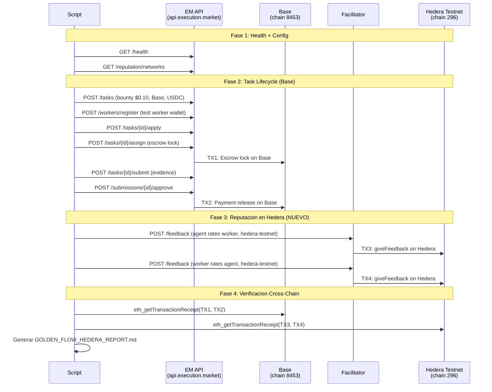

# MASTER PLAN: Golden Flow con Reputacion en Hedera

> **Objetivo**: Script E2E que ejecuta el ciclo completo de una tarea en produccion
> (pago en Base) y luego envia la reputacion a Hedera testnet. Genera un reporte
> Markdown verificable con TX hashes de ambas chains.
>
> **Output**: `hedera/GOLDEN_FLOW_HEDERA_REPORT.md` — para mostrar a jueces.
> **No requiere que los jueces lo corran** — leen el reporte con evidencia on-chain.

---

## Flujo del Script



---

## Credenciales Requeridas

| Secret | Fuente | Uso |
|--------|--------|-----|
| `EM_API_KEY` | AWS SM `em/api-keys` | Auth para crear tareas y aprobar |
| `WALLET_PRIVATE_KEY` | AWS SM `em/x402` | Firmar escrow EIP-3009 (agente) |
| `EM_WORKER_PRIVATE_KEY` | AWS SM `em/test-worker` → `private_key` | Worker wallet para aplicar/submittir |
| `EM_WORKER_WALLET` | AWS SM `em/test-worker` → `address` | Direccion del worker |

**IMPORTANTE**: El script lee secrets de env vars. NUNCA se commitean. Los jueces no lo corren — leen el reporte.

---

## Phase 1: Setup del Script — 3 tareas

| # | Tarea | Detalle |
|---|-------|---------|
| 1.1 | Crear `hedera/golden_flow_hedera.py` | Script principal. Estructura: argparse, httpx async, env vars, report generator. Basado en el patron de `scripts/e2e_golden_flow.py` pero simplificado (sin ERC-8128 signing — usar API key). |
| 1.2 | Crear helper `hedera/em_api.py` | Funciones helper para llamar a la EM API: `create_task()`, `register_worker()`, `apply_to_task()`, `assign_task()`, `submit_evidence()`, `approve_submission()`. Cada una retorna dict con datos relevantes. Usa `EM_API_KEY` para auth (Bearer token). |
| 1.3 | Crear helper `hedera/report_generator.py` | Genera el Markdown report con: header, config, resultados por fase, TX hashes con links a BaseScan y HashScan, diagramas Mermaid, resumen. Formato identico al Golden Flow Report existente pero con seccion "Cross-Chain Reputation". |

**Validacion**: `python golden_flow_hedera.py --dry-run` imprime la configuracion sin ejecutar.

---

## Phase 2: Task Lifecycle en Base — 4 tareas

| # | Tarea | Detalle |
|---|-------|---------|
| 2.1 | Health check | `GET /health` + `GET /api/v1/config` + `GET /api/v1/reputation/networks`. Verificar que Hedera aparece en networks. |
| 2.2 | Crear tarea | `POST /api/v1/tasks` con bounty $0.10, payment_network="base", payment_token="USDC". Guardar task_id. |
| 2.3 | Worker flow | `POST /workers/register` (test worker wallet) → `POST /tasks/{id}/apply` → `POST /tasks/{id}/assign` (con escrow). Usar `AdvancedEscrowClient` del SDK para firmar escrow, o simplificar usando `EM_SERVER_SIGNING=true` si esta habilitado. |
| 2.4 | Submit + Approve | `POST /tasks/{id}/submit` (evidence: `{"text_response": "golden_flow_hedera"}`) → `POST /submissions/{id}/approve`. Capturar payment_tx (TX en Base). |

**Validacion**: task_id creado, payment_tx con hash verificable en BaseScan.

**Nota sobre escrow**: Si `EM_SERVER_SIGNING` no esta habilitado en produccion, el script necesita firmar escrow con `WALLET_PRIVATE_KEY` usando `AdvancedEscrowClient`. Si esto es muy complejo, alternativa: usar una tarea YA existente que fue completada recientemente y solo hacer la Fase 3 (reputacion).

---

## Phase 3: Reputacion en Hedera — 3 tareas

| # | Tarea | Detalle |
|---|-------|---------|
| 3.1 | Agent rates Worker en Hedera | `POST https://facilitator.ultravioletadao.xyz/feedback` con `network: "hedera-testnet"`, agentId del worker en Hedera, value=90, tag1="task_completion". Capturar txHash. **GASLESS** — no necesita HBAR ni signing. |
| 3.2 | Worker rates Agent en Hedera | Mismo endpoint, agentId del agente en Hedera (Agent #99), value=85, tag1="agent_rating". Capturar txHash. |
| 3.3 | Verificar reputacion | `GET /reputation/hedera-testnet/{agentId}` para ambos. Confirmar que count incremento y avg se actualizo. |

**Payload exacto (probado y funcionando)**:
```json
{
  "x402Version": 1,
  "network": "hedera-testnet",
  "feedback": {
    "agentId": 99,
    "value": 90,
    "valueDecimals": 0,
    "tag1": "task_completion",
    "tag2": "golden_flow",
    "endpoint": "task:{task_id}",
    "feedbackUri": "",
    "feedbackHash": null,
    "proof": null
  }
}
```

**Validacion**: txHash de Hedera verificable en HashScan.

---

## Phase 4: Verificacion Cross-Chain — 2 tareas

| # | Tarea | Detalle |
|---|-------|---------|
| 4.1 | Verificar TXs en Base | `eth_getTransactionReceipt` via Base RPC para payment_tx y escrow_tx. Confirmar status=0x1 (success). |
| 4.2 | Verificar TXs en Hedera | `eth_getTransactionReceipt` via Hashio RPC para reputation TXs. Confirmar on-chain. Alternativamente, consultar Facilitator `/reputation/hedera-testnet/{id}`. |

**Validacion**: Todas las TXs confirmadas on-chain en ambas chains.

---

## Phase 5: Generar Reporte — 2 tareas

| # | Tarea | Detalle |
|---|-------|---------|
| 5.1 | Generar `GOLDEN_FLOW_HEDERA_REPORT.md` | Formato identico al Golden Flow Report existente: header con fecha, config table, mermaid diagram, resultados por fase, TX hashes con links, resumen. Seccion especial: **"Cross-Chain Reputation: Base Payment + Hedera Reputation"** con tabla comparativa de TXs. |
| 5.2 | Generar `GOLDEN_FLOW_HEDERA_REPORT.es.md` | Version espanol del reporte. |

**Estructura del reporte**:
```markdown
# Golden Flow Hedera Report — Cross-Chain E2E Test

> Date: 2026-04-04
> Payment Chain: Base Mainnet (chain 8453)
> Reputation Chain: Hedera Testnet (chain 296)
> Result: PASS

## Cross-Chain Transaction Summary

| Operation | Chain | TX Hash | Explorer |
|-----------|-------|---------|----------|
| Escrow Lock | Base | 0x... | BaseScan |
| Payment Release | Base | 0x... | BaseScan |
| Agent→Worker Rating | Hedera | 0x... | HashScan |
| Worker→Agent Rating | Hedera | 0x... | HashScan |

## Phase Results
| # | Phase | Chain | Status |
|---|-------|-------|--------|
| 1 | Health + Config | — | PASS |
| 2 | Task Creation | Base | PASS |
| 3 | Worker Registration | Base | PASS |
| 4 | Apply + Assign + Submit | Base | PASS |
| 5 | Approval + Payment | Base | PASS |
| 6 | Agent→Worker Reputation | Hedera | PASS |
| 7 | Worker→Agent Reputation | Hedera | PASS |
| 8 | Cross-Chain Verification | Both | PASS |
```

---

## Alternativa Simplificada (si escrow signing es muy complejo)

Si firmar el escrow con `AdvancedEscrowClient` resulta complejo para el script standalone:

| # | Tarea | Detalle |
|---|-------|---------|
| Alt-1 | Usar tarea existente | Tomar una tarea YA completada en produccion (del Golden Flow regular). Extraer task_id y payment_tx del reporte existente. |
| Alt-2 | Solo Fase 3-5 | Ejecutar solo la reputacion en Hedera + verificacion + reporte. Referenciar la tarea existente como contexto. |

Esto genera el MISMO reporte con TXs reales — solo que el pago viene de un Golden Flow anterior y la reputacion es nueva en Hedera.

---

## Archivos a Crear

```
em-cannes-hackathon/hedera/
├── golden_flow_hedera.py          # Script principal E2E
├── em_api.py                      # Helper para llamar EM API
├── report_generator.py            # Genera Markdown report
├── GOLDEN_FLOW_HEDERA_REPORT.md   # Output: reporte EN (generado)
├── GOLDEN_FLOW_HEDERA_REPORT.es.md # Output: reporte ES (generado)
└── ... (archivos existentes)
```

---

## Variables de Entorno

```bash
# EM API
EM_API_URL=https://api.execution.market
EM_API_KEY=em_...                    # API key para auth (si habilitado)

# Wallets (de AWS Secrets Manager)
WALLET_PRIVATE_KEY=0x...             # Agent wallet (escrow signing)
EM_WORKER_WALLET=0x...               # Test worker address
EM_WORKER_PRIVATE_KEY=0x...          # Test worker key

# Hedera
HEDERA_8004_NETWORK=testnet          # Toggle testnet/mainnet

# Opcional
EM_EXISTING_TASK_ID=...              # Si se usa la alternativa simplificada
```

---

## Orden de Ejecucion

```
Phase 1 (Setup) ── Phase 2 (Task en Base) ── Phase 3 (Rep en Hedera) ── Phase 4 (Verify) ── Phase 5 (Report)
```

Todo secuencial. Estimado: **4-5 horas** (script + ejecucion + reporte).

Si se usa la alternativa simplificada (tarea existente): **2-3 horas**.
