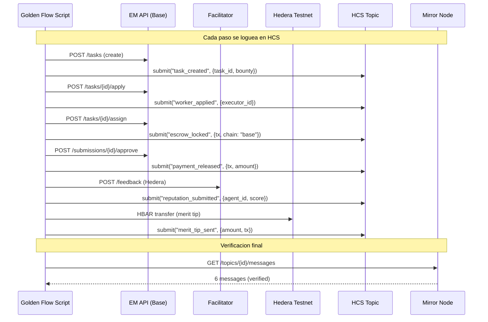

# MASTER PLAN: HCS (Hedera Consensus Service) Integration

> **Objetivo**: Agregar logging de eventos del task lifecycle a HCS.
> Cada paso del Golden Flow se registra como mensaje en un topic de Hedera.
> Esto demuestra uso de features NATIVOS de Hedera (no EVM generico).
> **Tiempo estimado**: 2-3 horas.
> **Prerequisito**: Cuenta Hedera testnet `0.0.8511157` con OPERATOR_KEY.

---

## Por que HCS?

HCS (Hedera Consensus Service) es un feature **nativo de Hedera** que NO existe
en chains EVM. No se puede acceder via JSON-RPC relay — requiere el SDK nativo.
Esto demuestra a los jueces que entendemos Hedera mas alla de "es otro EVM".

**Que hace**: Crea un log inmutable de eventos con timestamps de consenso.
Cada mensaje tiene un timestamp acordado por los nodos de Hedera (no del cliente).
Los mensajes son verificables via Mirror Node REST API (publico, sin auth).

**Como lo usamos**: Cada paso del Golden Flow se loguea en un HCS topic:

```
Topic: "Execution Market Task Events" (0.0.NNNNN)

Messages:
  [1] {"type":"task_created","task_id":"c767b255...","bounty":0.05,"chain":"base"}
  [2] {"type":"worker_applied","executor_id":"7bce9d59..."}
  [3] {"type":"escrow_locked","tx":"0x7c0fc1a4...","chain":"base"}
  [4] {"type":"payment_released","tx":"0x2d6ca373...","amount":0.05}
  [5] {"type":"reputation_submitted","agent_id":99,"score":90,"chain":"hedera-testnet"}
  [6] {"type":"merit_tip_sent","amount_hbar":0.01,"tx":"0x820ab464..."}
```

Verificable por cualquiera:
```
GET https://testnet.mirrornode.hedera.com/api/v1/topics/0.0.NNNNN/messages
```

---

## Arquitectura



---

## Phase 1: Setup — 3 tareas

| # | Tarea | Detalle |
|---|-------|---------|
| 1.1 | Instalar `hiero-sdk-python` | `pip install hiero-sdk-python` + agregar a `requirements.txt` |
| 1.2 | Guardar credenciales | `HEDERA_OPERATOR_ID=0.0.8511157` + `HEDERA_OPERATOR_KEY` en AWS SM o `.env.local`. Agregar a `.env.example` (sin valores). |
| 1.3 | Crear `hedera/hcs_logger.py` | Modulo con clase `HCSLogger`: `create_topic()`, `log_event(type, payload)`, `get_messages()`. Usa `hiero-sdk-python` para crear topics y submittir mensajes. |

**Validacion**: `python -c "from hcs_logger import HCSLogger; print('OK')"` importa sin error.

---

## Phase 2: Crear Topic + Submittir Mensajes — 3 tareas

| # | Tarea | Detalle |
|---|-------|---------|
| 2.1 | Crear HCS Topic | `TopicCreateTransaction` con memo "Execution Market Task Events". Guardar topic_id (formato `0.0.NNNNN`). Puede ser one-time (hardcodear topic_id despues de crearlo) o on-demand. |
| 2.2 | Implementar `log_event()` | `TopicMessageSubmitTransaction` con JSON payload. Fire-and-forget (try/except, nunca bloquear el flujo principal). Incluir timestamp ISO-8601. |
| 2.3 | Implementar `get_messages()` | `GET https://testnet.mirrornode.hedera.com/api/v1/topics/{id}/messages` via httpx. Decode base64 de cada mensaje. Retornar lista de eventos. |

**Validacion**: Crear topic en testnet, submittir 1 mensaje, leerlo del Mirror Node.

---

## Phase 3: Integrar en Golden Flow — 2 tareas

| # | Tarea | Detalle |
|---|-------|---------|
| 3.1 | Agregar HCS logging al Golden Flow | Despues de cada paso exitoso, llamar `logger.log_event(type, payload)`. 6 puntos de insercion: task_created, worker_applied, escrow_locked, payment_released, reputation_submitted, merit_tip_sent. |
| 3.2 | Agregar Phase 7: HCS Verification | Despues del merit tip, nueva fase: leer TODOS los mensajes del topic via Mirror Node, verificar que los 6 eventos estan presentes, mostrar en output. |

**Validacion**: Golden Flow PASS 7/7 con 6 mensajes en HCS verificados.

---

## Phase 4: Documentacion + Report — 2 tareas

| # | Tarea | Detalle |
|---|-------|---------|
| 4.1 | Actualizar reporte | `GOLDEN_FLOW_HEDERA_REPORT.md` incluye seccion "HCS Event Log" con topic_id, 6 mensajes, Mirror Node URL para verificacion. |
| 4.2 | Actualizar PROOF_OF_INTEGRATION | Agregar seccion "Hedera Consensus Service (HCS)" con: que es, por que lo usamos, topic_id, Mirror Node link, evidencia de mensajes. |

---

## Phase 5: Push + Tests — 2 tareas

| # | Tarea | Detalle |
|---|-------|---------|
| 5.1 | Tests | `test_hcs.py`: mock de TopicCreateTransaction + TopicMessageSubmitTransaction. Verificar formato de eventos. |
| 5.2 | Commit + Push | Commits granulares, push a repo del hackathon. |

---

## Archivos a Crear/Modificar

| Archivo | Accion |
|---------|--------|
| `hedera/hcs_logger.py` | **NUEVO** — HCS topic create + message submit + Mirror Node read |
| `hedera/golden_flow_hedera.py` | **MODIFICAR** — agregar HCS logging en cada paso + Phase 7 |
| `hedera/requirements.txt` | **MODIFICAR** — agregar `hiero-sdk-python>=0.2.3` |
| `hedera/tests/test_hcs.py` | **NUEVO** — tests del HCS logger |
| `hedera/GOLDEN_FLOW_HEDERA_REPORT.md` | **REGENERAR** — con HCS event log |
| `hedera/PROOF_OF_INTEGRATION.md` + `.es.md` | **MODIFICAR** — seccion HCS |
| `.env.example` | **MODIFICAR** — agregar HEDERA_OPERATOR_ID, HEDERA_OPERATOR_KEY |

---

## Variables de Entorno

```bash
# Hedera Testnet (nativo, para HCS)
HEDERA_OPERATOR_ID=0.0.8511157
HEDERA_OPERATOR_KEY=302e...   # DER-encoded private key

# Estas se suman a las existentes:
# HEDERA_8004_NETWORK=testnet  (para ERC-8004 via Facilitator)
# WALLET_PRIVATE_KEY=0x...     (para escrow en Base)
# EM_WORKER_PRIVATE_KEY=0x...  (para worker)
```

---

## Resumen

| Phase | Tareas | Tiempo |
|-------|--------|--------|
| 1. Setup | 3 | 30 min |
| 2. Topic + Mensajes | 3 | 45 min |
| 3. Integrar en Golden Flow | 2 | 30 min |
| 4. Documentacion | 2 | 30 min |
| 5. Push + Tests | 2 | 15 min |
| **Total** | **12** | **~2.5h** |

---

## Impacto en Evaluacion

Con HCS integrado, el entregable usa:
- **ERC-8004** (EVM) — identity + reputation
- **HBAR transfer** (EVM) — merit tip payment
- **HCS** (NATIVO) — event logging con timestamps de consenso
- **Facilitator** (infra open-source) — gasless operations
- **x402** (protocol) — escrow en Base

Eso cubre: EVM + nativo + payments + identity + infrastructure. Deberia subir Technicality de 7 a 8-9 y WOW Factor de 7 a 8.
