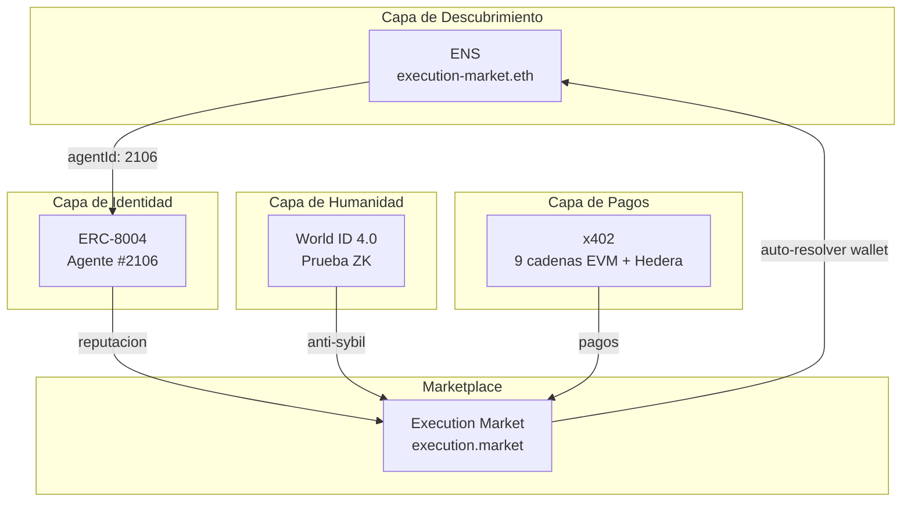

# Integracion ENS — Prueba de Operaciones On-Chain

> **Dominio**: `execution-market.eth` — registrado en Ethereum Mainnet, 4 de abril de 2026.
> **Propietario**: `0x2A840A562E7359621eb9BBD83168101c3c5D4498`
> **Produccion**: [execution.market](https://execution.market) — ENS integrado en la aplicacion en vivo.

---

## Track: "Best ENS Integration for AI Agents" ($10,000)

### Por que ENS?

Los agentes de IA necesitan **identidades legibles y descubribles** — no solo direcciones de wallet. ENS convierte a los agentes de cadenas opacas `0x...` en nombres como `execution-market.eth` que cualquier persona puede resolver desde cualquier protocolo, wallet o dApp.

### Como cumplimos los requisitos

| Requisito | Como lo cumplimos |
|-----------|-------------------|
| *"Nombrar agentes, resolver direcciones"* | `execution-market.eth` registrado en mainnet. Resolucion forward + reverse funcionando. |
| *"Almacenar metadata en text records"* | 7 text records on-chain (url, description, avatar, twitter, agentId, role, chains). |
| *"Registros de subdominios para flotas de agentes"* | Workers reclaman subdominios via NameWrapper (`alice.execution-market.eth`). |
| *"No cosmetico — mejorar identidad o descubrimiento"* | Agentes descubribles cross-protocolo SIN nuestra API. |
| *"Demos funcionales (sin valores hardcodeados)"* | Resolucion en vivo contra Ethereum Mainnet. |

---

## Resultados

| Paso | Operacion | Resultado |
|------|-----------|-----------|
| 1 | Resolucion forward | PASS — `execution-market.eth` -> `0x2A840A...` |
| 2 | Resolucion reverse | PASS — `0x2A840A...` -> `execution-market.eth` |
| 3 | Text records estandar | 4 records (url, description, avatar, com.twitter) |
| 4 | Text records EM custom | 3 records (agentId=2106, role=platform, chains=9) |
| 5 | Primary Name | PASS — TX `setName` confirmada en L1 |
| 6 | Integracion produccion | EN VIVO — badges ENS en dashboard execution.market |

---

## Evidencia On-Chain

### Resolucion Forward

```
Nombre:     execution-market.eth
Direccion:  0x2A840A562E7359621eb9BBD83168101c3c5D4498
Red:        Ethereum Mainnet (chain 1)
ENS App:    https://app.ens.domains/execution-market.eth
```

### Resolucion Reverse (Primary Name)

```
Direccion:  0x2A840A562E7359621eb9BBD83168101c3c5D4498
Resuelve a: execution-market.eth
Metodo:     setName() en ENS Reverse Registrar
TX:         Confirmada en Ethereum L1 (4 de abril, 2026)
```

### Text Records

```
url:                                https://execution.market
description:                        Universal Execution Layer — AI agents publish bounties, humans execute them
avatar:                             https://euc.li/execution-market.eth
com.twitter:                        executi0nmarket
com.execution.market.agentId:       2106
com.execution.market.role:          platform
com.execution.market.chains:        base,ethereum,polygon,arbitrum,hedera,avalanche,optimism,celo,monad
```

---

## Arquitectura



### Flujo de descubrimiento cross-protocolo

```
Cualquier protocolo externo:

  1. Resolver "execution-market.eth"
     --> ENS: 0x2A840A562E7359621eb9BBD83168101c3c5D4498

  2. Leer text("com.execution.market.agentId")
     --> ENS: "2106"

  3. Consultar ERC-8004 Agente #2106 en Base
     --> Facilitador: GET /identity/base/2106
     --> Retorna: owner, metadata_uri, reputacion

  Resultado: Identidad completa del agente desde 3 fuentes on-chain
             SIN tocar la API de execution.market
```

### Donde se ve ENS en el dashboard

```
+----------------------------------------------------------+
|  execution.market                                        |
+----------------------------------------------------------+
|                                                          |
|  Tarea: "Fotografiar tienda en la 5ta Ave"  $8.00       |
|  +----------------------------------------------------+ |
|  | Agente: Execution Market                            | |
|  | [ERC-8004 #2106] [World ID] [execution-market.eth]  | |
|  |                              ^^^^^^^^^^^^^^^^^^^^   | |
|  |                              Badge ENS (indigo)     | |
|  +----------------------------------------------------+ |
|                                                          |
|  Solicitantes:                                           |
|  +----------------------------------------------------+ |
|  | Alice    [Humano Verificado] [alice.eth]             | |
|  |          ^^^ World ID        ^^^ ENS auto-detectado | |
|  +----------------------------------------------------+ |
|  | Bob      [bob.execution-market.eth]                 | |
|  |          ^^^ Subdominio reclamado                   | |
|  +----------------------------------------------------+ |
|                                                          |
|  Pagina de Perfil:                                       |
|  +----------------------------------------------------+ |
|  | Verificacion Humana                                 | |
|  |   [World ID: Verificado con Orb]                   | |
|  |                                                    | |
|  | Identidad ENS                                       | |
|  |   Detectado: alice.eth                             | |
|  |   Subdominio: alice.execution-market.eth           | |
|  |   [Administrar en ENS App]                         | |
|  +----------------------------------------------------+ |
+----------------------------------------------------------+
```

---

## Integracion en Produccion

### Backend

| Componente | Ubicacion | Funcion |
|------------|-----------|---------|
| Cliente ENS | `mcp_server/integrations/ens/client.py` | Resolucion, text records, crear subdominios |
| Router API | `mcp_server/api/routers/ens.py` | 5 endpoints REST bajo `/api/v1/ens/` |
| Auto-resolver | `mcp_server/api/routers/workers.py` | Resolucion ENS al registrar worker |
| Migracion DB | `supabase/migrations/087_ens_integration.sql` | Columnas ens_name, ens_avatar, ens_subname |

### Frontend

| Componente | Ubicacion | Funcion |
|------------|-----------|---------|
| `ENSBadge.tsx` | `dashboard/src/components/agents/` | Badge indigo con nombre ENS |
| `ENSLinkSection.tsx` | `dashboard/src/components/` | Perfil: detectar ENS + reclamar subdominio |
| `ens.ts` | `dashboard/src/services/` | Cliente API para endpoints ENS |

---

## Reproducir la Demo

```bash
git clone https://github.com/UltravioletaDAO/em-cannes-hackathon.git
cd em-cannes-hackathon/ens
pip install -r requirements.txt
python demo.py

# Tests (24 casos)
cd .. && python -m pytest ens/tests/test_ens.py -v -p no:pytest_ethereum
```

---

## Codigo Fuente

- **Demo (hackathon)**: [github.com/UltravioletaDAO/em-cannes-hackathon/tree/main/ens](https://github.com/UltravioletaDAO/em-cannes-hackathon/tree/main/ens)
- **Produccion**: [github.com/UltravioletaDAO/execution-market](https://github.com/UltravioletaDAO/execution-market) (`mcp_server/integrations/ens/`, `dashboard/src/components/agents/ENSBadge.tsx`)
- **Dominio**: [app.ens.domains/execution-market.eth](https://app.ens.domains/execution-market.eth)
