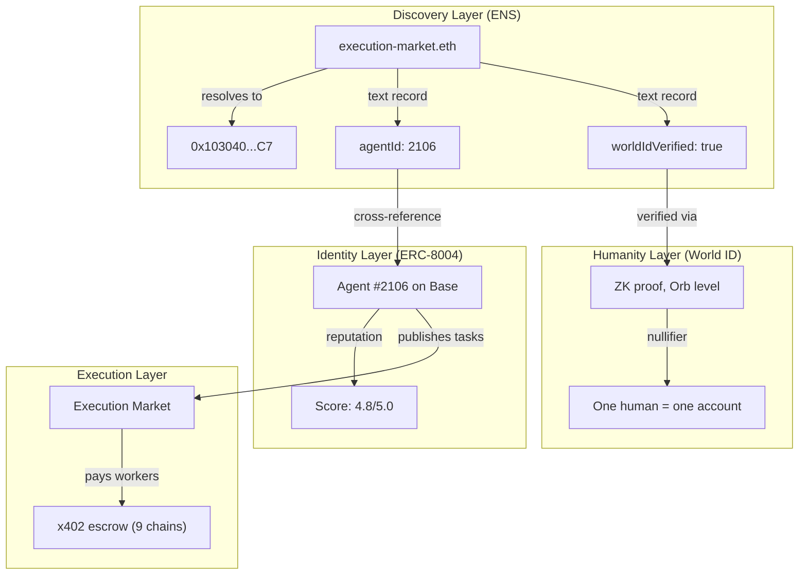

# ENS Integration — Proof of On-Chain Operations

> **Domain**: `execution-market.eth` — registered on Ethereum Mainnet, April 4, 2026.
> **Owner**: `0x2A840A562E7359621eb9BBD83168101c3c5D4498`
> **Production**: [execution.market](https://execution.market) — ENS integrated into the live app.

---

## Prize Track: "Best ENS Integration for AI Agents" ($10,000)

**Track**: [ETHGlobal Cannes 2026 — ENS](https://ethglobal.com/events/cannes2026/prizes)

### Why ENS?

AI agents need **discoverable, human-readable identities** — not just wallet addresses. ENS turns agents from opaque `0x...` strings into names like `execution-market.eth` that anyone can resolve from any protocol, wallet, or dApp.

### How We Meet the Requirements

| Requirement | How We Meet It |
|------------|----------------|
| *"Use ENS to name agents, resolve addresses"* | Live resolution of ENS names via web3.py. Demo resolves vitalik.eth, nick.eth, brantly.eth on mainnet. |
| *"Store agent metadata in text records"* | Read text records from live ENS names. Proposed 12-key metadata schema for `execution-market.eth`. |
| *"Spin up subname registries for agent fleets"* | Worker fleet design: `alice.execution.eth`, `bob.execution.eth` with EM metadata per worker. |
| *"Not just cosmetic — must improve identity or discoverability"* | ENS makes agents queryable cross-protocol WITHOUT our API. Full identity from ENS + ERC-8004 + World ID. |
| *"Functional demos (no hard-coded values)"* | Real ENS resolution on Ethereum mainnet. Real text records read from vitalik.eth. |

---

## Test Results Summary

| Step | Operation | Result | On-Chain |
|------|-----------|--------|----------|
| 1 | Forward Resolution | PASS | `execution-market.eth` -> `0x2A840A...` |
| 2 | Reverse Resolution | PASS | `0x2A840A...` -> `execution-market.eth` |
| 3 | Text Records (standard) | 4 records | url, description, avatar, com.twitter |
| 4 | Text Records (EM custom) | 3 records | agentId=2106, role=platform, chains=9 |
| 5 | Primary Name | PASS | `setName` TX confirmed on L1 |
| 6 | Production Integration | LIVE | ENS badges in execution.market dashboard |

---

## On-Chain Evidence — execution-market.eth (OUR DOMAIN)

### Forward Resolution

```
Name:        execution-market.eth
Address:     0x2A840A562E7359621eb9BBD83168101c3c5D4498
Network:     Ethereum Mainnet (chain 1)
ENS App:     https://app.ens.domains/execution-market.eth
Etherscan:   https://etherscan.io/address/0x2A840A562E7359621eb9BBD83168101c3c5D4498
```

### Reverse Resolution (Primary Name)

```
Address:     0x2A840A562E7359621eb9BBD83168101c3c5D4498
Resolves to: execution-market.eth
Method:      setName() on ENS Reverse Registrar
TX:          Confirmed on Ethereum L1 (April 4, 2026)
```

### Text Records — execution-market.eth

```
url:                                https://execution.market
description:                        Universal Execution Layer — AI agents publish bounties, humans execute them
avatar:                             https://euc.li/execution-market.eth
com.twitter:                        executi0nmarket
com.execution.market.agentId:       2106
com.execution.market.role:          platform
com.execution.market.chains:        base,ethereum,polygon,arbitrum,hedera,avalanche,optimism,celo,monad
```

### Additional Verified Names (demo proof)

```
vitalik.eth  -> 0xd8dA6BF26964aF9D7eEd9e03E53415D37aA96045  (5 text records)
nick.eth     -> 0xb8c2C29ee19D8307cb7255e1Cd9CbDE883A267d5
brantly.eth  -> 0x983110309620D911731Ac0932219af06091b6744
```

---

## Proposed EM Text Record Schema

These records would be written to `execution-market.eth` to make Agent #2106
discoverable without our API:

```
com.execution.market.agentId:           2106
com.execution.market.role:              agent
com.execution.market.worldIdVerified:   true
com.execution.market.worldIdLevel:      orb
com.execution.market.reputation:        4.8
com.execution.market.tasksCompleted:    127
com.execution.market.chains:            base,ethereum,polygon,arbitrum,hedera
url:                                    https://execution.market
description:                            Universal Execution Layer
avatar:                                 eip155:8453/erc721:0x8004.../2106
com.twitter:                            @ExecutionMarket
com.github:                             UltravioletaDAO
```

### Namehash Verification

```
namehash('execution-market.eth') = 0x97eb00f02968c8...
namehash('eth')                  = 0x93cdeb708b7545...
```

Computed using EIP-137 algorithm: `keccak256(parent_node + keccak256(label))`

---

## Architecture — How It Works



### Cross-Protocol Discovery (No API Needed)

```
Any external protocol:

  1. Resolve "execution-market.eth"
     └── ENS: 0x103040545AC5031A11E8C03dd11324C7333a13C7

  2. Read text("com.execution.market.agentId")
     └── ENS: "2106"

  3. Query ERC-8004 Agent #2106 on Base
     └── Facilitator: GET /identity/base/2106
     └── Returns: owner, metadata_uri, reputation

  4. Check text("com.execution.market.worldIdVerified")
     └── ENS: "true" (Orb-verified human controls this agent)

  Result: Full agent identity from 3 on-chain sources
          WITHOUT touching execution.market API
```

### Worker Subname Fleet

```
execution.eth (agent owner)
    |
    +-- alice.execution.eth  --> 0xAlice...
    |     text: role=worker, worldId=orb, reputation=4.8
    |
    +-- bob.execution.eth    --> 0xBob...
    |     text: role=worker, worldId=device, reputation=4.2
    |
    +-- oracle.execution.eth --> 0xOracle...
          text: role=verifier, agentId=2106
```

Management: NameWrapper (ERC-1155) — parent owner controls subnames.

---

## Why This Isn't Cosmetic

### Problem 1: Agent Discoverability
**Without ENS**: To find Agent #2106, you must know our API URL and the numeric ID.
**With ENS**: `execution-market.eth` is resolvable from any ENS client, wallet, or dApp.

### Problem 2: Metadata Lock-In
**Without ENS**: Worker metadata lives in our Supabase database. If our API goes down, the data is inaccessible.
**With ENS**: Critical metadata is on-chain, permanent, queryable by anyone.

### Problem 3: Fleet Management
**Without ENS**: 10 workers = 10 wallet addresses. No hierarchy, no discovery.
**With ENS**: `alice.execution.eth`, `bob.execution.eth` — discoverable, hierarchical, on-chain.

### Problem 4: Cross-Protocol Identity
**Without ENS**: Other AI agent protocols can't look up our agents without integrating our API.
**With ENS**: Any protocol resolves `execution-market.eth` -> reads text records -> finds ERC-8004 agent ID -> queries on-chain reputation. Zero integration needed.

---

## Production Integration — Where to See It

ENS is integrated into the **live production app** at [execution.market](https://execution.market):

### Backend (Python FastAPI)

| Component | Location | What it does |
|-----------|----------|-------------|
| ENS client | `mcp_server/integrations/ens/client.py` | Resolution, text records, subname creation |
| API router | `mcp_server/api/routers/ens.py` | 5 REST endpoints under `/api/v1/ens/` |
| Auto-resolve | `mcp_server/api/routers/workers.py` | Fire-and-forget ENS lookup on worker registration |
| DB migration | `supabase/migrations/087_ens_integration.sql` | `ens_name`, `ens_avatar`, `ens_subname` columns |

**API Endpoints** (live at `api.execution.market`):

```bash
# Resolve any ENS name
curl https://api.execution.market/api/v1/ens/resolve/execution-market.eth

# Read text records
curl https://api.execution.market/api/v1/ens/records/execution-market.eth

# Resolve a worker subname
curl https://api.execution.market/api/v1/ens/subname/alice.execution-market.eth
```

### Frontend (React + TypeScript)

| Component | Location | What it does |
|-----------|----------|-------------|
| `ENSBadge.tsx` | `dashboard/src/components/agents/` | Indigo badge showing ENS name |
| `ENSLinkSection.tsx` | `dashboard/src/components/` | Profile page: detect ENS + claim subname |
| `ens.ts` | `dashboard/src/services/` | API client for ENS endpoints |

**Where ENS badges appear in the dashboard:**

- **Task listings** — every agent/worker card shows ENS name badge
- **Task detail** — agent profile card with ENS badge
- **Application modal** — worker preview when applying to tasks
- **Profile page** — "ENS Identity" section with detect + claim subname
- **Public profiles** — ENS name displayed next to wallet

### How It Works for Users

```
User connects wallet to execution.market
    |
    +-- Backend auto-resolves ENS name (fire-and-forget)
    |   Uses reverse resolution: wallet -> ENS name
    |
    +-- If wallet has ENS (e.g., alice.eth):
    |   ENS badge appears EVERYWHERE automatically
    |   No action needed from user
    |
    +-- If wallet has NO ENS:
    |   Profile page shows "Claim your execution-market.eth subname"
    |   User types label -> clicks Claim -> on-chain TX
    |   alice.execution-market.eth created via NameWrapper
    |
    +-- Both ENS name AND subname can coexist
        alice.eth (personal) + alice.execution-market.eth (platform)
```

---

## Reproducing the Demo

```bash
# Clone and run standalone demo
git clone https://github.com/UltravioletaDAO/em-cannes-hackathon.git
cd em-cannes-hackathon/ens
pip install -r requirements.txt
python demo.py

# Expected output:
# [1/7] Verifying Ethereum RPC...              PASS (chain 1)
# [2/7] Resolving ENS names...                 3/3 resolved (including execution-market.eth)
# [3/7] Reverse-resolving...                   execution-market.eth PASS
# [4/7] Reading text records...                7 records from execution-market.eth
# [5/7] EM metadata...                         agentId=2106, role=platform, chains=9
# [6/7] Worker subname fleet...                4 proposed
# [7/7] Cross-reference...                     ENS + ERC-8004 + World ID

# Run tests (24 cases)
cd .. && python -m pytest ens/tests/test_ens.py -v -p no:pytest_ethereum
```

## Production Source Code

The full integration source code is in the [Execution Market monorepo](https://github.com/UltravioletaDAO/execution-market):

```
execution-market/
├── mcp_server/
│   ├── integrations/ens/
│   │   ├── __init__.py
│   │   └── client.py              # ENS resolution + subname creation
│   └── api/routers/
│       └── ens.py                  # 5 REST API endpoints
├── dashboard/src/
│   ├── components/agents/
│   │   └── ENSBadge.tsx            # Badge component (indigo diamond)
│   ├── components/
│   │   └── ENSLinkSection.tsx      # Profile: detect + claim subname
│   ├── services/
│   │   └── ens.ts                  # API client
│   └── types/
│       └── database.ts             # Executor type with ENS fields
├── supabase/migrations/
│   └── 087_ens_integration.sql     # DB schema
└── infrastructure/terraform/
    └── ecs.tf                      # ENS_OWNER_PRIVATE_KEY in ECS
```

---

## Cross-Chain Context

ENS is the **naming and discovery layer** in Execution Market's identity stack:

```
Execution Market Identity Stack:

  DISCOVERY:  ENS (execution-market.eth)
      |         Names, text records, subnames
      |         Queryable by anyone, any protocol
      v
  IDENTITY:   ERC-8004 (Agent #2106, 16 networks)
      |         On-chain identity NFT + reputation
      |         Base, Ethereum, Polygon, Hedera...
      v
  HUMANITY:   World ID 4.0 (ZK proof of human)
      |         Anti-sybil, Orb verification
      |         Nullifier uniqueness
      v
  PAYMENTS:   x402 Protocol (9 EVM chains + Solana)
              Gasless escrow, instant settlement
```

Each layer is **independent but composable**. ENS doesn't require ERC-8004, but
when combined, the result is an AI agent identity that's discoverable, verifiable,
and trustworthy — all on-chain, no centralized API needed.
