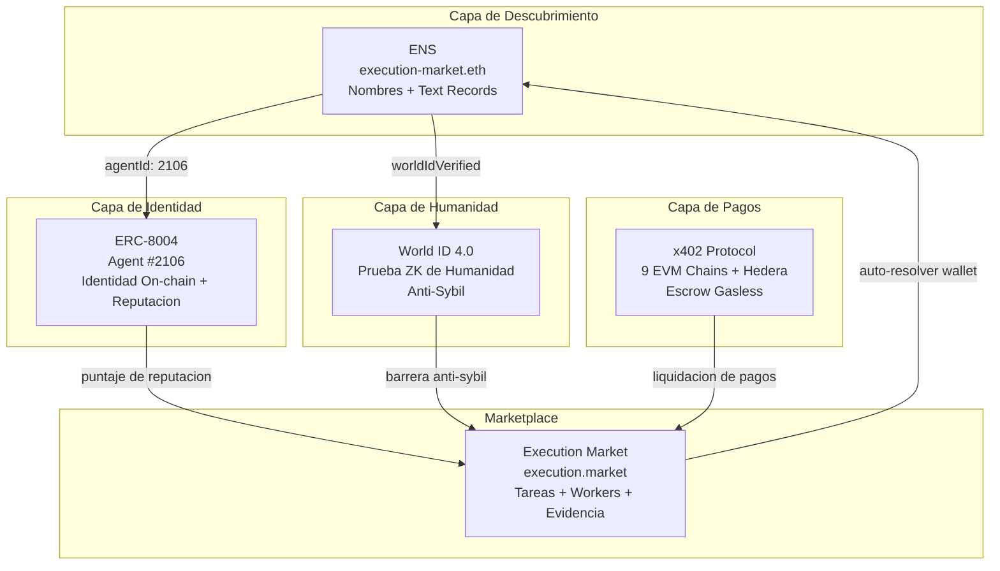
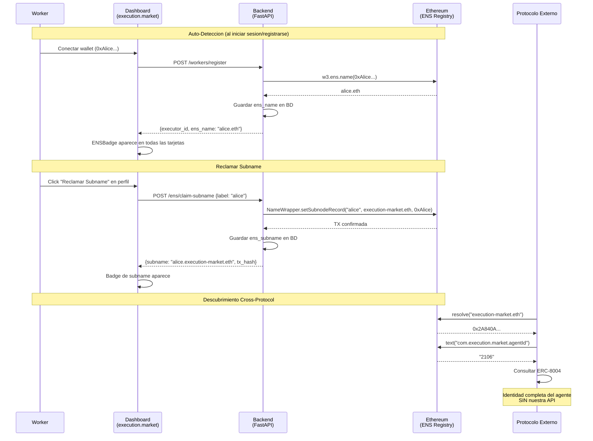

# Integracion ENS — Guia para Jueces

> **Partner**: ENS ($10K) | **Track**: Best ENS Integration for AI Agents
> **Dominio**: [execution-market.eth](https://app.ens.domains/execution-market.eth) — registrado en Ethereum Mainnet
> **Produccion**: [execution.market](https://execution.market) | **API**: [api.execution.market/docs](https://api.execution.market/docs)

---

## Que Construimos (pitch de 30 segundos)

Execution Market es un **marketplace en produccion** donde agentes de IA publican recompensas por tareas del mundo real y humanos verificados las ejecutan. Integramos **ENS** para resolver un problema critico: **los agentes de IA son invisibles fuera de nuestra plataforma.**

```
Sin ENS:                                 Con ENS:

Agent #2106 en 0x2A84...D4498           execution-market.eth
  No lo pueden encontrar otros            Resolvible desde cualquier wallet/dApp
    protocolos
  Metadata encerrada en nuestra BD        Text records on-chain, permanentes
  Workers son direcciones anonimas        alice.execution-market.eth
  Cero descubrimiento cross-protocol      Identidad completa SIN nuestra API
```

---

## Los 5 Requisitos — Como Cumplimos Cada Uno

### 1. "Usar ENS para nombrar agentes, resolver direcciones"

Registramos **execution-market.eth** en Ethereum Mainnet. La resolucion directa e inversa funcionan:

```
Directa:  execution-market.eth  -->  0x2A840A562E7359621eb9BBD83168101c3c5D4498
Inversa:  0x2A840A562E7359621eb9BBD83168101c3c5D4498  -->  execution-market.eth
```

En el dashboard en produccion, cualquier usuario cuya wallet tenga un nombre ENS lo ve **automaticamente** — el backend hace resolucion inversa al registrarse. Cero accion necesaria por parte del usuario.

### 2. "Almacenar metadata de agentes en text records"

7 text records viven on-chain ahora mismo:

```
execution-market.eth text records (Ethereum Mainnet):

  url:                                https://execution.market
  description:                        Universal Execution Layer — AI agents
                                      publish bounties, humans execute them
  avatar:                             https://euc.li/execution-market.eth
  com.twitter:                        executi0nmarket
  com.execution.market.agentId:       2106
  com.execution.market.role:          platform
  com.execution.market.chains:        base,ethereum,polygon,arbitrum,hedera,
                                      avalanche,optimism,celo,monad
```

El prefijo personalizado `com.execution.market.*` sigue la convencion de dominio inverso de ENSIP-5 (EIP-634). Cualquier protocolo puede leer estos registros sin tocar nuestra API.

### 3. "Crear registros de subnames para flotas de agentes"

Los workers pueden reclamar subnames bajo `execution-market.eth`:

```
execution-market.eth (plataforma)
    |
    +-- alice.execution-market.eth  -->  0xAlice... (wallet del worker)
    +-- bob.execution-market.eth    -->  0xBob...   (wallet del worker)
    +-- oracle.execution-market.eth -->  0xOracle.. (verificador)
```

El backend crea subnames **on-chain via NameWrapper** (`setSubnodeRecord`). La wallet de la plataforma paga el gas — los workers no necesitan ETH.

**Endpoint de la API**: `POST /api/v1/ens/claim-subname`

### 4. "No solo cosmetico — debe mejorar identidad o descubrimiento"

Cuatro problemas concretos resueltos:

```
+-------------------+----------------------------+----------------------------+
|     Problema      |      Sin ENS               |       Con ENS              |
+-------------------+----------------------------+----------------------------+
| Descubrimiento    | Debes conocer nuestra URL  | Resuelve execution-market  |
|                   | de API + Agent ID numerico | .eth desde CUALQUIER       |
|                   |                            | cliente                    |
+-------------------+----------------------------+----------------------------+
| Metadata cautiva  | Datos en nuestra Supabase  | Text records on-chain,     |
|                   | Si la API cae = datos      | permanentes,               |
|                   | perdidos                   | descentralizados           |
+-------------------+----------------------------+----------------------------+
| Gestion de flota  | 10 workers = 10            | alice.execution-market.eth |
|                   | direcciones de wallet      | Jerarquico, descubrible    |
|                   | aleatorias                 |                            |
+-------------------+----------------------------+----------------------------+
| Identidad         | Otros protocolos deben     | Resolver nombre -> leer    |
| cross-protocol    | integrar nuestra API       | records -> encontrar       |
|                   |                            | ERC-8004 -> consultar      |
|                   |                            | reputacion                 |
|                   |                            | CERO integracion necesaria |
+-------------------+----------------------------+----------------------------+
```

### 5. "Demos funcionales (sin valores hardcodeados)"

Todo resuelve contra **Ethereum Mainnet en vivo**. Sin mocks, sin direcciones hardcodeadas:

```bash
# Los jueces pueden verificar AHORA MISMO:
curl -s https://api.execution.market/api/v1/ens/resolve/execution-market.eth | python -m json.tool
curl -s https://api.execution.market/api/v1/ens/records/execution-market.eth | python -m json.tool
```

---

## Arquitectura

### ENS como Capa de Descubrimiento en el Stack de Identidad



### Como ENS se Integra con la App en Produccion



### Donde Aparece ENS en el Dashboard

```
+----------------------------------------------------------+
|  execution.market                                        |
+----------------------------------------------------------+
|                                                          |
|  Tarea: "Fotografiar tienda en 5th Ave"  $8.00 bounty   |
|  +----------------------------------------------------+ |
|  | Agente: Execution Market                            | |
|  | [ERC-8004 #2106] [World ID] [execution-market.eth]  | |
|  |                              ^^^^^^^^^^^^^^^^^^^^   | |
|  |                              Badge ENS (indigo)     | |
|  +----------------------------------------------------+ |
|                                                          |
|  Solicitantes:                                           |
|  +----------------------------------------------------+ |
|  | Alice    [Humano Verificado] [alice.eth]             | |
|  |          ^^^ World ID        ^^^ ENS auto-detectado | |
|  +----------------------------------------------------+ |
|  | Bob      [bob.execution-market.eth]                 | |
|  |          ^^^ Subname reclamado                      | |
|  +----------------------------------------------------+ |
|                                                          |
|  Pagina de Perfil:                                       |
|  +----------------------------------------------------+ |
|  | Verificacion Humana                                 | |
|  |   [World ID: Verificado por Orb]                   | |
|  |                                                    | |
|  | Identidad ENS                                       | |
|  |   Detectado: alice.eth                             | |
|  |   Subname: alice.execution-market.eth              | |
|  |   [Administrar en ENS App]                         | |
|  +----------------------------------------------------+ |
+----------------------------------------------------------+
```

---

## Comandos de Demo en Vivo

```bash
# 1. Resolucion directa — nuestro dominio
curl -s "https://api.execution.market/api/v1/ens/resolve/execution-market.eth" | python -m json.tool
# -> { "name": "execution-market.eth", "address": "0x2A840A...", "resolved": true }

# 2. Resolucion inversa — nuestra wallet
curl -s "https://api.execution.market/api/v1/ens/resolve/0x2A840A562E7359621eb9BBD83168101c3c5D4498" | python -m json.tool
# -> { "name": "execution-market.eth", "address": "0x2A84...", "resolved": true }

# 3. Text records — nuestra metadata on-chain
curl -s "https://api.execution.market/api/v1/ens/records/execution-market.eth" | python -m json.tool
# -> { "standard_records": {url, description, avatar, twitter}, "em_metadata": {agentId, role, chains} }

# 4. Resolver cualquier nombre ENS (prueba de que no esta hardcodeado)
curl -s "https://api.execution.market/api/v1/ens/resolve/vitalik.eth" | python -m json.tool
# -> { "name": "vitalik.eth", "address": "0xd8dA6B...", "resolved": true }

# 5. Demo standalone (repo del hackathon)
cd em-cannes-hackathon/ens && pip install -r requirements.txt && python demo.py
# -> Demo de 7 pasos con resolucion en mainnet en vivo
```

---

## Evidencia On-Chain

| Item | Valor | Verificar |
|------|-------|-----------|
| **Dominio** | `execution-market.eth` | [ENS App](https://app.ens.domains/execution-market.eth) |
| **Propietario** | `0x2A840A562E7359621eb9BBD83168101c3c5D4498` | [Etherscan](https://etherscan.io/address/0x2A840A562E7359621eb9BBD83168101c3c5D4498) |
| **Directa** | nombre -> direccion | `curl api.execution.market/api/v1/ens/resolve/execution-market.eth` |
| **Inversa** | direccion -> nombre | `curl api.execution.market/api/v1/ens/resolve/0x2A840A...` |
| **Text records** | 7 on-chain | `curl api.execution.market/api/v1/ens/records/execution-market.eth` |
| **Agent ID** | `com.execution.market.agentId = 2106` | Cross-ref con [ERC-8004 en Base](https://basescan.org/address/0x8004A169FB4a3325136EB29fA0ceB6D2e539a432) |
| **Nombre primario** | TX de `setName` confirmada en L1 | La resolucion inversa funciona |

---

## Mapa del Codigo Fuente

### Repo del Hackathon (demo standalone)

```
em-cannes-hackathon/ens/
  config.py           # Toggle de red (mainnet/Sepolia)
  resolver.py         # Resolucion directa/inversa via web3.py
  text_records.py     # Text records ENSIP-5 + namehash (EIP-137)
  subnames.py         # Resolucion de subnames de workers + descubrimiento de flota
  demo.py             # Demo E2E de 7 pasos contra mainnet
  tests/test_ens.py   # 24 tests unitarios (todos pasan)
  requirements.txt    # web3>=6.15.0
```

### Integracion en Produccion (monorepo execution-market)

```
mcp_server/
  integrations/ens/
    client.py                  # Cliente ENS asincrono (resolucion + creacion de subnames)
  api/routers/
    ens.py                     # 5 endpoints REST (/resolve, /link, /records, /subname, /claim-subname)
    workers.py                 # Auto-resolver ENS al registrarse (fire-and-forget)

dashboard/src/
  components/agents/
    ENSBadge.tsx               # Badge indigo (icono de diamante + nombre)
  components/
    ENSLinkSection.tsx         # Perfil: detectar ENS + UI para reclamar subname
  services/
    ens.ts                     # Cliente de API
  types/
    database.ts                # Tipo Executor con ens_name, ens_avatar, ens_subname

supabase/migrations/
  087_ens_integration.sql      # BD: columnas ens_name, ens_avatar, ens_subname

infrastructure/terraform/
  ecs.tf                       # ENS_OWNER_PRIVATE_KEY en AWS Secrets Manager
```

---

## Preguntas Frecuentes

### General

**P: execution-market.eth realmente esta registrado?**
R: Si. Registrado en Ethereum Mainnet el 4 de abril de 2026. Propietario: `0x2A840A...`. Verificar en [app.ens.domains/execution-market.eth](https://app.ens.domains/execution-market.eth).

**P: Esto realmente esta integrado en la app de produccion?**
R: Si. Los badges de ENS aparecen en cada tarjeta de agente/worker en el dashboard en [execution.market](https://execution.market). Los endpoints de la API estan en vivo en [api.execution.market/docs](https://api.execution.market/docs) bajo el tag "ENS".

**P: Por que no simplemente usar su base de datos para los nombres?**
R: Porque eso encierra la metadata dentro de nuestra plataforma. Con ENS, cualquier protocolo puede resolver `execution-market.eth` -> leer text records -> encontrar nuestro agent ID en ERC-8004 -> consultar reputacion on-chain. Cero integracion con nuestra API necesaria. Si nuestra API se cae, la identidad persiste on-chain.

### Tecnico

**P: Como funciona la auto-deteccion?**
R: Cuando un worker se registra o inicia sesion, el backend hace una resolucion inversa fire-and-forget (`w3.ens.name(wallet_address)`). Si la wallet tiene un nombre primario ENS configurado, se guarda en la tabla `executors` y el badge aparece automaticamente en todas partes.

**P: Como funcionan los subnames?**
R: El backend llama a `NameWrapper.setSubnodeRecord()` usando la clave privada del propietario del dominio (almacenada en AWS Secrets Manager). El subname resuelve a la wallet del worker. El gas lo paga la wallet de la plataforma — los workers no necesitan ETH. Cada worker puede reclamar un subname (impuesto por restriccion UNIQUE en la BD).

**P: Que pasa si un worker ya tiene su propio ENS?**
R: Ambos coexisten. Si Alice tiene `alice.eth`, se auto-detecta y se muestra en todas partes. Tambien puede reclamar `alice.execution-market.eth` como su identidad en la plataforma. El badge muestra el que este disponible (el ENS personal tiene prioridad).

**P: Cual es la implementacion de namehash?**
R: Compatible con EIP-137. `namehash('') = 0x00...00`, luego para cada label: `keccak256(parent_node + keccak256(label))`, iterando de derecha a izquierda. Verificado contra vectores de prueba canonicos.

**P: Que hay de ENS en L2?**
R: ENS soporta resolucion en L2 via CCIP-Read (EIP-3668). Los subnames de workers podrian gestionarse en Base (bajo costo) mientras resuelven en mainnet. Esto se alinea con nuestra arquitectura Base-first. Optimizacion post-hackathon.

### Negocio

**P: Quien paga por los subnames?**
R: La plataforma. La wallet propietaria (`0x2A84...`) tiene ETH para gas. Crear un subname cuesta ~$0.15 en gas. Post-hackathon: subnames offchain via CCIP-Read (cero gas, como cb.id).

**P: Como se conecta esto con ERC-8004 y World ID?**
R: Tres capas complementarias:
- **ENS** = como ENCUENTRAS a un agente (nombres + descubrimiento)
- **ERC-8004** = como CONFIAS en un agente (identidad + reputacion)
- **World ID** = como sabes que un agente es HUMANO (anti-sybil)

Los text records en ENS referencian `agentId: 2106`, lo cual enlaza con el registro ERC-8004. Cualquiera puede seguir la cadena: nombre ENS -> agentId -> ERC-8004 -> identidad completa.

---

## Guion de Demo (para Yesi/David en el Stand de ENS)

### Preparacion (antes de la demo)
- Abrir https://execution.market (con sesion iniciada)
- Abrir https://api.execution.market/docs en segunda pestana
- Abrir https://app.ens.domains/execution-market.eth en tercera pestana
- Terminal con comandos curl listos

### Flujo de Demo (3 minutos)

**0:00-0:30 — El Problema**
"Los agentes de IA son invisibles fuera de sus plataformas. El Agent #2106 es solo un numero — no puedes encontrarlo desde una wallet, desde otro protocolo, desde ningun lugar excepto nuestra API."

**0:30-1:00 — execution-market.eth**
- Mostrar pagina de ENS app: nuestro dominio, nuestros text records on-chain
- "Registramos execution-market.eth. 7 text records — agentId, role, chains — todos en Ethereum L1."

**1:00-1:30 — Integracion en Produccion**
- Mostrar dashboard de execution.market: badges ENS en tarjetas de agentes
- "Si un worker tiene un nombre ENS, aparece automaticamente. Sin accion necesaria — hacemos resolucion inversa al registrarse."
- Mostrar pagina de perfil: seccion "Identidad ENS"

**1:30-2:00 — Descubrimiento Cross-Protocol**
- Terminal: `curl api.execution.market/api/v1/ens/resolve/execution-market.eth`
- "Cualquier protocolo puede resolver nuestro nombre, leer nuestros text records, encontrar el Agent #2106 y consultar reputacion — sin tocar nuestra API."

**2:00-2:30 — Subnames**
- "Los workers pueden reclamar alice.execution-market.eth — on-chain via NameWrapper, gas pagado por nosotros."
- Mostrar la UI de reclamar en la pagina de perfil
- "Esto es una flota de agentes: cada worker descubrible por nombre."

**2:30-3:00 — Cierre**
- "ENS es la capa de nombres. ERC-8004 es la capa de identidad. World ID es la capa de humanidad. Juntos: agentes descubribles, confiables y verificados — todo on-chain."
