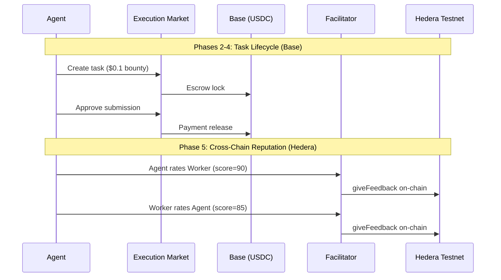

# Golden Flow Hedera Report -- Cross-Chain E2E Test

> **Date**: 2026-04-05 05:47 UTC
> **Payment Chain**: Base Mainnet (chain 8453)
> **Reputation Chain**: Hedera Testnet (chain 296)
> **Facilitator**: https://facilitator.ultravioletadao.xyz
> **Result**: **PASS**

---

## Executive Summary

Full Execution Market lifecycle executed on production:
task created, worker applied, evidence submitted, payment released on **Base** (USDC),
then bidirectional reputation posted on **Hedera Testnet** (ERC-8004).

**Key Result**: Same task, two chains -- payment where the money is (Base),
reputation where the identity lives (Hedera).

---

## Cross-Chain Transaction Summary

| Operation | Chain | TX Hash | Explorer |
|-----------|-------|---------|----------|
| Escrow Lock | Base (8453) | `0x40f5f93e5e6e4d2e23...` | [BaseScan](https://basescan.org/tx/0x40f5f93e5e6e4d2e237ab1eec554918c4b80b53fe3474b739172959ebbcedaeb) |
| Payment Release | Base (8453) | `0x8a0fe03c8470916948...` | [BaseScan](https://basescan.org/tx/0x8a0fe03c847091694876a3b252a80205dd48c2facc3013881cf15296db3070ce) |
| Agent->Worker Rating | Hedera Testnet (296) | `0x4852394640db88f74b...` | [HashScan](https://hashscan.io/testnet/transaction/0x4852394640db88f74b960ed685073495f6348b3603c704a4f81c196d4fb8a535) |
| Worker->Agent Rating | Hedera Testnet (296) | `0x2f0995d74f0de7063b...` | [HashScan](https://hashscan.io/testnet/transaction/0x2f0995d74f0de7063b88b14d6194cb8025b3cd5f6894f5c071b062c4223cb4fe) |
| Merit Tip (0.01 HBAR) | Hedera Testnet (296) | `0x7b539a385b3b358e9c...` | [HashScan](https://hashscan.io/testnet/transaction/0x7b539a385b3b358e9cfa0d8fc8d75a42a3a65bf49db06e5abd0b58b937088975) |

---

## Test Configuration

| Parameter | Value |
|-----------|-------|
| Task ID | `4fe13187-fe40-438b-ad8d-e7b9b6789607` |
| Bounty | $0.1 USDC |
| Worker Net (87%) | $0.0870 USDC |
| Payment Chain | Base Mainnet (chain 8453) |
| Reputation Chain | Hedera Testnet (chain 296) |
| Hedera Agent ID | #100 |
| Facilitator HBAR | 2093.465774 |
| Identity Registry | `0x8004A818BFB912233c491871b3d84c89A494BD9e` |
| Reputation Registry | `0x8004B663056A597Dffe9eCcC1965A193B7388713` |

---

## Flow Diagram



---

## Phase Results

| # | Phase | Status |
|---|-------|--------|
| 1 | Connectivity | **PASS** |
| 2 | Task Creation (Base) | **PASS** |
| 3 | Worker Flow | **PASS** |
| 4 | Approval + Payment (Base) | **PASS** |
| 5 | Reputation (Hedera) | **PASS** |
| 6 | Merit Tip (Hedera HBAR) | **PASS** |
| 7 | HCS Event Log (Hedera Native) | **PASS** |

---

## Reputation After Test

| Metric | Value |
|--------|-------|
| Agent #100 | hedera-testnet |
| Feedback Count | 16 |
| Average Score | 87 |
| Verify | [API](https://facilitator.ultravioletadao.xyz/reputation/hedera-testnet/100) |

---

## On-Chain Evidence

### Base Mainnet (Payment)

| TX | Explorer |
|----|----------|
| Escrow | [0x40f5f93e5e6e4d...](https://basescan.org/tx/0x40f5f93e5e6e4d2e237ab1eec554918c4b80b53fe3474b739172959ebbcedaeb) |
| Payment | [0x8a0fe03c847091...](https://basescan.org/tx/0x8a0fe03c847091694876a3b252a80205dd48c2facc3013881cf15296db3070ce) |

### Hedera Testnet (Reputation)

| TX | Explorer |
|----|----------|
| Agent->Worker | [0x4852394640db88...](https://hashscan.io/testnet/transaction/0x4852394640db88f74b960ed685073495f6348b3603c704a4f81c196d4fb8a535) |
| Worker->Agent | [0x2f0995d74f0de7...](https://hashscan.io/testnet/transaction/0x2f0995d74f0de7063b88b14d6194cb8025b3cd5f6894f5c071b062c4223cb4fe) |

---

## Reproducibility

```bash
# Anyone can verify the Hedera reputation:
curl https://facilitator.ultravioletadao.xyz/reputation/hedera-testnet/100

# Run the full flow (requires wallet keys):
cd hedera
pip install -r requirements.txt
EM_HIRING_AGENT_PRIVATE_KEY=0x... EM_WORKER_PRIVATE_KEY=0x... python golden_flow_hedera.py
```
