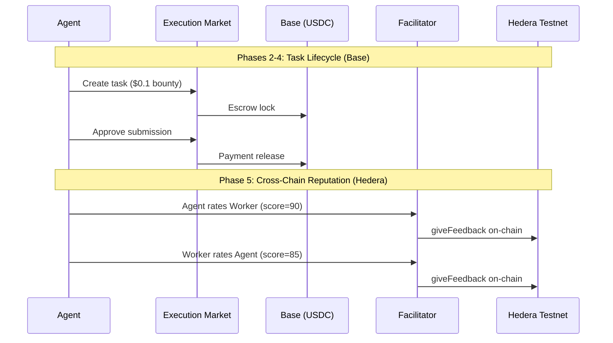

# Golden Flow Hedera Report -- Cross-Chain E2E Test

> **Date**: 2026-04-05 05:37 UTC
> **Payment Chain**: Base Mainnet (chain 8453)
> **Reputation Chain**: Hedera Testnet (chain 296)
> **Facilitator**: https://facilitator.ultravioletadao.xyz
> **Result**: **PASS**

---

## Executive Summary

Full Execution Market lifecycle executed on production:
task created, worker applied, evidence submitted, payment released on **Base** (USDC),
then bidirectional reputation posted on **Hedera Testnet** (ERC-8004).

**Key Result**: Same task, two chains -- payment where the money is (Base),
reputation where the identity lives (Hedera).

---

## Cross-Chain Transaction Summary

| Operation | Chain | TX Hash | Explorer |
|-----------|-------|---------|----------|
| Escrow Lock | Base (8453) | `0xcb24e514506ec4e8a8...` | [BaseScan](https://basescan.org/tx/0xcb24e514506ec4e8a807278a2726c0ba0a93a60e98de30552891c926aedd35a4) |
| Payment Release | Base (8453) | `0x5cc420d03316810bbe...` | [BaseScan](https://basescan.org/tx/0x5cc420d03316810bbee5a5e2d519b7bd9670d881f5ad027b724c0d99a7a029d6) |
| Agent->Worker Rating | Hedera Testnet (296) | `0x25f8703cd37e2554f1...` | [HashScan](https://hashscan.io/testnet/transaction/0x25f8703cd37e2554f1752fc2990bd092cf5d595a9f7071128f22409e7f45045f) |
| Worker->Agent Rating | Hedera Testnet (296) | `0x03f84c9cdfc281c692...` | [HashScan](https://hashscan.io/testnet/transaction/0x03f84c9cdfc281c692ea028a48460d33226e9798d641850fdbb9dcfd5e20b68a) |
| Merit Tip (0.01 HBAR) | Hedera Testnet (296) | `0xb6f329b131bcb939d9...` | [HashScan](https://hashscan.io/testnet/transaction/0xb6f329b131bcb939d914acadcf95bf748d068f04beeace7acf130e685b0b409a) |

---

## Test Configuration

| Parameter | Value |
|-----------|-------|
| Task ID | `655df2a2-c0b0-4639-9425-9c9c40f1e20c` |
| Bounty | $0.1 USDC |
| Worker Net (87%) | $0.0870 USDC |
| Payment Chain | Base Mainnet (chain 8453) |
| Reputation Chain | Hedera Testnet (chain 296) |
| Hedera Agent ID | #100 |
| Facilitator HBAR | 2094.457516 |
| Identity Registry | `0x8004A818BFB912233c491871b3d84c89A494BD9e` |
| Reputation Registry | `0x8004B663056A597Dffe9eCcC1965A193B7388713` |

---

## Flow Diagram



---

## Phase Results

| # | Phase | Status |
|---|-------|--------|
| 1 | Connectivity | **PASS** |
| 2 | Task Creation (Base) | **PASS** |
| 3 | Worker Flow | **PASS** |
| 4 | Approval + Payment (Base) | **PASS** |
| 5 | Reputation (Hedera) | **PASS** |
| 6 | Merit Tip (Hedera HBAR) | **PASS** |
| 7 | HCS Event Log (Hedera Native) | **PASS** |

---

## Reputation After Test

| Metric | Value |
|--------|-------|
| Agent #100 | hedera-testnet |
| Feedback Count | 8 |
| Average Score | 87 |
| Verify | [API](https://facilitator.ultravioletadao.xyz/reputation/hedera-testnet/100) |

---

## On-Chain Evidence

### Base Mainnet (Payment)

| TX | Explorer |
|----|----------|
| Escrow | [0xcb24e514506ec4...](https://basescan.org/tx/0xcb24e514506ec4e8a807278a2726c0ba0a93a60e98de30552891c926aedd35a4) |
| Payment | [0x5cc420d0331681...](https://basescan.org/tx/0x5cc420d03316810bbee5a5e2d519b7bd9670d881f5ad027b724c0d99a7a029d6) |

### Hedera Testnet (Reputation)

| TX | Explorer |
|----|----------|
| Agent->Worker | [0x25f8703cd37e25...](https://hashscan.io/testnet/transaction/0x25f8703cd37e2554f1752fc2990bd092cf5d595a9f7071128f22409e7f45045f) |
| Worker->Agent | [0x03f84c9cdfc281...](https://hashscan.io/testnet/transaction/0x03f84c9cdfc281c692ea028a48460d33226e9798d641850fdbb9dcfd5e20b68a) |

---

## Reproducibility

```bash
# Anyone can verify the Hedera reputation:
curl https://facilitator.ultravioletadao.xyz/reputation/hedera-testnet/100

# Run the full flow (requires wallet keys):
cd hedera
pip install -r requirements.txt
EM_HIRING_AGENT_PRIVATE_KEY=0x... EM_WORKER_PRIVATE_KEY=0x... python golden_flow_hedera.py
```
