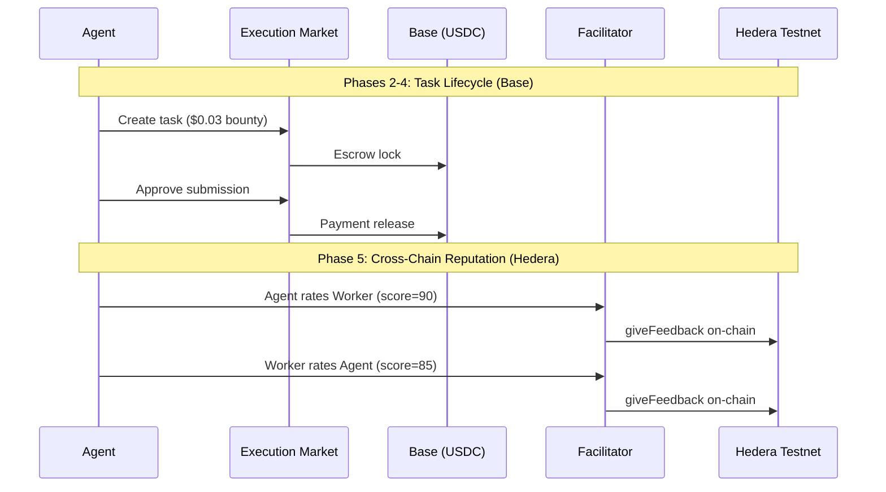

# Golden Flow Hedera Report -- Cross-Chain E2E Test

> **Date**: 2026-04-04 20:42 UTC
> **Payment Chain**: Base Mainnet (chain 8453)
> **Reputation Chain**: Hedera Testnet (chain 296)
> **Facilitator**: https://facilitator.ultravioletadao.xyz
> **Result**: **PASS**

---

## Executive Summary

Full Execution Market lifecycle executed on production:
task created, worker applied, evidence submitted, payment released on **Base** (USDC),
then bidirectional reputation posted on **Hedera Testnet** (ERC-8004).

**Key Result**: Same task, two chains -- payment where the money is (Base),
reputation where the identity lives (Hedera).

---

## Cross-Chain Transaction Summary

| Operation | Chain | TX Hash | Explorer |
|-----------|-------|---------|----------|
| Escrow Lock | Base (8453) | `0x98fc338221502fb937...` | [BaseScan](https://basescan.org/tx/0x98fc338221502fb937cf9fdfe26248a9a0700580ef4b690b6853c58da3efeb84) |
| Payment Release | Base (8453) | `0x29f1aea3cbee79996e...` | [BaseScan](https://basescan.org/tx/0x29f1aea3cbee79996eab4c632d1982c0578820556fc348bdb5d1a012c502e95a) |
| Agent->Worker Rating | Hedera Testnet (296) | `0x26464dbd022d6829e1...` | [HashScan](https://hashscan.io/testnet/transaction/0x26464dbd022d6829e107ca3a52b04720b59c5aa9d7f6a7394a3b50948acdb1c6) |
| Worker->Agent Rating | Hedera Testnet (296) | `0x300c402eb1051b8995...` | [HashScan](https://hashscan.io/testnet/transaction/0x300c402eb1051b8995fee783b23b3b74e68863ad3ac7c958ccccfea30cdd658e) |
| Merit Tip (0.01 HBAR) | Hedera Testnet (296) | `0x419d824ca972ddae63...` | [HashScan](https://hashscan.io/testnet/transaction/0x419d824ca972ddae63b6da1597bad2c4c52172fa1339897d1e2a95c36e9a3321) |

---

## Test Configuration

| Parameter | Value |
|-----------|-------|
| Task ID | `d25a38fa-d296-4679-aa5b-f7b945b61a37` |
| Bounty | $0.03 USDC |
| Worker Net (87%) | $0.0261 USDC |
| Payment Chain | Base Mainnet (chain 8453) |
| Reputation Chain | Hedera Testnet (chain 296) |
| Hedera Agent ID | #99 |
| Facilitator HBAR | 2096.012619 |
| Identity Registry | `0x8004A818BFB912233c491871b3d84c89A494BD9e` |
| Reputation Registry | `0x8004B663056A597Dffe9eCcC1965A193B7388713` |

---

## Flow Diagram



---

## Phase Results

| # | Phase | Status |
|---|-------|--------|
| 1 | Connectivity | **PASS** |
| 2 | Task Creation (Base) | **PASS** |
| 3 | Worker Flow | **PASS** |
| 4 | Approval + Payment (Base) | **PASS** |
| 5 | Reputation (Hedera) | **PASS** |
| 6 | Merit Tip (Hedera HBAR) | **PASS** |
| 7 | HCS Event Log (Hedera Native) | **PASS** |

---

## Reputation After Test

| Metric | Value |
|--------|-------|
| Agent #99 | hedera-testnet |
| Feedback Count | 29 |
| Average Score | 87 |
| Verify | [API](https://facilitator.ultravioletadao.xyz/reputation/hedera-testnet/99) |

---

## On-Chain Evidence

### Base Mainnet (Payment)

| TX | Explorer |
|----|----------|
| Escrow | [0x98fc338221502f...](https://basescan.org/tx/0x98fc338221502fb937cf9fdfe26248a9a0700580ef4b690b6853c58da3efeb84) |
| Payment | [0x29f1aea3cbee79...](https://basescan.org/tx/0x29f1aea3cbee79996eab4c632d1982c0578820556fc348bdb5d1a012c502e95a) |

### Hedera Testnet (Reputation)

| TX | Explorer |
|----|----------|
| Agent->Worker | [0x26464dbd022d68...](https://hashscan.io/testnet/transaction/0x26464dbd022d6829e107ca3a52b04720b59c5aa9d7f6a7394a3b50948acdb1c6) |
| Worker->Agent | [0x300c402eb1051b...](https://hashscan.io/testnet/transaction/0x300c402eb1051b8995fee783b23b3b74e68863ad3ac7c958ccccfea30cdd658e) |

---

## Reproducibility

```bash
# Anyone can verify the Hedera reputation:
curl https://facilitator.ultravioletadao.xyz/reputation/hedera-testnet/99

# Run the full flow (requires wallet keys):
cd hedera
pip install -r requirements.txt
EM_HIRING_AGENT_PRIVATE_KEY=0x... EM_WORKER_PRIVATE_KEY=0x... python golden_flow_hedera.py
```
