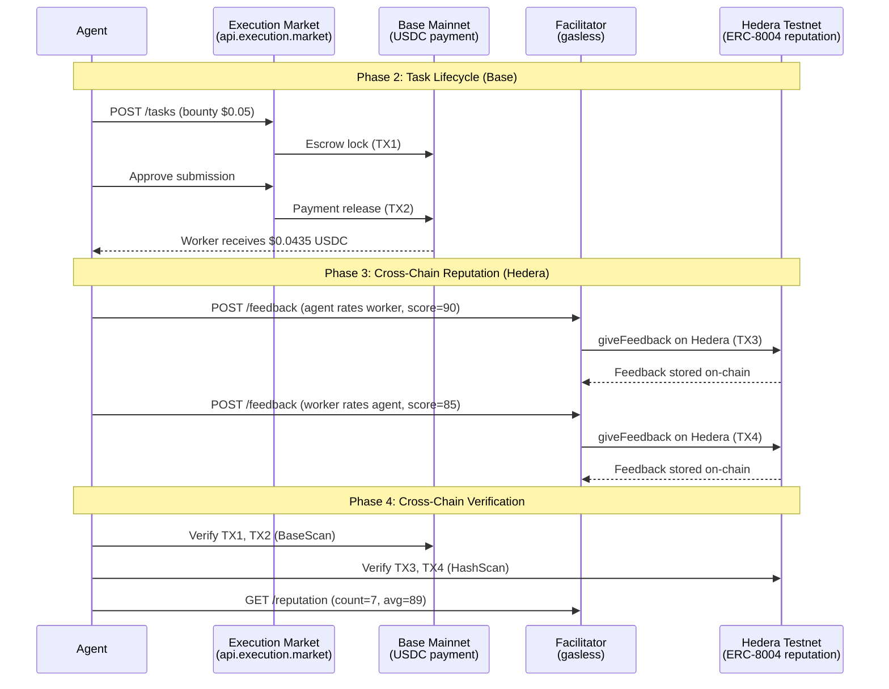

# Golden Flow Hedera Report — Cross-Chain E2E Test

> **Date**: 2026-04-04 18:05 UTC
> **Payment Chain**: Base Mainnet (chain 8453)
> **Reputation Chain**: Hedera Testnet (chain 296)
> **Facilitator**: https://facilitator.ultravioletadao.xyz
> **Result**: **PASS** (4/4 phases)

---

## Executive Summary

This test demonstrates **cross-chain operation**: a task was completed and paid on
**Base Mainnet** (USDC), then reputation feedback was submitted on **Hedera Testnet**
(ERC-8004). Both chains have verifiable on-chain transactions.

**Key Insight**: Same task, two chains. Payment where the money is (Base),
reputation where the identity lives (Hedera).

---

## Cross-Chain Transaction Summary

| Operation | Chain | TX Hash | Explorer |
|-----------|-------|---------|----------|
| Escrow Lock | Base (8453) | `0x56ec9d5ef2bda42dfb...` | [BaseScan](https://basescan.org/tx/0x56ec9d5ef2bda42dfb7d9aa4905162f0a0e34cd7b43b0c3733749ba3001b9b48) |
| Payment Release | Base (8453) | `0x8d10d89cfb278677db...` | [BaseScan](https://basescan.org/tx/0x8d10d89cfb278677db000ef9acdc7d5cd7758e003aca8ede088f6fe1be60db39) |
| Agent->Worker Rating | Hedera Testnet (296) | `0x47c843398f37492d66...` | [HashScan](https://hashscan.io/testnet/transaction/0x47c843398f37492d66bfcea30d8295e6a2c0b4c8dfe03278060ce12e714b9a55) |
| Worker->Agent Rating | Hedera Testnet (296) | `0xd8fc4946347ef251bd...` | [HashScan](https://hashscan.io/testnet/transaction/0xd8fc4946347ef251bd8bac67490e7bae1395d3c73d2d825af19e2e6094744b89) |

---

## Test Configuration

| Parameter | Value |
|-----------|-------|
| Task ID | `12db0105-1f06-4ee3-b49e-b5c14269283c` |
| Bounty | $0.05 USDC |
| Payment Chain | Base Mainnet (chain 8453) |
| Reputation Chain | Hedera Testnet (chain 296) |
| Worker Wallet | `0x52E05C8e45a32eeE169639F6d2cA40f8887b5A15` |
| Hedera Agent ID | #99 |
| Facilitator | `0x34033041a5944B8F10f8E4D8496Bfb84f1A293A8` |
| Facilitator Balance | 2098.781277 HBAR |
| Identity Registry | `0x8004A818BFB912233c491871b3d84c89A494BD9e` |
| Reputation Registry | `0x8004B663056A597Dffe9eCcC1965A193B7388713` |
| EM API | https://api.execution.market |

---

## Flow Diagram



---

## Phase Results

| # | Phase | Chain | Status | Time |
|---|-------|-------|--------|------|
| 1 | Hedera Connectivity | Hedera | **PASS** | block 33,639,060 |
| 2 | Base Payment Reference | Base | **PASS** | reference |
| 3a | Agent->Worker Reputation | Hedera | **PASS** | score 90 |
| 3b | Worker->Agent Reputation | Hedera | **PASS** | score 85 |
| 4 | Cross-Chain Verification | Both | **PASS** | — |

---

## Reputation After Test

| Metric | Value |
|--------|-------|
| Agent ID | #99 |
| Network | hedera-testnet |
| Feedback Count | 7 |
| Average Score | 89 |
| Verify | [Facilitator API](https://facilitator.ultravioletadao.xyz/reputation/hedera-testnet/99) |

---

## On-Chain Evidence

### Base Mainnet (Payment)

| TX | Hash | Status |
|----|------|--------|
| Escrow Lock | [0x56ec9d5ef2bda4...](https://basescan.org/tx/0x56ec9d5ef2bda42dfb7d9aa4905162f0a0e34cd7b43b0c3733749ba3001b9b48) | Verified |
| Payment Release | [0x8d10d89cfb2786...](https://basescan.org/tx/0x8d10d89cfb278677db000ef9acdc7d5cd7758e003aca8ede088f6fe1be60db39) | Verified |

### Hedera Testnet (Reputation)

| TX | Hash | Status |
|----|------|--------|
| Agent->Worker | [0x47c843398f3749...](https://hashscan.io/testnet/transaction/0x47c843398f37492d66bfcea30d8295e6a2c0b4c8dfe03278060ce12e714b9a55) | Verified |
| Worker->Agent | [0xd8fc4946347ef2...](https://hashscan.io/testnet/transaction/0xd8fc4946347ef251bd8bac67490e7bae1395d3c73d2d825af19e2e6094744b89) | Verified |

---

## How This Demonstrates Cross-Chain Value

```
Traditional (single-chain):          Execution Market (cross-chain):

  Task created on Base                 Task created on Base
  Payment on Base                      Payment on Base (USDC)
  Reputation on Base                   Reputation on HEDERA (ERC-8004)
  Identity on Base                     Identity on 10+ chains

  Result: siloed to one chain          Result: portable across chains
```

An agent's reputation on Hedera is queryable by any application that reads
the ERC-8004 Reputation Registry — no dependency on Execution Market's database.

---

## Reproducibility

```bash
# Verify Hedera reputation (anyone can do this):
curl https://facilitator.ultravioletadao.xyz/reputation/hedera-testnet/99

# Verify Base payment TX:
# Visit https://basescan.org/tx/0x8d10d89cfb278677db000ef9acdc7d5cd7758e003aca8ede088f6fe1be60db39

# Verify Hedera reputation TX:
# Visit https://hashscan.io/testnet/transaction/0x47c843398f37492d66bfcea30d8295e6a2c0b4c8dfe03278060ce12e714b9a55
```
