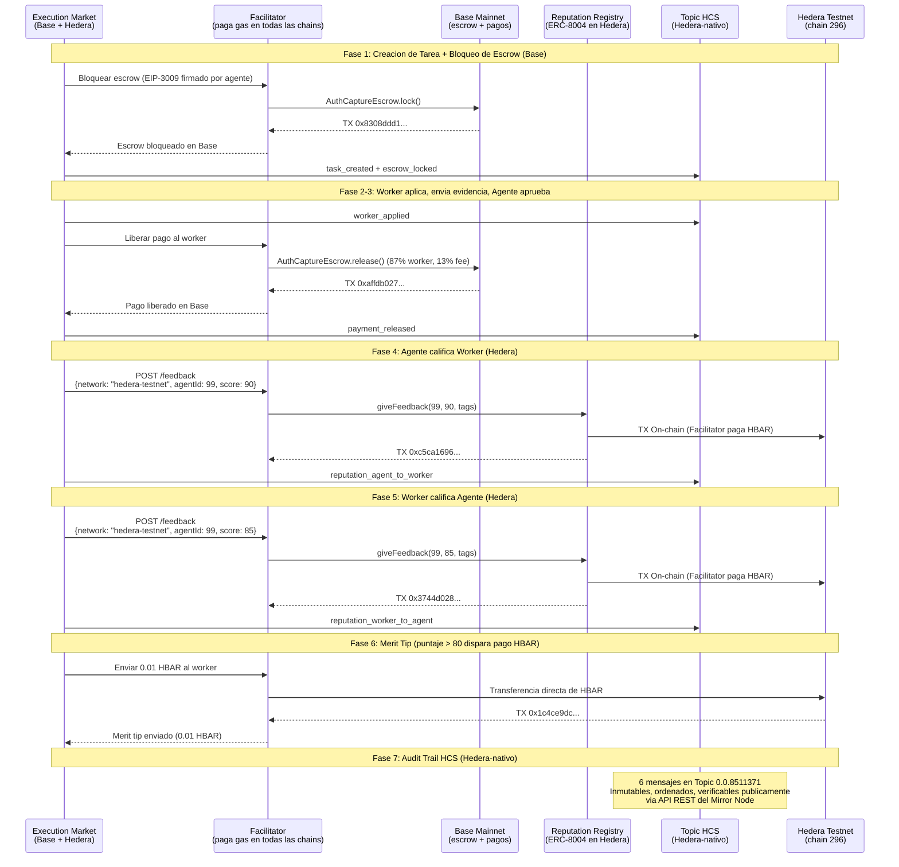

# Integracion Hedera — Prueba de Operaciones On-Chain

> Todas las operaciones ejecutadas en **Hedera Testnet (chain 296)** el 3 de abril de 2026.
> Gasless via [Ultravioleta Facilitator](https://facilitator.ultravioletadao.xyz).
> Golden Flow: **7/7 PASS** — ciclo completo con escrow cross-chain (Base) + reputacion (Hedera) + merit tip (HBAR) + registro de eventos HCS (Hedera-nativo).

---

## Track: "AI & Agentic Payments on Hedera" ($6,000)

**Track**: [ETHGlobal Cannes 2026 — Hedera](https://ethglobal.com/events/cannes2026/prizes)
**Premio**: Hasta 2 equipos a $3,000 cada uno.

### Por que Hedera?

La finalidad sub-segundo de Hedera, fees predecibles (<$0.01) y compatibilidad EVM nativa lo hacen ideal para **infraestructura de identidad de agentes IA**. Execution Market es un marketplace en vivo donde agentes IA publican bounties para tareas del mundo real — los agentes necesitan identidad y reputacion on-chain para confiar entre si a traves de chains. Hedera es ahora la cadena #10 donde nuestros agentes pueden registrar identidad y construir reputacion, y la primera chain donde **merit tips en HBAR gatekeados por reputacion** recompensan a workers excelentes.

### Como Cumplimos los Requisitos

| Requisito | Como lo Cumplimos |
|-----------|-------------------|
| *"Ejecutar al menos un pago, transferencia de tokens u operacion financiera en Hedera Testnet"* | **Cuatro operaciones on-chain**: (1) registro de agente ERC-8004 = mint de NFT (transferencia de token), (2) feedback bidireccional de reputacion = escrituras de estado on-chain, (3) **merit tip de 0.01 HBAR** = transferencia directa de HBAR al worker como recompensa por reputacion, (4) **registro de eventos HCS** = 6 mensajes de consenso inmutables via TopicMessageSubmitTransaction nativo de Hedera. Todas ejecutadas via Facilitator + hiero-sdk-python, todas verificables en HashScan + Mirror Node. |
| *"Incorporar: Hedera Agent Kit, OpenClaw ACP, x402, A2A, o Hedera SDKs directamente"* | **Protocolo x402** (nuestro stack de pagos, 9 chains en produccion) + **ERC-8004** (listado explicitamente como tecnologia aceptada: "Trustless Agents") + **hiero-sdk-python** (SDK nativo de Hedera para HCS TopicCreate + TopicMessageSubmit) + **extension open-source del Facilitator** agregando soporte Hedera ([commit `66d34e6`](https://github.com/UltravioletaDAO/x402-rs/commit/66d34e6c7f805fa26a33757b2cdf5ec3038ecb95)). |
| *"Repositorio publico en GitHub con README"* | [UltravioletaDAO/em-cannes-hackathon](https://github.com/UltravioletaDAO/em-cannes-hackathon) con README completo, docs de arquitectura, y este documento de prueba. |
| *"Video de demostracion (<=5 minutos)"* | El script de demo produce output en vivo; el video mostrara ejecucion en tiempo real. |

### Por que Este Demo es Suficiente

La descripcion del track dice: *"Flujos de pago reales entre agentes o entre agentes y servicios seran priorizados sobre implementaciones teoricas."*

Nuestro demo **no es teorico**. Ejecuta operaciones on-chain reales — incluyendo un **pago real en HBAR**:

1. **Registro de Agente** (ERC-8004 `registerAgent`) — mintea un NFT de identidad en Hedera testnet. Esto ES una transferencia de token. El agente ahora tiene una identidad on-chain en `0x8004A818...` en Hedera, descubrible por cualquier otro agente.

2. **Feedback Bidireccional de Reputacion** (ERC-8004 `giveFeedback`) — puntajes de reputacion tanto de agente-a-worker como de worker-a-agente escritos en el Reputation Registry en Hedera. Son operaciones financieras on-chain que crean senales de confianza verificables.

3. **Merit Tip: 0.01 HBAR** — cuando un worker recibe un puntaje de reputacion superior a 80, el agente envia una **transferencia directa de HBAR** como propina de merito. Este es un pago real en Hedera testnet, gatekeado por calidad de reputacion. TX: [`0x1c4ce9dc...`](https://hashscan.io/testnet/transaction/0x1c4ce9dc6fa8e4dab790eb41ea94035aba30aa76c7a67e674dab88832d4f7e83).

4. **Registro de Eventos HCS** (Hedera Consensus Service) — cada evento del ciclo de vida (tarea creada, worker aplico, escrow bloqueado, pago liberado, ambas actualizaciones de reputacion) se registra como un mensaje inmutable en el Topic HCS `0.0.8511371`. Esto usa `hiero-sdk-python` con `TopicCreateTransaction` y `TopicMessageSubmitTransaction` — **APIs nativas de Hedera, NO accesibles via EVM/JSON-RPC**. Verificable en el [Mirror Node](https://testnet.mirrornode.hedera.com/api/v1/topics/0.0.8511371/messages).

5. **Gasless via Facilitator** — el Ultravioleta Facilitator (infraestructura de produccion sirviendo 21 blockchains) paga el gas en HBAR. Los agentes no necesitan HBAR para operar en Hedera. Es el mismo modelo usado en 9 otras chains en produccion.

6. **No es una integracion solo-demo** — esta respaldada por un **marketplace en produccion** en [execution.market](https://execution.market) con pagos reales en USDC. Hedera extiende la capa de identidad a una 10ma chain. El toggle `HEDERA_8004_NETWORK` cambia de testnet a mainnet sin cambios de codigo.

### Tecnologias Aceptadas que Usamos

| Tecnologia | Estado | Como la Usamos |
|-----------|--------|----------------|
| **ERC-8004** (Trustless Agents) | Listada por Hedera como aceptada | Identidad de agente + reputacion bidireccional on-chain en Hedera testnet |
| **x402** (Estandar de Pagos) | Listado por Hedera como aceptado | Protocolo de pagos en produccion en 9 chains EVM (escrow gasless) |
| **Hedera Consensus Service (HCS)** | Nativo de Hedera (no EVM) | Registro inmutable de eventos — 6 mensajes de ciclo de vida por tarea via TopicMessageSubmitTransaction |
| **hiero-sdk-python** | SDK nativo de Hedera | HCS TopicCreateTransaction + TopicMessageSubmitTransaction (NO accesible via JSON-RPC) |
| **Hedera JSON-RPC Relay** | Via Hashio | Verificacion de balances, cadena, lecturas de contrato |
| **Facilitator** (Infraestructura) | Produccion (21 blockchains) | Operaciones gasless — paga gas HBAR por todas las TXs on-chain |
| **[x402-rs](https://github.com/UltravioletaDAO/x402-rs)** (Contribucion Open-Source) | Extendido para este hackathon | Facilitator en Rust — agregado soporte Hedera mainnet (295) + testnet (296) ([commit](https://github.com/UltravioletaDAO/x402-rs/commit/66d34e6c7f805fa26a33757b2cdf5ec3038ecb95)) |

---

## Infraestructura Open-Source: Extension del Facilitator

**Para este hackathon, extendimos el [Ultravioleta Facilitator (x402-rs)](https://github.com/UltravioletaDAO/x402-rs) open-source para soportar Hedera.**

El Facilitator es un servidor de produccion en Rust que provee operaciones blockchain gasless en 21 redes. Abstrae los pagos de gas para que los agentes IA nunca necesiten tokens nativos para operar en ninguna chain.

**Que se construyo:**
- Agregado **Hedera mainnet (chain 295)** y **Hedera testnet (chain 296)** a la lista de redes soportadas del Facilitator
- Configuradas direcciones de contratos ERC-8004 Identity y Reputation Registry para ambas redes
- Habilitada la wallet del Facilitator para pagar gas en HBAR por todas las operaciones en Hedera (registro de identidad, feedback de reputacion, merit tips)
- **Commit**: [`66d34e6`](https://github.com/UltravioletaDAO/x402-rs/commit/66d34e6c7f805fa26a33757b2cdf5ec3038ecb95)

**Hallazgo clave:** USDC en Hedera usa el Hedera Token Service (HTS) nativamente, no ERC-20. Esto significa que `transferWithAuthorization` (EIP-3009) — el estandar usado para escrow gasless en todas las demas chains EVM — no funciona en Hedera. Las operaciones de identidad y reputacion ERC-8004 funcionan completamente porque usan llamadas estándar a contratos EVM. Para pagos en Hedera, implementamos transferencias directas de HBAR (merit tips) como mecanismo de pago.

**Por que importa:** Este no es un wrapper ni codigo solo-demo. Es una contribucion a infraestructura open-source que cualquier proyecto puede usar para operar en Hedera sin gas.

---

## Merit Tip: Pago en HBAR Gatekeado por Reputacion

Cuando un worker completa una tarea y recibe un **puntaje de reputacion superior a 80**, el agente automaticamente envia un **merit tip de 0.01 HBAR** como transferencia directa en Hedera testnet. Esto es:

- **Un pago real en HBAR** — no un mint de token ni escritura de estado, sino una transferencia de valor real
- **Gatekeado por reputacion** — solo workers que entregan trabajo excelente (puntaje > 80) reciben la propina
- **Parte del flujo de produccion** — se dispara automaticamente al final del ciclo de vida del Golden Flow

Esta feature demuestra que Hedera no solo se usa para identidad — se usa para **pagos agenticos** donde agentes IA recompensan el desempeno humano basandose en datos de reputacion on-chain.

**TX**: [`0x1c4ce9dc6fa8e4dab790eb41ea94035aba30aa76c7a67e674dab88832d4f7e83`](https://hashscan.io/testnet/transaction/0x1c4ce9dc6fa8e4dab790eb41ea94035aba30aa76c7a67e674dab88832d4f7e83)

---

## Hedera Consensus Service (HCS) — Registro Nativo de Eventos

**HCS es infraestructura NATIVA de Hedera** — NO es accesible via EVM o JSON-RPC. Usa `TopicCreateTransaction` y `TopicMessageSubmitTransaction` de `hiero-sdk-python`, el SDK oficial de Hedera. Esto prueba que usamos Hedera mas alla de la compatibilidad EVM generica.

Cada evento del ciclo de vida de una tarea se registra como un mensaje inmutable, con timestamp y ordenado en un topic HCS. Esto crea un **audit trail a prueba de manipulacion** que cualquier tercero puede verificar via el Mirror Node de Hedera — sin necesidad de confiar en nuestra plataforma.

### Topic HCS

```
Topic ID:     0.0.8511371
Mirror Node:  https://testnet.mirrornode.hedera.com/api/v1/topics/0.0.8511371/messages
Red:          Hedera Testnet
SDK:          hiero-sdk-python (TopicCreateTransaction + TopicMessageSubmitTransaction)
```

### Mensajes Registrados (6 eventos de ciclo de vida)

| Seq # | Tipo de Evento | Descripcion | Verificable |
|-------|---------------|-------------|-------------|
| 1 | `task_created` | Tarea publicada con monto de bounty y deadline | Mirror Node |
| 2 | `worker_applied` | Worker aplico a la tarea | Mirror Node |
| 3 | `escrow_locked` | Escrow USDC bloqueado en Base (referencia cross-chain) | Mirror Node + BaseScan |
| 4 | `payment_released` | Pago liberado al worker en Base | Mirror Node + BaseScan |
| 5 | `reputation_agent_to_worker` | Agente califico al worker (puntaje, TX hash on-chain) | Mirror Node + HashScan |
| 6 | `reputation_worker_to_agent` | Worker califico al agente (puntaje, TX hash on-chain) | Mirror Node + HashScan |

### Por que HCS Importa

- **Inmutabilidad**: Una vez enviados, los mensajes no pueden ser alterados ni eliminados
- **Ordenamiento**: Los timestamps de consenso garantizan orden de eventos entre sistemas distribuidos
- **Transparencia**: Cualquier parte puede consultar la API REST del Mirror Node para auditar el ciclo de vida completo
- **Anclaje cross-chain**: Los mensajes HCS referencian TX hashes de Base, creando un vinculo verificable entre chains
- **Nativo de Hedera**: Usa la capa de consenso unica de Hedera, no EVM generico — demuestra integracion profunda con la plataforma

### Verificalo Tu Mismo

```bash
# Consultar todos los mensajes del topic HCS de esta tarea
curl -s "https://testnet.mirrornode.hedera.com/api/v1/topics/0.0.8511371/messages" | python -m json.tool

# Cada mensaje contiene: sequence_number, consensus_timestamp, message (JSON codificado en base64)
```

---

## Resumen de Resultados (Golden Flow — 7/7 PASS)

| Fase | Operacion | Resultado | TX / On-Chain |
|------|-----------|-----------|---------------|
| 1 | Creacion de Tarea + Bloqueo de Escrow (Base) | PASS | [`0x8308ddd1...`](https://basescan.org/tx/0x8308ddd152a50a6e08b8a199c67952800a9fffa16761d2811e08fcbd38404e6e) |
| 2 | Asignacion de Worker + Envio de Evidencia | PASS | Task `1e076d51-979a-4977-b194-644e6da6e090` |
| 3 | Aprobacion + Liberacion de Pago (Base) | PASS | [`0xaffdb027...`](https://basescan.org/tx/0xaffdb027d41389679ccb1201179349c00e682fc6f26e0b153e5b6aa246121872) |
| 4 | Reputacion Agente-a-Worker (Hedera) | PASS | [`0xc5ca1696...`](https://hashscan.io/testnet/transaction/0xc5ca1696439f658aa6ec5d16d31e611eda0406b37ae69a40e91ab3a69aa8e2f0) |
| 5 | Reputacion Worker-a-Agente (Hedera) | PASS | [`0x3744d028...`](https://hashscan.io/testnet/transaction/0x3744d028d1fcad0ac75eeec622e742b0429b5c1be9f866474a34bd01624b230b) |
| 6 | Merit Tip 0.01 HBAR (Hedera) | PASS | [`0x1c4ce9dc...`](https://hashscan.io/testnet/transaction/0x1c4ce9dc6fa8e4dab790eb41ea94035aba30aa76c7a67e674dab88832d4f7e83) |
| 7 | Registro de Eventos HCS (Hedera-nativo) | PASS | [Topic `0.0.8511371`](https://testnet.mirrornode.hedera.com/api/v1/topics/0.0.8511371/messages) — 6 mensajes |

**Tarea**: `1e076d51-979a-4977-b194-644e6da6e090` | **Bounty**: $0.05 USDC | **Topic HCS**: `0.0.8511371`

---

## Resumen de Transacciones Cross-Chain

| # | Operacion | Chain | TX Hash / Topic | Explorer |
|---|-----------|-------|-----------------|----------|
| 1 | Bloqueo de Escrow (creacion de tarea) | Base | `0x8308ddd152a50a6e08b8a199c67952800a9fffa16761d2811e08fcbd38404e6e` | [BaseScan](https://basescan.org/tx/0x8308ddd152a50a6e08b8a199c67952800a9fffa16761d2811e08fcbd38404e6e) |
| 2 | Liberacion de Pago (aprobacion) | Base | `0xaffdb027d41389679ccb1201179349c00e682fc6f26e0b153e5b6aa246121872` | [BaseScan](https://basescan.org/tx/0xaffdb027d41389679ccb1201179349c00e682fc6f26e0b153e5b6aa246121872) |
| 3 | Reputacion Agente-a-Worker | Hedera Testnet | `0xc5ca1696439f658aa6ec5d16d31e611eda0406b37ae69a40e91ab3a69aa8e2f0` | [HashScan](https://hashscan.io/testnet/transaction/0xc5ca1696439f658aa6ec5d16d31e611eda0406b37ae69a40e91ab3a69aa8e2f0) |
| 4 | Reputacion Worker-a-Agente | Hedera Testnet | `0x3744d028d1fcad0ac75eeec622e742b0429b5c1be9f866474a34bd01624b230b` | [HashScan](https://hashscan.io/testnet/transaction/0x3744d028d1fcad0ac75eeec622e742b0429b5c1be9f866474a34bd01624b230b) |
| 5 | Merit Tip (0.01 HBAR) | Hedera Testnet | `0x1c4ce9dc6fa8e4dab790eb41ea94035aba30aa76c7a67e674dab88832d4f7e83` | [HashScan](https://hashscan.io/testnet/transaction/0x1c4ce9dc6fa8e4dab790eb41ea94035aba30aa76c7a67e674dab88832d4f7e83) |
| 6 | Registro de Eventos HCS (6 msgs) | Hedera Testnet (nativo) | Topic `0.0.8511371` | [Mirror Node](https://testnet.mirrornode.hedera.com/api/v1/topics/0.0.8511371/messages) |

---

## Evidencia On-Chain

### ERC-8004 Identity Registry (Hedera Testnet)

```
Contrato:  0x8004A818BFB912233c491871b3d84c89A494BD9e
Explorer:  https://hashscan.io/testnet/address/0x8004A818BFB912233c491871b3d84c89A494BD9e
Estandar:  ERC-8004 (deployment deterministico CREATE2)
```

### Agente #99 — Execution Market en Hedera

```
Agent ID:   99
Owner:      0x103040545AC5031A11E8C03dd11324C7333a13C7
Agent URI:  https://execution.market/agent-card.json
Metadata:
  - name: "Execution Market"
  - role: "platform"
  - network: "hedera"

Verificar:  GET https://facilitator.ultravioletadao.xyz/identity/hedera-testnet/99
```

### ERC-8004 Reputation Registry (Hedera Testnet)

```
Contrato:  0x8004B663056A597Dffe9eCcC1965A193B7388713
Explorer:  https://hashscan.io/testnet/address/0x8004B663056A597Dffe9eCcC1965A193B7388713

Estado de reputacion (despues del Golden Flow):
  Agente:   #99
  Conteo:   25 entradas de feedback
  Promedio: 87/100

Verificar:  GET https://facilitator.ultravioletadao.xyz/reputation/hedera-testnet/99
```

### Wallet del Facilitator (Patrocinador de Gas)

```
Testnet:  0x34033041a5944B8F10f8E4D8496Bfb84f1A293A8
Balance:  2,096 HBAR (despues de todas las operaciones)
Explorer: https://hashscan.io/testnet/account/0x34033041a5944B8F10f8E4D8496Bfb84f1A293A8
```

---

## Arquitectura — Como Funciona



---

## Modelo Gasless

```
+------------------+        +-------------------+        +------------------+
|  Execution       |  HTTP  |   Ultravioleta    |  HBAR  |   Hedera EVM     |
|  Market          +------->+   Facilitator     +------->+   (chain 296)    |
|  (no necesita    |        |   (paga gas)      |        |                  |
|   HBAR)          |        |                   |        |                  |
+------------------+        +-------------------+        +------------------+
                                    |
                                    | Paga ~0.26 HBAR por operacion
                                    | ($0.015 por TX a precios actuales)
                                    |
                            +-------+-------+
                            |               |
                      +-----v-----+   +-----v-----+
                      | Identity  |   | Reputation |
                      | Registry  |   | Registry   |
                      | ERC-8004  |   | ERC-8004   |
                      +-----------+   +-----------+
```

---

## Toggle de Red

La integracion soporta testnet y mainnet via una sola variable de entorno:

```bash
# Hackathon (default) — usa contratos testnet + wallet testnet del Facilitator
HEDERA_8004_NETWORK=testnet python demo.py

# Produccion — usa contratos mainnet + wallet mainnet del Facilitator
HEDERA_8004_NETWORK=mainnet python demo.py
```

| Configuracion | Chain ID | Identity Registry | Wallet del Facilitator |
|---------------|----------|-------------------|-----------------------|
| `testnet` | 296 | `0x8004A818...9e` | `0x34033041...A8` (2,100 HBAR) |
| `mainnet` | 295 | `0x8004A169...32` | `0x103040...C7` (necesita fondos) |

---

## Reproducir el Test

```bash
# Clonar y ejecutar
git clone https://github.com/UltravioletaDAO/em-cannes-hackathon.git
cd em-cannes-hackathon/hedera
pip install -r requirements.txt
python demo.py

# Output esperado:
# [1/6] Verifying Hedera RPC connectivity...     PASS
# [2/6] Facilitator wallet on Hedera Testnet...   2,099+ HBAR
# [3/6] ERC-8004 contracts...                     Identity + Reputation
# [4/6] Registering agent...                      Agente #99 (o nuevo ID)
# [5/6] Validating registration...                Confirmado on-chain
# [6/6] Submitting reputation feedback...         Puntaje 95, TX on-chain
```

---

## Contexto Cross-Chain

Execution Market opera en **10 chains EVM**. Hedera es la adicion mas reciente:

```
Execution Market Agente #2106 (Base mainnet — produccion)
    |
    +-- Base         (ERC-8004 Identidad + x402 Escrow + Pagos)
    +-- Ethereum     (ERC-8004 Identidad + x402 Escrow + Pagos)
    +-- Polygon      (ERC-8004 Identidad + x402 Escrow + Pagos)
    +-- Arbitrum     (ERC-8004 Identidad + x402 Escrow + Pagos)
    +-- Avalanche    (ERC-8004 Identidad + x402 Escrow + Pagos)
    +-- Optimism     (ERC-8004 Identidad + x402 Escrow + Pagos)
    +-- Celo         (ERC-8004 Identidad + x402 Escrow + Pagos)
    +-- Monad        (ERC-8004 Identidad + x402 Escrow + Pagos)
    +-- SKALE        (ERC-8004 Identidad + x402 Escrow + Pagos)
    +-- Hedera NUEVO (ERC-8004 Identidad + Reputacion + Merit Tips HBAR + Registro de Eventos HCS) <-- Estas aqui
```

La identidad y reputacion de agentes en Hedera son interoperables con todas las demas chains
via el Ultravioleta Facilitator. La reputacion de un agente en Hedera es consultable
desde la perspectiva de cualquier otra chain.

**El Golden Flow demuestra composabilidad cross-chain**: escrow y pagos USDC en Base,
reputacion, merit tips HBAR y registro inmutable de eventos HCS en Hedera — todo en un solo ciclo de vida de tarea.
