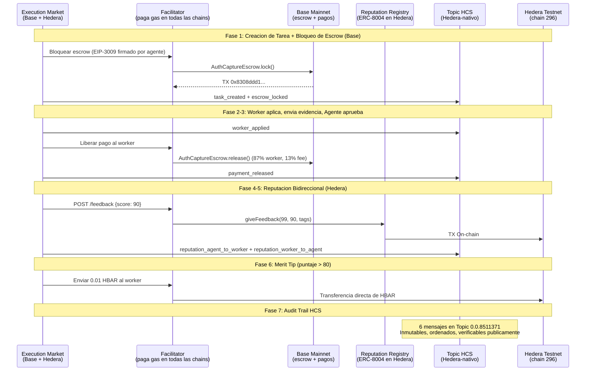

# Integracion Hedera — Prueba de Operaciones On-Chain

> Todas las operaciones en **Hedera Testnet (chain 296)**, 3 de abril de 2026.
> Gasless via [Ultravioleta Facilitator](https://facilitator.ultravioletadao.xyz).
> Golden Flow: **7/7 PASS** — escrow (Base) + reputacion + merit tip HBAR + registro HCS (Hedera).

---

## Track: "AI & Agentic Payments on Hedera" ($6,000)

**Premio**: Hasta 2 equipos a $3,000 cada uno. [ETHGlobal Cannes 2026](https://ethglobal.com/events/cannes2026/prizes)

| Requisito | Evidencia |
|-----------|-----------|
| *"Ejecutar al menos un pago/transferencia en Hedera Testnet"* | 4 operaciones on-chain: registro ERC-8004 (mint NFT), reputacion bidireccional, merit tip 0.01 HBAR, 6 mensajes HCS |
| *"Usar Hedera Agent Kit, x402, o Hedera SDKs"* | x402 (9 chains en produccion) + ERC-8004 + hiero-sdk-python (HCS) + extension del Facilitator ([commit `66d34e6`](https://github.com/UltravioletaDAO/x402-rs/commit/66d34e6c7f805fa26a33757b2cdf5ec3038ecb95)) |
| *"GitHub publico con README"* | [UltravioletaDAO/em-cannes-hackathon](https://github.com/UltravioletaDAO/em-cannes-hackathon) |
| *"Video demo (<=5 min)"* | Script de demo produce output en vivo |

### Tecnologias Aceptadas que Usamos

| Tecnologia | Uso |
|-----------|-----|
| **ERC-8004** (Trustless Agents) | Identidad on-chain + reputacion bidireccional |
| **x402** (Estandar de Pagos) | Pagos en produccion en 9 chains EVM |
| **HCS** (Hedera Consensus Service) | 6 mensajes inmutables via TopicMessageSubmitTransaction |
| **hiero-sdk-python** | HCS TopicCreate + TopicMessageSubmit (NO accesible via JSON-RPC) |
| **[x402-rs](https://github.com/UltravioletaDAO/x402-rs)** | Facilitator Rust extendido para Hedera mainnet (295) + testnet (296) |

---

## Extension Open-Source del Facilitator

Extendimos [x402-rs](https://github.com/UltravioletaDAO/x402-rs) (servidor Rust en produccion, 21 redes) para soportar Hedera. **Commit**: [`66d34e6`](https://github.com/UltravioletaDAO/x402-rs/commit/66d34e6c7f805fa26a33757b2cdf5ec3038ecb95)

- Agregado Hedera mainnet (295) + testnet (296) con direcciones de contratos ERC-8004
- Wallet del Facilitator paga gas HBAR (agentes no necesitan HBAR)
- USDC en Hedera usa HTS nativamente (no ERC-20), EIP-3009 no funciona. ERC-8004 funciona via llamadas EVM estandar. Para pagos, usamos transferencias directas de HBAR (merit tips).

Contribucion a infraestructura open-source, no codigo solo-demo.

---

## Merit Tip: Pago HBAR Gatekeado por Reputacion

Workers con puntaje > 80 reciben **0.01 HBAR** automaticamente. Pago real gatekeado por datos de reputacion on-chain.

**TX**: [`0x1c4ce9dc6fa8e4dab790eb41ea94035aba30aa76c7a67e674dab88832d4f7e83`](https://hashscan.io/testnet/transaction/0x1c4ce9dc6fa8e4dab790eb41ea94035aba30aa76c7a67e674dab88832d4f7e83)

---

## HCS — Registro Nativo de Eventos

**HCS es NATIVO de Hedera** — NO accesible via EVM o JSON-RPC. Usa `TopicCreateTransaction` y `TopicMessageSubmitTransaction` de `hiero-sdk-python`.

```
Topic ID:     0.0.8511371
Mirror Node:  https://testnet.mirrornode.hedera.com/api/v1/topics/0.0.8511371/messages
SDK:          hiero-sdk-python
```

| Seq # | Evento | Verificable |
|-------|--------|-------------|
| 1 | `task_created` — monto bounty, deadline | Mirror Node |
| 2 | `worker_applied` — ID ejecutor | Mirror Node |
| 3 | `escrow_locked` — TX hash de Base (cross-chain) | Mirror Node + BaseScan |
| 4 | `payment_released` — TX hash de Base, monto | Mirror Node + BaseScan |
| 5 | `reputation_agent_to_worker` — puntaje, TX Hedera | Mirror Node + HashScan |
| 6 | `reputation_worker_to_agent` — puntaje, TX Hedera | Mirror Node + HashScan |

Inmutables, con timestamps de consenso, verificables publicamente. Referencias cross-chain vinculan evidencia de pago en Base con audit trail en Hedera.

```bash
curl -s "https://testnet.mirrornode.hedera.com/api/v1/topics/0.0.8511371/messages" | python -m json.tool
```

---

## Resultados Golden Flow (7/7 PASS)

| Fase | Operacion | Resultado | Evidencia |
|------|-----------|-----------|-----------|
| 1 | Bloqueo de Escrow (Base) | PASS | [`0x8308ddd1...`](https://basescan.org/tx/0x8308ddd152a50a6e08b8a199c67952800a9fffa16761d2811e08fcbd38404e6e) |
| 2 | Asignacion de Worker + Evidencia | PASS | Task `1e076d51-979a-4977-b194-644e6da6e090` |
| 3 | Liberacion de Pago (Base) | PASS | [`0xaffdb027...`](https://basescan.org/tx/0xaffdb027d41389679ccb1201179349c00e682fc6f26e0b153e5b6aa246121872) |
| 4 | Reputacion Agente-a-Worker (Hedera) | PASS | [`0xc5ca1696...`](https://hashscan.io/testnet/transaction/0xc5ca1696439f658aa6ec5d16d31e611eda0406b37ae69a40e91ab3a69aa8e2f0) |
| 5 | Reputacion Worker-a-Agente (Hedera) | PASS | [`0x3744d028...`](https://hashscan.io/testnet/transaction/0x3744d028d1fcad0ac75eeec622e742b0429b5c1be9f866474a34bd01624b230b) |
| 6 | Merit Tip 0.01 HBAR (Hedera) | PASS | [`0x1c4ce9dc...`](https://hashscan.io/testnet/transaction/0x1c4ce9dc6fa8e4dab790eb41ea94035aba30aa76c7a67e674dab88832d4f7e83) |
| 7 | Registro HCS (6 msgs) | PASS | [Topic `0.0.8511371`](https://testnet.mirrornode.hedera.com/api/v1/topics/0.0.8511371/messages) |

**Bounty**: $0.05 USDC | **Topic HCS**: `0.0.8511371`

---

## Evidencia On-Chain

### ERC-8004 Identity Registry (Hedera Testnet)

```
Contrato:  0x8004A818BFB912233c491871b3d84c89A494BD9e
Agente #99, Owner: 0x103040545AC5031A11E8C03dd11324C7333a13C7
URI: https://execution.market/agent-card.json
Verificar: GET https://facilitator.ultravioletadao.xyz/identity/hedera-testnet/99
```

### ERC-8004 Reputation Registry (Hedera Testnet)

```
Contrato:  0x8004B663056A597Dffe9eCcC1965A193B7388713
Agente #99: 25 entradas de feedback, promedio 87/100
Verificar: GET https://facilitator.ultravioletadao.xyz/reputation/hedera-testnet/99
```

### Wallet del Facilitator

```
Testnet: 0x34033041a5944B8F10f8E4D8496Bfb84f1A293A8 (2,096 HBAR)
Explorer: https://hashscan.io/testnet/account/0x34033041a5944B8F10f8E4D8496Bfb84f1A293A8
```

---

## Arquitectura



---

## Modelo Gasless

```
+------------------+        +-------------------+        +------------------+
|  Execution       |  HTTP  |   Ultravioleta    |  HBAR  |   Hedera EVM     |
|  Market          +------->+   Facilitator     +------->+   (chain 296)    |
|  (no necesita    |        |   (paga gas)      |        |                  |
|   HBAR)          |        |                   |        |                  |
+------------------+        +-------------------+        +------------------+
                                    |
                            +-------+-------+
                            |               |
                      +-----v-----+   +-----v-----+
                      | Identity  |   | Reputation |
                      | Registry  |   | Registry   |
                      | ERC-8004  |   | ERC-8004   |
                      +-----------+   +-----------+
```

---

## Toggle de Red

```bash
HEDERA_8004_NETWORK=testnet python demo.py   # Hackathon (default)
HEDERA_8004_NETWORK=mainnet python demo.py   # Produccion
```

| Configuracion | Chain ID | Identity Registry | Wallet del Facilitator |
|---------------|----------|-------------------|-----------------------|
| `testnet` | 296 | `0x8004A818...9e` | `0x34033041...A8` (2,100 HBAR) |
| `mainnet` | 295 | `0x8004A169...32` | `0x103040...C7` (necesita fondos) |

---

## Reproducir

```bash
git clone https://github.com/UltravioletaDAO/em-cannes-hackathon.git
cd em-cannes-hackathon/hedera
pip install -r requirements.txt
python demo.py
```

---

## Contexto Cross-Chain

Hedera es la cadena #10. Escrow + USDC en Base, reputacion + tips HBAR + HCS en Hedera -- todo en un ciclo de vida de tarea.

```
Agente #2106 (Base mainnet — produccion)
    +-- Base, Ethereum, Polygon, Arbitrum, Avalanche, Optimism, Celo, Monad, SKALE
    +-- Hedera NUEVO (ERC-8004 + Reputacion + Merit Tips HBAR + HCS) <-- Estas aqui
```

---

## Auto-Evaluacion: 41/50

> Esta evaluacion fue realizada utilizando el [framework de evaluacion Hedera Skills](https://github.com/hedera-dev/hedera-skills) proporcionado por el equipo de desarrollo de Hedera. El skill audita submissions contra los criterios oficiales del track.

| Criterio | v1 | v2 (+Facilitator, +merit tip) | v3 (+HCS) | Max |
|----------|:---:|:---:|:---:|:---:|
| **Technicality** | 6 | 7 | **8** | 10 |
| **Originality** | 8 | 8 | **8** | 10 |
| **Practicality** | 9 | 9 | **9** | 10 |
| **Usability** | 7 | 8 | **8** | 10 |
| **WOW Factor** | 6 | 7 | **8** | 10 |
| **TOTAL** | **36** | **39** | **41** | **50** |

**v1->v2 (+3)**: Extension del Facilitator (Rust, commit `66d34e6`), merit tip (0.01 HBAR), docs bilingues.
**v2->v3 (+2)**: HCS (nativo de Hedera, no EVM). Respondio a critica del evaluador: "trata a Hedera como EVM generico."

**Fortalezas**: Sistema en produccion (no prototipo), composabilidad cross-chain, HCS nativo, Facilitator open-source, evidencia verificable.
**Gaps**: Bounty principal se liquida en Base (incompatibilidad HTS/EIP-3009). No usa Hedera Agent Kit (se uso hiero-sdk-python). HCS es append-only.
