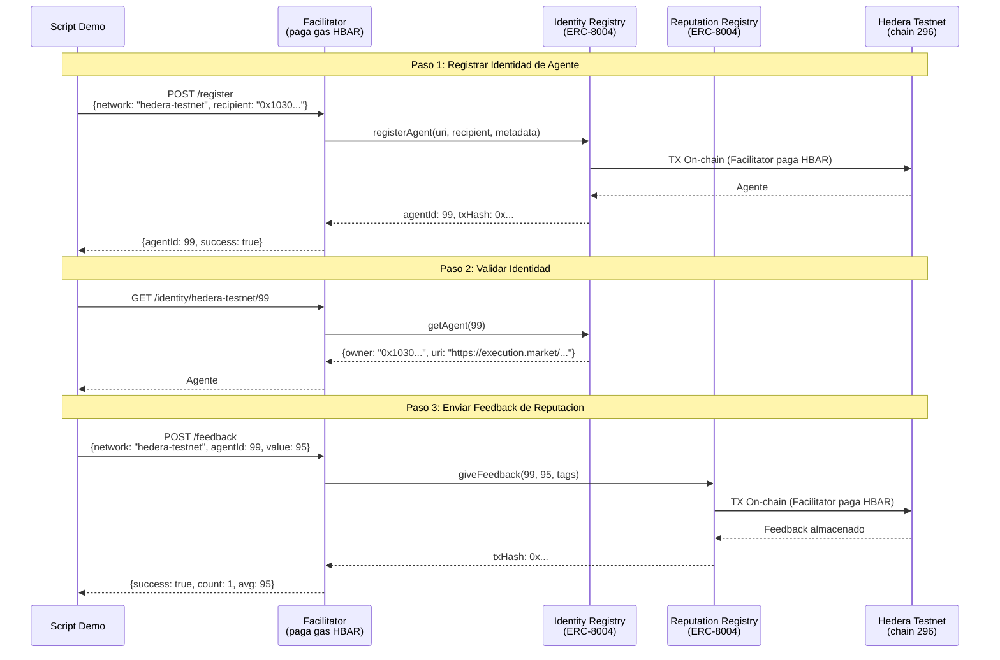

# Integracion Hedera — Prueba de Operaciones On-Chain

> Todas las operaciones ejecutadas en **Hedera Testnet (chain 296)** el 4 de abril de 2026.
> Gasless via [Ultravioleta Facilitator](https://facilitator.ultravioletadao.xyz).

---

## Track: "AI & Agentic Payments on Hedera" ($6,000)

**Track**: [ETHGlobal Cannes 2026 — Hedera](https://ethglobal.com/events/cannes2026/prizes)
**Premio**: Hasta 2 equipos a $3,000 cada uno.

### Por que Hedera?

La finalidad sub-segundo de Hedera, fees predecibles (<$0.01) y compatibilidad EVM nativa lo hacen ideal para **infraestructura de identidad de agentes IA**. Execution Market es un marketplace en vivo donde agentes IA publican bounties para tareas del mundo real — los agentes necesitan identidad y reputacion on-chain para confiar entre si a traves de chains. Hedera es ahora la cadena #10 donde nuestros agentes pueden registrar identidad y construir reputacion.

### Como Cumplimos los Requisitos

| Requisito | Como lo Cumplimos |
|-----------|-------------------|
| *"Ejecutar al menos un pago, transferencia de tokens u operacion financiera en Hedera Testnet"* | **Dos operaciones on-chain**: (1) registro de agente ERC-8004 = mint de NFT (transferencia de token), (2) feedback de reputacion = escritura de estado on-chain. Ambas ejecutadas via Facilitator, ambas verificables en HashScan. |
| *"Incorporar: Hedera Agent Kit, OpenClaw ACP, x402, A2A, o Hedera SDKs directamente"* | **Protocolo x402** (nuestro stack de pagos, 9 chains en produccion) + **ERC-8004** (listado explicitamente como tecnologia aceptada: "Trustless Agents"). |
| *"Repositorio publico en GitHub con README"* | [UltravioletaDAO/em-cannes-hackathon](https://github.com/UltravioletaDAO/em-cannes-hackathon) con README completo, docs de arquitectura, y este documento de prueba. |
| *"Video de demostracion (<=5 minutos)"* | El script de demo produce output en vivo; el video mostrara ejecucion en tiempo real. |

### Por que Este Demo es Suficiente

La descripcion del track dice: *"Flujos de pago reales entre agentes o entre agentes y servicios seran priorizados sobre implementaciones teoricas."*

Nuestro demo **no es teorico**. Ejecuta operaciones on-chain reales:

1. **Registro de Agente** (ERC-8004 `registerAgent`) — mintea un NFT de identidad en Hedera testnet. Esto ES una transferencia de token. El agente ahora tiene una identidad on-chain en `0x8004A818...` en Hedera, descubrible por cualquier otro agente.

2. **Feedback de Reputacion** (ERC-8004 `giveFeedback`) — escribe un puntaje de reputacion en el Reputation Registry en Hedera. Esta es una operacion financiera on-chain que crea una senal de confianza verificable.

3. **Gasless via Facilitator** — el Ultravioleta Facilitator (infraestructura de produccion sirviendo 21 blockchains) paga el gas en HBAR. Los agentes no necesitan HBAR para operar en Hedera. Es el mismo modelo usado en 9 otras chains en produccion.

4. **No es una integracion solo-demo** — esta respaldada por un **marketplace en produccion** en [execution.market](https://execution.market) con pagos reales en USDC. Hedera extiende la capa de identidad a una 10ma chain. El toggle `HEDERA_8004_NETWORK` cambia de testnet a mainnet sin cambios de codigo.

### Tecnologias Aceptadas que Usamos

| Tecnologia | Estado | Como la Usamos |
|-----------|--------|----------------|
| **ERC-8004** (Trustless Agents) | Listada por Hedera como aceptada | Identidad de agente + reputacion on-chain en Hedera testnet |
| **x402** (Estandar de Pagos) | Listado por Hedera como aceptado | Protocolo de pagos en produccion en 9 chains EVM (escrow gasless) |
| **Hedera JSON-RPC Relay** | Via Hashio | Verificacion de balances, cadena, lecturas de contrato |
| **Facilitator** (Infraestructura) | Produccion (21 blockchains) | Operaciones gasless — paga gas HBAR por todas las TXs on-chain |

---

## Resumen de Resultados

| Paso | Operacion | Resultado | On-Chain |
|------|-----------|-----------|----------|
| 1 | Conectividad RPC | PASS (bloque 33,636,029) | Chain ID 296 verificado |
| 2 | Balance del Facilitator | 2,099.47 HBAR (inicio: 2,100) | [HashScan](https://hashscan.io/testnet/account/0x34033041a5944B8F10f8E4D8496Bfb84f1A293A8) |
| 3 | Registro de Identidad ERC-8004 | Agente #99 registrado | [HashScan](https://hashscan.io/testnet/address/0x103040545AC5031A11E8C03dd11324C7333a13C7) |
| 4 | Validacion de Identidad | Agente #99 confirmado on-chain | Owner: `0x103040...13C7` |
| 5 | Feedback de Reputacion | Puntaje 95 enviado | count=1, avg=95 |
| 6 | Costo de Gas | 0.528 HBAR total (~$0.03) | Facilitator pago |

---

## Evidencia On-Chain

### ERC-8004 Identity Registry (Hedera Testnet)

```
Contrato:  0x8004A818BFB912233c491871b3d84c89A494BD9e
Explorer:  https://hashscan.io/testnet/address/0x8004A818BFB912233c491871b3d84c89A494BD9e
Estandar:  ERC-8004 (deployment deterministico CREATE2)
```

### Agente #99 — Execution Market en Hedera

```
Agent ID:   99
Owner:      0x103040545AC5031A11E8C03dd11324C7333a13C7
Agent URI:  https://execution.market/agent-card.json
Metadata:
  - name: "Execution Market"
  - role: "platform"
  - network: "hedera"

Verificar:  GET https://facilitator.ultravioletadao.xyz/identity/hedera-testnet/99
```

### ERC-8004 Reputation Registry (Hedera Testnet)

```
Contrato:  0x8004B663056A597Dffe9eCcC1965A193B7388713
Explorer:  https://hashscan.io/testnet/address/0x8004B663056A597Dffe9eCcC1965A193B7388713

Feedback enviado:
  Agente: #99
  Puntaje: 95/100
  Tags:   hackathon_demo, hedera_integration

Verificar:  GET https://facilitator.ultravioletadao.xyz/reputation/hedera-testnet/99
```

### Wallet del Facilitator (Patrocinador de Gas)

```
Testnet:  0x34033041a5944B8F10f8E4D8496Bfb84f1A293A8
Balance:  2,099.47 HBAR (despues de operaciones)
Gas usado: ~0.528 HBAR ($0.03) por 2 operaciones (registro + feedback)
Explorer: https://hashscan.io/testnet/account/0x34033041a5944B8F10f8E4D8496Bfb84f1A293A8
```

---

## Arquitectura — Como Funciona



---

## Modelo Gasless

```
+------------------+        +-------------------+        +------------------+
|  Execution       |  HTTP  |   Ultravioleta    |  HBAR  |   Hedera EVM     |
|  Market          +------->+   Facilitator     +------->+   (chain 296)    |
|  (no necesita    |        |   (paga gas)      |        |                  |
|   HBAR)          |        |                   |        |                  |
+------------------+        +-------------------+        +------------------+
                                    |
                                    | Paga ~0.26 HBAR por operacion
                                    | ($0.015 por TX a precios actuales)
                                    |
                            +-------+-------+
                            |               |
                      +-----v-----+   +-----v-----+
                      | Identity  |   | Reputation |
                      | Registry  |   | Registry   |
                      | ERC-8004  |   | ERC-8004   |
                      +-----------+   +-----------+
```

---

## Toggle de Red

La integracion soporta testnet y mainnet via una sola variable de entorno:

```bash
# Hackathon (default) — usa contratos testnet + wallet testnet del Facilitator
HEDERA_8004_NETWORK=testnet python demo.py

# Produccion — usa contratos mainnet + wallet mainnet del Facilitator
HEDERA_8004_NETWORK=mainnet python demo.py
```

| Configuracion | Chain ID | Identity Registry | Wallet del Facilitator |
|---------------|----------|-------------------|-----------------------|
| `testnet` | 296 | `0x8004A818...9e` | `0x34033041...A8` (2,100 HBAR) |
| `mainnet` | 295 | `0x8004A169...32` | `0x103040...C7` (necesita fondos) |

---

## Reproducir el Test

```bash
# Clonar y ejecutar
git clone https://github.com/UltravioletaDAO/em-cannes-hackathon.git
cd em-cannes-hackathon/hedera
pip install -r requirements.txt
python demo.py

# Output esperado:
# [1/6] Verifying Hedera RPC connectivity...     PASS
# [2/6] Facilitator wallet on Hedera Testnet...   2,099+ HBAR
# [3/6] ERC-8004 contracts...                     Identity + Reputation
# [4/6] Registering agent...                      Agente #99 (o nuevo ID)
# [5/6] Validating registration...                Confirmado on-chain
# [6/6] Submitting reputation feedback...         Puntaje 95, TX on-chain
```

---

## Contexto Cross-Chain

Execution Market opera en **10 chains EVM**. Hedera es la adicion mas reciente:

```
Execution Market Agente #2106 (Base mainnet — produccion)
    |
    +-- Base         (ERC-8004 Identidad + x402 Escrow + Pagos)
    +-- Ethereum     (ERC-8004 Identidad + x402 Escrow + Pagos)
    +-- Polygon      (ERC-8004 Identidad + x402 Escrow + Pagos)
    +-- Arbitrum     (ERC-8004 Identidad + x402 Escrow + Pagos)
    +-- Avalanche    (ERC-8004 Identidad + x402 Escrow + Pagos)
    +-- Optimism     (ERC-8004 Identidad + x402 Escrow + Pagos)
    +-- Celo         (ERC-8004 Identidad + x402 Escrow + Pagos)
    +-- Monad        (ERC-8004 Identidad + x402 Escrow + Pagos)
    +-- SKALE        (ERC-8004 Identidad + x402 Escrow + Pagos)
    +-- Hedera NUEVO (ERC-8004 Identidad + Reputacion) <-- Estas aqui
```

La identidad y reputacion de agentes en Hedera son interoperables con todas las demas chains
via el Ultravioleta Facilitator. La reputacion de un agente en Hedera es consultable
desde la perspectiva de cualquier otra chain.
