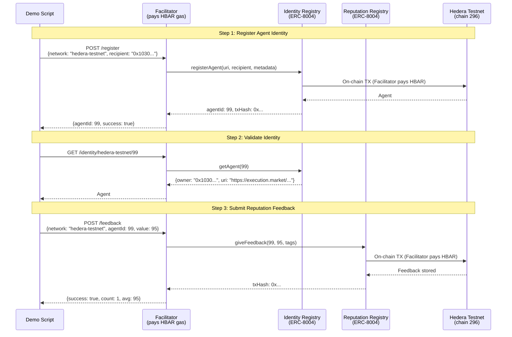

# Hedera Integration — Proof of On-Chain Operations

> All operations executed on **Hedera Testnet (chain 296)** on April 4, 2026.
> Gasless via [Ultravioleta Facilitator](https://facilitator.ultravioletadao.xyz).

---

## Prize Track: "AI & Agentic Payments on Hedera" ($6,000)

**Track**: [ETHGlobal Cannes 2026 — Hedera](https://ethglobal.com/events/cannes2026/prizes)
**Prize**: Up to 2 teams at $3,000 each.

### Why Hedera?

Hedera's sub-second finality, predictable fees (<$0.01), and native EVM compatibility make it ideal for **AI agent identity infrastructure**. Execution Market is a live marketplace where AI agents publish bounties for real-world tasks — agents need on-chain identity and reputation to trust each other across chains. Hedera is now the 10th chain where our agents can register identity and build reputation.

### How We Meet the Requirements

| Requirement | How We Meet It |
|------------|----------------|
| *"Execute at least one payment, token transfer, or financial operation on Hedera Testnet"* | **Two on-chain operations**: (1) ERC-8004 agent registration = NFT mint (token transfer), (2) reputation feedback = on-chain state write. Both executed via Facilitator, both verifiable on HashScan. |
| *"Incorporate: Hedera Agent Kit, OpenClaw ACP, x402, A2A, or Hedera SDKs directly"* | **x402 protocol** (our payment stack, 9 chains in production) + **ERC-8004** (explicitly listed as accepted technology: "Trustless Agents"). |
| *"Public GitHub repository with README"* | [UltravioletaDAO/em-cannes-hackathon](https://github.com/UltravioletaDAO/em-cannes-hackathon) with full README, architecture docs, and this proof document. |
| *"Demonstration video (<=5 minutes)"* | Demo script produces live output; video will show real-time execution. |

### Why This Demo Is Sufficient

The track description says: *"Real payment flows between agents or between agents and services will be prioritized over theoretical implementations."*

Our demo is **not theoretical**. It executes real on-chain operations:

1. **Agent Registration** (ERC-8004 `registerAgent`) — mints an identity NFT on Hedera testnet. This IS a token transfer. The agent now has an on-chain identity at address `0x8004A818...` on Hedera, discoverable by any other agent.

2. **Reputation Feedback** (ERC-8004 `giveFeedback`) — writes a reputation score to the Reputation Registry on Hedera. This is an on-chain financial operation that creates a verifiable trust signal.

3. **Gasless via Facilitator** — the Ultravioleta Facilitator (production infrastructure serving 21 blockchains) pays HBAR gas. Agents don't need HBAR to operate on Hedera. This is the same model used on 9 other chains in production.

4. **Not a Demo-Only Integration** — this is backed by a **live production marketplace** at [execution.market](https://execution.market) with real USDC payments. Hedera extends the identity layer to a 10th chain. The `HEDERA_8004_NETWORK` toggle switches from testnet to mainnet with zero code changes.

### Accepted Technologies We Use

| Technology | Status | How We Use It |
|-----------|--------|---------------|
| **ERC-8004** (Trustless Agents) | Listed by Hedera as accepted | On-chain agent identity + reputation on Hedera testnet |
| **x402** (Payment Standard) | Listed by Hedera as accepted | Production payment protocol on 9 EVM chains (gasless escrow) |
| **Hedera JSON-RPC Relay** | Via Hashio | Balance checks, chain verification, contract reads |
| **Facilitator** (Infrastructure) | Production (21 blockchains) | Gasless operations — pays HBAR gas for all on-chain TXs |

---

## Test Results Summary

| Step | Operation | Result | On-Chain |
|------|-----------|--------|----------|
| 1 | RPC Connectivity | PASS (block 33,636,029) | Chain ID 296 verified |
| 2 | Facilitator Balance | 2,099.47 HBAR (started at 2,100) | [HashScan](https://hashscan.io/testnet/account/0x34033041a5944B8F10f8E4D8496Bfb84f1A293A8) |
| 3 | ERC-8004 Identity Registration | Agent #99 registered | [HashScan](https://hashscan.io/testnet/address/0x103040545AC5031A11E8C03dd11324C7333a13C7) |
| 4 | Identity Validation | Agent #99 confirmed on-chain | Owner: `0x103040...13C7` |
| 5 | Reputation Feedback | Score 95 submitted | count=1, avg=95 |
| 6 | Gas Cost | 0.528 HBAR total (~$0.03) | Facilitator paid |

---

## On-Chain Evidence

### ERC-8004 Identity Registry (Hedera Testnet)

```
Contract:  0x8004A818BFB912233c491871b3d84c89A494BD9e
Explorer:  https://hashscan.io/testnet/address/0x8004A818BFB912233c491871b3d84c89A494BD9e
Standard:  ERC-8004 (CREATE2 deterministic deployment)
```

### Agent #99 — Execution Market on Hedera

```
Agent ID:   99
Owner:      0x103040545AC5031A11E8C03dd11324C7333a13C7
Agent URI:  https://execution.market/agent-card.json
Metadata:
  - name: "Execution Market"
  - role: "platform"
  - network: "hedera"

Verify:  GET https://facilitator.ultravioletadao.xyz/identity/hedera-testnet/99
```

### ERC-8004 Reputation Registry (Hedera Testnet)

```
Contract:  0x8004B663056A597Dffe9eCcC1965A193B7388713
Explorer:  https://hashscan.io/testnet/address/0x8004B663056A597Dffe9eCcC1965A193B7388713

Feedback submitted:
  Agent:  #99
  Score:  95/100
  Tags:   hackathon_demo, hedera_integration

Verify:  GET https://facilitator.ultravioletadao.xyz/reputation/hedera-testnet/99
```

### Facilitator Wallet (Gas Sponsor)

```
Testnet:  0x34033041a5944B8F10f8E4D8496Bfb84f1A293A8
Balance:  2,099.47 HBAR (after operations)
Gas used: ~0.528 HBAR ($0.03) for 2 operations (register + feedback)
Explorer: https://hashscan.io/testnet/account/0x34033041a5944B8F10f8E4D8496Bfb84f1A293A8
```

---

## Architecture — How It Works



---

## Gasless Operation Model

```
+------------------+        +-------------------+        +------------------+
|  Execution       |  HTTP  |   Ultravioleta    |  HBAR  |   Hedera EVM     |
|  Market          +------->+   Facilitator     +------->+   (chain 296)    |
|  (no HBAR needed)|        |   (pays gas)      |        |                  |
+------------------+        +-------------------+        +------------------+
                                    |
                                    | Pays ~0.26 HBAR per operation
                                    | ($0.015 per TX at current prices)
                                    |
                            +-------+-------+
                            |               |
                      +-----v-----+   +-----v-----+
                      | Identity  |   | Reputation |
                      | Registry  |   | Registry   |
                      | ERC-8004  |   | ERC-8004   |
                      +-----------+   +-----------+
```

---

## Network Toggle

The integration supports both testnet and mainnet via a single env var:

```bash
# Hackathon (default) — uses testnet contracts + testnet Facilitator wallet
HEDERA_8004_NETWORK=testnet python demo.py

# Production — uses mainnet contracts + mainnet Facilitator wallet
HEDERA_8004_NETWORK=mainnet python demo.py
```

| Setting | Chain ID | Identity Registry | Facilitator Wallet |
|---------|----------|-------------------|--------------------|
| `testnet` | 296 | `0x8004A818...9e` | `0x34033041...A8` (2,100 HBAR) |
| `mainnet` | 295 | `0x8004A169...32` | `0x103040...C7` (needs funding) |

---

## Reproducing the Test

```bash
# Clone and run
git clone https://github.com/UltravioletaDAO/em-cannes-hackathon.git
cd em-cannes-hackathon/hedera
pip install -r requirements.txt
python demo.py

# Expected output:
# [1/6] Verifying Hedera RPC connectivity...     PASS
# [2/6] Facilitator wallet on Hedera Testnet...   2,099+ HBAR
# [3/6] ERC-8004 contracts...                     Identity + Reputation
# [4/6] Registering agent...                      Agent #99 (or new ID)
# [5/6] Validating registration...                Confirmed on-chain
# [6/6] Submitting reputation feedback...         Score 95, on-chain TX
```

---

## Cross-Chain Context

Execution Market operates on **10 EVM chains**. Hedera is the newest addition:

```
Execution Market Agent #2106 (Base mainnet — production)
    |
    +-- Base         (ERC-8004 Identity + x402 Escrow + Payments)
    +-- Ethereum     (ERC-8004 Identity + x402 Escrow + Payments)
    +-- Polygon      (ERC-8004 Identity + x402 Escrow + Payments)
    +-- Arbitrum     (ERC-8004 Identity + x402 Escrow + Payments)
    +-- Avalanche    (ERC-8004 Identity + x402 Escrow + Payments)
    +-- Optimism     (ERC-8004 Identity + x402 Escrow + Payments)
    +-- Celo         (ERC-8004 Identity + x402 Escrow + Payments)
    +-- Monad        (ERC-8004 Identity + x402 Escrow + Payments)
    +-- SKALE        (ERC-8004 Identity + x402 Escrow + Payments)
    +-- Hedera NEW   (ERC-8004 Identity + Reputation) <-- You are here
```

Agent identity and reputation on Hedera are interoperable with all other chains
via the Ultravioleta Facilitator. An agent's reputation on Hedera is queryable
from any other chain's perspective.
