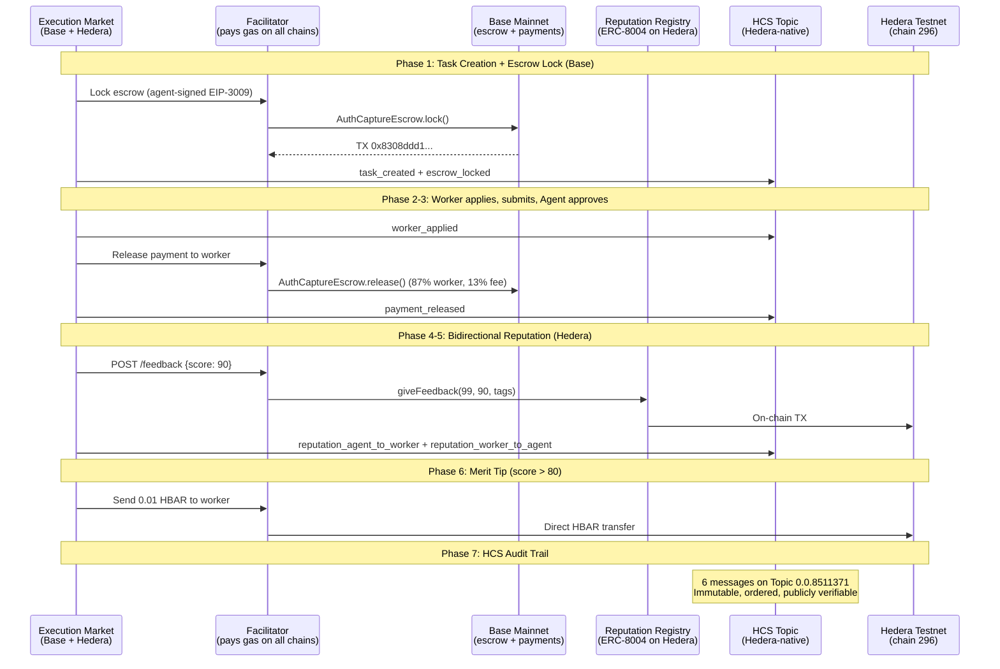

# Hedera Integration — Proof of On-Chain Operations

> All operations on **Hedera Testnet (chain 296)**, April 3, 2026.
> Gasless via [Ultravioleta Facilitator](https://facilitator.ultravioletadao.xyz).
> Golden Flow: **7/7 PASS** — escrow (Base) + reputation + HBAR merit tip + HCS logging (Hedera).

---

## Track: "AI & Agentic Payments on Hedera" ($6,000)

**Prize**: Up to 2 teams at $3,000 each. [ETHGlobal Cannes 2026](https://ethglobal.com/events/cannes2026/prizes)

| Requirement | Evidence |
|------------|---------|
| *"Execute at least one payment/transfer on Hedera Testnet"* | 4 on-chain operations: ERC-8004 registration (NFT mint), bidirectional reputation, 0.01 HBAR merit tip, 6 HCS messages |
| *"Use Hedera Agent Kit, x402, or Hedera SDKs"* | x402 (9 chains in production) + ERC-8004 + hiero-sdk-python (HCS) + Facilitator extension ([commit `66d34e6`](https://github.com/UltravioletaDAO/x402-rs/commit/66d34e6c7f805fa26a33757b2cdf5ec3038ecb95)) |
| *"Public GitHub with README"* | [UltravioletaDAO/em-cannes-hackathon](https://github.com/UltravioletaDAO/em-cannes-hackathon) |
| *"Demo video (<=5 min)"* | Demo script produces live output |

### Accepted Technologies Used

| Technology | Usage |
|-----------|-------|
| **ERC-8004** (Trustless Agents) | On-chain agent identity + bidirectional reputation |
| **x402** (Payment Standard) | Production payments on 9 EVM chains |
| **HCS** (Hedera Consensus Service) | 6 immutable lifecycle messages via TopicMessageSubmitTransaction |
| **hiero-sdk-python** | HCS TopicCreate + TopicMessageSubmit (NOT accessible via JSON-RPC) |
| **[x402-rs](https://github.com/UltravioletaDAO/x402-rs)** | Rust Facilitator extended for Hedera mainnet (295) + testnet (296) |

---

## Open-Source Facilitator Extension

Extended [x402-rs](https://github.com/UltravioletaDAO/x402-rs) (production Rust server, 21 networks) to support Hedera. **Commit**: [`66d34e6`](https://github.com/UltravioletaDAO/x402-rs/commit/66d34e6c7f805fa26a33757b2cdf5ec3038ecb95)

- Added Hedera mainnet (295) + testnet (296) with ERC-8004 contract addresses
- Facilitator wallet pays HBAR gas for all operations (agents need zero HBAR)
- USDC on Hedera uses HTS natively (not ERC-20), so EIP-3009 gasless escrow does not work. ERC-8004 operations work fully via standard EVM calls. For payments, we use direct HBAR transfers (merit tips).

This is a contribution to open-source infrastructure, not demo-only code.

---

## Merit Tip: Reputation-Gated HBAR Payment

Workers with reputation score > 80 receive **0.01 HBAR** direct transfer automatically. A real HBAR payment gated by on-chain reputation data.

**TX**: [`0x1c4ce9dc6fa8e4dab790eb41ea94035aba30aa76c7a67e674dab88832d4f7e83`](https://hashscan.io/testnet/transaction/0x1c4ce9dc6fa8e4dab790eb41ea94035aba30aa76c7a67e674dab88832d4f7e83)

---

## HCS — Native Event Logging

**HCS is Hedera-NATIVE** — NOT accessible via EVM or JSON-RPC. Uses `TopicCreateTransaction` and `TopicMessageSubmitTransaction` from `hiero-sdk-python`.

```
Topic ID:     0.0.8511371
Mirror Node:  https://testnet.mirrornode.hedera.com/api/v1/topics/0.0.8511371/messages
SDK:          hiero-sdk-python
```

| Seq # | Event | Verifiable |
|-------|-------|------------|
| 1 | `task_created` — bounty amount, deadline | Mirror Node |
| 2 | `worker_applied` — executor ID | Mirror Node |
| 3 | `escrow_locked` — Base TX hash (cross-chain) | Mirror Node + BaseScan |
| 4 | `payment_released` — Base TX hash, amount | Mirror Node + BaseScan |
| 5 | `reputation_agent_to_worker` — score, Hedera TX | Mirror Node + HashScan |
| 6 | `reputation_worker_to_agent` — score, Hedera TX | Mirror Node + HashScan |

Immutable, consensus-timestamped, publicly verifiable. Cross-chain references link Base payment evidence to Hedera audit trail.

```bash
curl -s "https://testnet.mirrornode.hedera.com/api/v1/topics/0.0.8511371/messages" | python -m json.tool
```

---

## Golden Flow Results (7/7 PASS)

| Phase | Operation | Result | Evidence |
|-------|-----------|--------|----------|
| 1 | Escrow Lock (Base) | PASS | [`0x8308ddd1...`](https://basescan.org/tx/0x8308ddd152a50a6e08b8a199c67952800a9fffa16761d2811e08fcbd38404e6e) |
| 2 | Worker Assignment + Evidence | PASS | Task `1e076d51-979a-4977-b194-644e6da6e090` |
| 3 | Payment Release (Base) | PASS | [`0xaffdb027...`](https://basescan.org/tx/0xaffdb027d41389679ccb1201179349c00e682fc6f26e0b153e5b6aa246121872) |
| 4 | Agent-to-Worker Reputation (Hedera) | PASS | [`0xc5ca1696...`](https://hashscan.io/testnet/transaction/0xc5ca1696439f658aa6ec5d16d31e611eda0406b37ae69a40e91ab3a69aa8e2f0) |
| 5 | Worker-to-Agent Reputation (Hedera) | PASS | [`0x3744d028...`](https://hashscan.io/testnet/transaction/0x3744d028d1fcad0ac75eeec622e742b0429b5c1be9f866474a34bd01624b230b) |
| 6 | Merit Tip 0.01 HBAR (Hedera) | PASS | [`0x1c4ce9dc...`](https://hashscan.io/testnet/transaction/0x1c4ce9dc6fa8e4dab790eb41ea94035aba30aa76c7a67e674dab88832d4f7e83) |
| 7 | HCS Event Logging (6 msgs) | PASS | [Topic `0.0.8511371`](https://testnet.mirrornode.hedera.com/api/v1/topics/0.0.8511371/messages) |

**Bounty**: $0.05 USDC | **HCS Topic**: `0.0.8511371`

---

## On-Chain Evidence

### ERC-8004 Identity Registry (Hedera Testnet)

```
Contract:  0x8004A818BFB912233c491871b3d84c89A494BD9e
Agent #99, Owner: 0x103040545AC5031A11E8C03dd11324C7333a13C7
URI: https://execution.market/agent-card.json
Verify: GET https://facilitator.ultravioletadao.xyz/identity/hedera-testnet/99
```

### ERC-8004 Reputation Registry (Hedera Testnet)

```
Contract:  0x8004B663056A597Dffe9eCcC1965A193B7388713
Agent #99: 25 feedback entries, average 87/100
Verify: GET https://facilitator.ultravioletadao.xyz/reputation/hedera-testnet/99
```

### Facilitator Wallet

```
Testnet: 0x34033041a5944B8F10f8E4D8496Bfb84f1A293A8 (2,096 HBAR)
Explorer: https://hashscan.io/testnet/account/0x34033041a5944B8F10f8E4D8496Bfb84f1A293A8
```

---

## Architecture



---

## Gasless Model

```
+------------------+        +-------------------+        +------------------+
|  Execution       |  HTTP  |   Ultravioleta    |  HBAR  |   Hedera EVM     |
|  Market          +------->+   Facilitator     +------->+   (chain 296)    |
|  (no HBAR needed)|        |   (pays gas)      |        |                  |
+------------------+        +-------------------+        +------------------+
                                    |
                            +-------+-------+
                            |               |
                      +-----v-----+   +-----v-----+
                      | Identity  |   | Reputation |
                      | Registry  |   | Registry   |
                      | ERC-8004  |   | ERC-8004   |
                      +-----------+   +-----------+
```

---

## Network Toggle

```bash
HEDERA_8004_NETWORK=testnet python demo.py   # Hackathon (default)
HEDERA_8004_NETWORK=mainnet python demo.py   # Production
```

| Setting | Chain ID | Identity Registry | Facilitator Wallet |
|---------|----------|-------------------|--------------------|
| `testnet` | 296 | `0x8004A818...9e` | `0x34033041...A8` (2,100 HBAR) |
| `mainnet` | 295 | `0x8004A169...32` | `0x103040...C7` (needs funding) |

---

## Reproduce

```bash
git clone https://github.com/UltravioletaDAO/em-cannes-hackathon.git
cd em-cannes-hackathon/hedera
pip install -r requirements.txt
python demo.py
```

---

## Cross-Chain Context

Hedera is the 10th chain. Escrow + USDC on Base, reputation + HBAR tips + HCS on Hedera -- all in one task lifecycle.

```
Agent #2106 (Base mainnet — production)
    +-- Base, Ethereum, Polygon, Arbitrum, Avalanche, Optimism, Celo, Monad, SKALE
    +-- Hedera NEW (ERC-8004 + Reputation + HBAR Merit Tips + HCS) <-- You are here
```

---

## Self-Evaluation: 41/50

> This evaluation was conducted using the [Hedera Skills evaluation framework](https://github.com/hedera-dev/hedera-skills) provided by the Hedera developer team. The skill audits submissions against the official track criteria.

| Criterion | v1 | v2 (+Facilitator, +merit tip) | v3 (+HCS) | Max |
|-----------|:---:|:---:|:---:|:---:|
| **Technicality** | 6 | 7 | **8** | 10 |
| **Originality** | 8 | 8 | **8** | 10 |
| **Practicality** | 9 | 9 | **9** | 10 |
| **Usability** | 7 | 8 | **8** | 10 |
| **WOW Factor** | 6 | 7 | **8** | 10 |
| **TOTAL** | **36** | **39** | **41** | **50** |

**v1->v2 (+3)**: Facilitator extension (Rust, commit `66d34e6`), merit tip (0.01 HBAR), bilingual docs.
**v2->v3 (+2)**: HCS (Hedera-native, not EVM). Addressed evaluator criticism: "treats Hedera as generic EVM."

**Strengths**: Production system (not prototype), cross-chain composability, Hedera-native HCS, open-source Facilitator, verifiable TX evidence.
**Gaps**: Primary bounty settles on Base (HTS/EIP-3009 incompatibility). No Hedera Agent Kit (used hiero-sdk-python). HCS is append-only logging.
