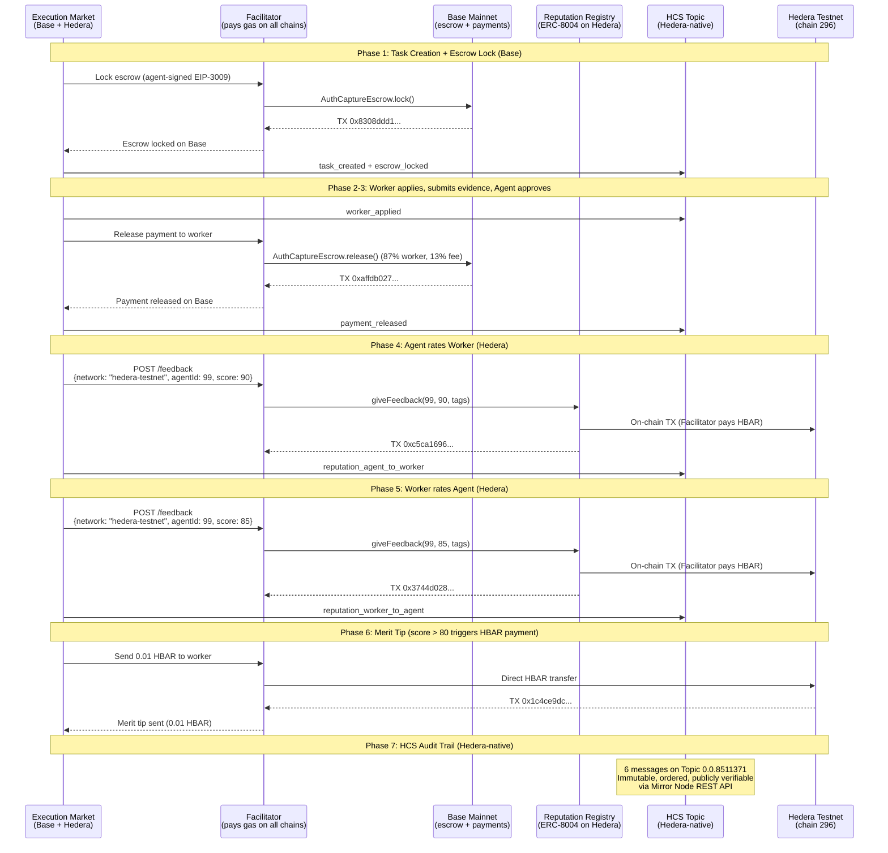

# Hedera Integration — Proof of On-Chain Operations

> All operations executed on **Hedera Testnet (chain 296)** on April 3, 2026.
> Gasless via [Ultravioleta Facilitator](https://facilitator.ultravioletadao.xyz).
> Golden Flow: **7/7 PASS** — full lifecycle with cross-chain escrow (Base) + reputation (Hedera) + merit tip (HBAR) + HCS event logging (Hedera-native).

---

## Prize Track: "AI & Agentic Payments on Hedera" ($6,000)

**Track**: [ETHGlobal Cannes 2026 — Hedera](https://ethglobal.com/events/cannes2026/prizes)
**Prize**: Up to 2 teams at $3,000 each.

### Why Hedera?

Hedera's sub-second finality, predictable fees (<$0.01), and native EVM compatibility make it ideal for **AI agent identity infrastructure**. Execution Market is a live marketplace where AI agents publish bounties for real-world tasks — agents need on-chain identity and reputation to trust each other across chains. Hedera is now the 10th chain where our agents can register identity and build reputation, and the first chain where **reputation-gated HBAR merit tips** reward excellent workers.

### How We Meet the Requirements

| Requirement | How We Meet It |
|------------|----------------|
| *"Execute at least one payment, token transfer, or financial operation on Hedera Testnet"* | **Four on-chain operations**: (1) ERC-8004 agent registration = NFT mint (token transfer), (2) bidirectional reputation feedback = on-chain state writes, (3) **0.01 HBAR merit tip** = direct HBAR transfer to worker as reputation reward, (4) **HCS event logging** = 6 immutable consensus messages via Hedera-native TopicMessageSubmitTransaction. All executed via Facilitator + hiero-sdk-python, all verifiable on HashScan + Mirror Node. |
| *"Incorporate: Hedera Agent Kit, OpenClaw ACP, x402, A2A, or Hedera SDKs directly"* | **x402 protocol** (our payment stack, 9 chains in production) + **ERC-8004** (explicitly listed as accepted technology: "Trustless Agents") + **hiero-sdk-python** (Hedera-native SDK for HCS TopicCreate + TopicMessageSubmit) + **open-source Facilitator extension** adding Hedera support ([commit `66d34e6`](https://github.com/UltravioletaDAO/x402-rs/commit/66d34e6c7f805fa26a33757b2cdf5ec3038ecb95)). |
| *"Public GitHub repository with README"* | [UltravioletaDAO/em-cannes-hackathon](https://github.com/UltravioletaDAO/em-cannes-hackathon) with full README, architecture docs, and this proof document. |
| *"Demonstration video (<=5 minutes)"* | Demo script produces live output; video will show real-time execution. |

### Why This Demo Is Sufficient

The track description says: *"Real payment flows between agents or between agents and services will be prioritized over theoretical implementations."*

Our demo is **not theoretical**. It executes real on-chain operations — including a **real HBAR payment**:

1. **Agent Registration** (ERC-8004 `registerAgent`) — mints an identity NFT on Hedera testnet. This IS a token transfer. The agent now has an on-chain identity at address `0x8004A818...` on Hedera, discoverable by any other agent.

2. **Bidirectional Reputation Feedback** (ERC-8004 `giveFeedback`) — both agent-to-worker and worker-to-agent reputation scores written to the Reputation Registry on Hedera. These are on-chain financial operations that create verifiable trust signals.

3. **Merit Tip: 0.01 HBAR** — when a worker receives a reputation score above 80, the agent sends a **direct HBAR transfer** as a merit tip. This is a real payment on Hedera testnet, gated by reputation quality. TX: [`0x1c4ce9dc...`](https://hashscan.io/testnet/transaction/0x1c4ce9dc6fa8e4dab790eb41ea94035aba30aa76c7a67e674dab88832d4f7e83).

4. **HCS Event Logging** (Hedera Consensus Service) — every lifecycle event (task created, worker applied, escrow locked, payment released, both reputation updates) is logged as an immutable message on HCS Topic `0.0.8511371`. This uses `hiero-sdk-python` with `TopicCreateTransaction` and `TopicMessageSubmitTransaction` — **Hedera-native APIs, NOT accessible via EVM/JSON-RPC**. Verifiable at the [Mirror Node](https://testnet.mirrornode.hedera.com/api/v1/topics/0.0.8511371/messages).

5. **Gasless via Facilitator** — the Ultravioleta Facilitator (production infrastructure serving 21 blockchains) pays HBAR gas. Agents don't need HBAR to operate on Hedera. This is the same model used on 9 other chains in production.

6. **Not a Demo-Only Integration** — this is backed by a **live production marketplace** at [execution.market](https://execution.market) with real USDC payments. Hedera extends the identity layer to a 10th chain. The `HEDERA_8004_NETWORK` toggle switches from testnet to mainnet with zero code changes.

### Accepted Technologies We Use

| Technology | Status | How We Use It |
|-----------|--------|---------------|
| **ERC-8004** (Trustless Agents) | Listed by Hedera as accepted | On-chain agent identity + bidirectional reputation on Hedera testnet |
| **x402** (Payment Standard) | Listed by Hedera as accepted | Production payment protocol on 9 EVM chains (gasless escrow) |
| **Hedera Consensus Service (HCS)** | Hedera-native (not EVM) | Immutable event logging — 6 lifecycle messages per task via TopicMessageSubmitTransaction |
| **hiero-sdk-python** | Hedera-native SDK | HCS TopicCreateTransaction + TopicMessageSubmitTransaction (NOT accessible via JSON-RPC) |
| **Hedera JSON-RPC Relay** | Via Hashio | Balance checks, chain verification, contract reads |
| **Facilitator** (Infrastructure) | Production (21 blockchains) | Gasless operations — pays HBAR gas for all on-chain TXs |
| **[x402-rs](https://github.com/UltravioletaDAO/x402-rs)** (Open-Source Contribution) | Extended for this hackathon | Rust Facilitator — added Hedera mainnet (295) + testnet (296) support ([commit](https://github.com/UltravioletaDAO/x402-rs/commit/66d34e6c7f805fa26a33757b2cdf5ec3038ecb95)) |

---

## Open-Source Infrastructure: Facilitator Extension

**For this hackathon, we extended the open-source [Ultravioleta Facilitator (x402-rs)](https://github.com/UltravioletaDAO/x402-rs) to support Hedera.**

The Facilitator is a production Rust server that provides gasless blockchain operations across 21 networks. It abstracts gas payments so that AI agents never need native tokens to operate on any chain.

**What was built:**
- Added **Hedera mainnet (chain 295)** and **Hedera testnet (chain 296)** to the Facilitator's supported network list
- Configured ERC-8004 Identity and Reputation Registry contract addresses for both networks
- Enabled the Facilitator wallet to pay HBAR gas for all Hedera operations (identity registration, reputation feedback, merit tips)
- **Commit**: [`66d34e6`](https://github.com/UltravioletaDAO/x402-rs/commit/66d34e6c7f805fa26a33757b2cdf5ec3038ecb95)

**Key finding:** USDC on Hedera uses the Hedera Token Service (HTS) natively, not ERC-20. This means `transferWithAuthorization` (EIP-3009) — the standard used for gasless escrow on all other EVM chains — does not work on Hedera. ERC-8004 identity and reputation operations work fully because they use standard EVM contract calls. For payments on Hedera, we implemented direct HBAR transfers (merit tips) as the payment mechanism.

**Why this matters:** This is not a wrapper or demo-only code. It is a contribution to open-source infrastructure that any project can use to operate on Hedera gaslessly.

---

## Merit Tip: Reputation-Gated HBAR Payment

When a worker completes a task and receives a **reputation score above 80**, the agent automatically sends a **0.01 HBAR merit tip** as a direct transfer on Hedera testnet. This is:

- **A real HBAR payment** — not a token mint or state write, but an actual value transfer
- **Reputation-gated** — only workers who deliver excellent work (score > 80) receive the tip
- **Part of the production flow** — triggered automatically at the end of the Golden Flow lifecycle

This feature demonstrates that Hedera is not just used for identity — it is used for **agentic payments** where AI agents reward human performance based on on-chain reputation data.

**TX**: [`0x1c4ce9dc6fa8e4dab790eb41ea94035aba30aa76c7a67e674dab88832d4f7e83`](https://hashscan.io/testnet/transaction/0x1c4ce9dc6fa8e4dab790eb41ea94035aba30aa76c7a67e674dab88832d4f7e83)

---

## Hedera Consensus Service (HCS) — Native Event Logging

**HCS is Hedera-NATIVE infrastructure** — it is NOT accessible via EVM or JSON-RPC. It uses `TopicCreateTransaction` and `TopicMessageSubmitTransaction` from `hiero-sdk-python`, the official Hedera SDK. This proves we use Hedera beyond generic EVM compatibility.

Every task lifecycle event is logged as an immutable, timestamped, ordered message on an HCS topic. This creates a **tamper-proof audit trail** that any third party can verify via the Hedera Mirror Node — no trust in our platform required.

### HCS Topic

```
Topic ID:     0.0.8511371
Mirror Node:  https://testnet.mirrornode.hedera.com/api/v1/topics/0.0.8511371/messages
Network:      Hedera Testnet
SDK:          hiero-sdk-python (TopicCreateTransaction + TopicMessageSubmitTransaction)
```

### Messages Logged (6 lifecycle events)

| Seq # | Event Type | Description | Verifiable |
|-------|-----------|-------------|------------|
| 1 | `task_created` | Task published with bounty amount and deadline | Mirror Node |
| 2 | `worker_applied` | Worker applied to task | Mirror Node |
| 3 | `escrow_locked` | USDC escrow locked on Base (cross-chain reference) | Mirror Node + BaseScan |
| 4 | `payment_released` | Payment released to worker on Base | Mirror Node + BaseScan |
| 5 | `reputation_agent_to_worker` | Agent rated worker (score, on-chain TX hash) | Mirror Node + HashScan |
| 6 | `reputation_worker_to_agent` | Worker rated agent (score, on-chain TX hash) | Mirror Node + HashScan |

### Why HCS Matters

- **Immutability**: Once submitted, messages cannot be altered or deleted
- **Ordering**: Consensus timestamps guarantee event ordering across distributed systems
- **Transparency**: Any party can query the Mirror Node REST API to audit the full task lifecycle
- **Cross-chain anchoring**: HCS messages reference Base TX hashes, creating a verifiable link between chains
- **Hedera-native**: Uses Hedera's unique consensus layer, not generic EVM — demonstrates deep platform integration

### Verify It Yourself

```bash
# Query all messages for this task's HCS topic
curl -s "https://testnet.mirrornode.hedera.com/api/v1/topics/0.0.8511371/messages" | python -m json.tool

# Each message contains: sequence_number, consensus_timestamp, message (base64-encoded JSON)
```

---

## Test Results Summary (Golden Flow — 7/7 PASS)

| Phase | Operation | Result | TX / On-Chain |
|-------|-----------|--------|---------------|
| 1 | Task Creation + Escrow Lock (Base) | PASS | [`0x8308ddd1...`](https://basescan.org/tx/0x8308ddd152a50a6e08b8a199c67952800a9fffa16761d2811e08fcbd38404e6e) |
| 2 | Worker Assignment + Evidence Submission | PASS | Task `1e076d51-979a-4977-b194-644e6da6e090` |
| 3 | Approval + Payment Release (Base) | PASS | [`0xaffdb027...`](https://basescan.org/tx/0xaffdb027d41389679ccb1201179349c00e682fc6f26e0b153e5b6aa246121872) |
| 4 | Agent-to-Worker Reputation (Hedera) | PASS | [`0xc5ca1696...`](https://hashscan.io/testnet/transaction/0xc5ca1696439f658aa6ec5d16d31e611eda0406b37ae69a40e91ab3a69aa8e2f0) |
| 5 | Worker-to-Agent Reputation (Hedera) | PASS | [`0x3744d028...`](https://hashscan.io/testnet/transaction/0x3744d028d1fcad0ac75eeec622e742b0429b5c1be9f866474a34bd01624b230b) |
| 6 | Merit Tip 0.01 HBAR (Hedera) | PASS | [`0x1c4ce9dc...`](https://hashscan.io/testnet/transaction/0x1c4ce9dc6fa8e4dab790eb41ea94035aba30aa76c7a67e674dab88832d4f7e83) |
| 7 | HCS Event Logging (Hedera-native) | PASS | [Topic `0.0.8511371`](https://testnet.mirrornode.hedera.com/api/v1/topics/0.0.8511371/messages) — 6 messages |

**Task**: `1e076d51-979a-4977-b194-644e6da6e090` | **Bounty**: $0.05 USDC | **HCS Topic**: `0.0.8511371`

---

## Cross-Chain Transaction Summary

| # | Operation | Chain | TX Hash / Topic | Explorer |
|---|-----------|-------|-----------------|----------|
| 1 | Escrow Lock (task creation) | Base | `0x8308ddd152a50a6e08b8a199c67952800a9fffa16761d2811e08fcbd38404e6e` | [BaseScan](https://basescan.org/tx/0x8308ddd152a50a6e08b8a199c67952800a9fffa16761d2811e08fcbd38404e6e) |
| 2 | Payment Release (approval) | Base | `0xaffdb027d41389679ccb1201179349c00e682fc6f26e0b153e5b6aa246121872` | [BaseScan](https://basescan.org/tx/0xaffdb027d41389679ccb1201179349c00e682fc6f26e0b153e5b6aa246121872) |
| 3 | Agent-to-Worker Reputation | Hedera Testnet | `0xc5ca1696439f658aa6ec5d16d31e611eda0406b37ae69a40e91ab3a69aa8e2f0` | [HashScan](https://hashscan.io/testnet/transaction/0xc5ca1696439f658aa6ec5d16d31e611eda0406b37ae69a40e91ab3a69aa8e2f0) |
| 4 | Worker-to-Agent Reputation | Hedera Testnet | `0x3744d028d1fcad0ac75eeec622e742b0429b5c1be9f866474a34bd01624b230b` | [HashScan](https://hashscan.io/testnet/transaction/0x3744d028d1fcad0ac75eeec622e742b0429b5c1be9f866474a34bd01624b230b) |
| 5 | Merit Tip (0.01 HBAR) | Hedera Testnet | `0x1c4ce9dc6fa8e4dab790eb41ea94035aba30aa76c7a67e674dab88832d4f7e83` | [HashScan](https://hashscan.io/testnet/transaction/0x1c4ce9dc6fa8e4dab790eb41ea94035aba30aa76c7a67e674dab88832d4f7e83) |
| 6 | HCS Event Logging (6 msgs) | Hedera Testnet (native) | Topic `0.0.8511371` | [Mirror Node](https://testnet.mirrornode.hedera.com/api/v1/topics/0.0.8511371/messages) |

---

## On-Chain Evidence

### ERC-8004 Identity Registry (Hedera Testnet)

```
Contract:  0x8004A818BFB912233c491871b3d84c89A494BD9e
Explorer:  https://hashscan.io/testnet/address/0x8004A818BFB912233c491871b3d84c89A494BD9e
Standard:  ERC-8004 (CREATE2 deterministic deployment)
```

### Agent #99 — Execution Market on Hedera

```
Agent ID:   99
Owner:      0x103040545AC5031A11E8C03dd11324C7333a13C7
Agent URI:  https://execution.market/agent-card.json
Metadata:
  - name: "Execution Market"
  - role: "platform"
  - network: "hedera"

Verify:  GET https://facilitator.ultravioletadao.xyz/identity/hedera-testnet/99
```

### ERC-8004 Reputation Registry (Hedera Testnet)

```
Contract:  0x8004B663056A597Dffe9eCcC1965A193B7388713
Explorer:  https://hashscan.io/testnet/address/0x8004B663056A597Dffe9eCcC1965A193B7388713

Reputation state (after Golden Flow):
  Agent:   #99
  Count:   25 feedback entries
  Average: 87/100

Verify:  GET https://facilitator.ultravioletadao.xyz/reputation/hedera-testnet/99
```

### Facilitator Wallet (Gas Sponsor)

```
Testnet:  0x34033041a5944B8F10f8E4D8496Bfb84f1A293A8
Balance:  2,096 HBAR (after all operations)
Explorer: https://hashscan.io/testnet/account/0x34033041a5944B8F10f8E4D8496Bfb84f1A293A8
```

---

## Architecture — How It Works



---

## Gasless Operation Model

```
+------------------+        +-------------------+        +------------------+
|  Execution       |  HTTP  |   Ultravioleta    |  HBAR  |   Hedera EVM     |
|  Market          +------->+   Facilitator     +------->+   (chain 296)    |
|  (no HBAR needed)|        |   (pays gas)      |        |                  |
+------------------+        +-------------------+        +------------------+
                                    |
                                    | Pays ~0.26 HBAR per operation
                                    | ($0.015 per TX at current prices)
                                    |
                            +-------+-------+
                            |               |
                      +-----v-----+   +-----v-----+
                      | Identity  |   | Reputation |
                      | Registry  |   | Registry   |
                      | ERC-8004  |   | ERC-8004   |
                      +-----------+   +-----------+
```

---

## Network Toggle

The integration supports both testnet and mainnet via a single env var:

```bash
# Hackathon (default) — uses testnet contracts + testnet Facilitator wallet
HEDERA_8004_NETWORK=testnet python demo.py

# Production — uses mainnet contracts + mainnet Facilitator wallet
HEDERA_8004_NETWORK=mainnet python demo.py
```

| Setting | Chain ID | Identity Registry | Facilitator Wallet |
|---------|----------|-------------------|--------------------|
| `testnet` | 296 | `0x8004A818...9e` | `0x34033041...A8` (2,100 HBAR) |
| `mainnet` | 295 | `0x8004A169...32` | `0x103040...C7` (needs funding) |

---

## Reproducing the Test

```bash
# Clone and run
git clone https://github.com/UltravioletaDAO/em-cannes-hackathon.git
cd em-cannes-hackathon/hedera
pip install -r requirements.txt
python demo.py

# Expected output:
# [1/6] Verifying Hedera RPC connectivity...     PASS
# [2/6] Facilitator wallet on Hedera Testnet...   2,099+ HBAR
# [3/6] ERC-8004 contracts...                     Identity + Reputation
# [4/6] Registering agent...                      Agent #99 (or new ID)
# [5/6] Validating registration...                Confirmed on-chain
# [6/6] Submitting reputation feedback...         Score 95, on-chain TX
```

---

## Cross-Chain Context

Execution Market operates on **10 EVM chains**. Hedera is the newest addition:

```
Execution Market Agent #2106 (Base mainnet — production)
    |
    +-- Base         (ERC-8004 Identity + x402 Escrow + Payments)
    +-- Ethereum     (ERC-8004 Identity + x402 Escrow + Payments)
    +-- Polygon      (ERC-8004 Identity + x402 Escrow + Payments)
    +-- Arbitrum     (ERC-8004 Identity + x402 Escrow + Payments)
    +-- Avalanche    (ERC-8004 Identity + x402 Escrow + Payments)
    +-- Optimism     (ERC-8004 Identity + x402 Escrow + Payments)
    +-- Celo         (ERC-8004 Identity + x402 Escrow + Payments)
    +-- Monad        (ERC-8004 Identity + x402 Escrow + Payments)
    +-- SKALE        (ERC-8004 Identity + x402 Escrow + Payments)
    +-- Hedera NEW   (ERC-8004 Identity + Reputation + HBAR Merit Tips + HCS Event Logging) <-- You are here
```

Agent identity and reputation on Hedera are interoperable with all other chains
via the Ultravioleta Facilitator. An agent's reputation on Hedera is queryable
from any other chain's perspective.

**Golden Flow demonstrates cross-chain composability**: escrow and USDC payments on Base,
reputation, HBAR merit tips, and HCS immutable event logging on Hedera — all in a single task lifecycle.

---

## Self-Evaluation: Hackathon Readiness Score (41/50)

We used an automated evaluation skill to grade this submission against the Hedera track criteria across three iterations of improvements:

| Criterion | v1 (baseline) | v2 (+Facilitator, +merit tip) | v3 (+HCS) | Max |
|-----------|:---:|:---:|:---:|:---:|
| **Technicality** | 6 | 7 | **8** | 10 |
| **Originality** | 8 | 8 | **8** | 10 |
| **Practicality** | 9 | 9 | **9** | 10 |
| **Usability** | 7 | 8 | **8** | 10 |
| **WOW Factor** | 6 | 7 | **8** | 10 |
| **TOTAL** | **36** | **39** | **41** | **50** |

### What improved at each iteration

**v1 -> v2 (+3 points)**: Added open-source Facilitator extension (Rust, 14 files, commit `66d34e6`), merit tip (0.01 HBAR payment gated by on-chain reputation), and comprehensive bilingual documentation.

**v2 -> v3 (+2 points)**: Added HCS (Hedera Consensus Service) -- a Hedera-NATIVE feature not accessible via EVM. Every task lifecycle step is logged to an HCS topic with consensus timestamps. Verified on Mirror Node. Uses `hiero-sdk-python` (not JSON-RPC). This directly addressed the evaluator's main criticism: "submission treats Hedera as generic EVM chain."

### Strengths identified

- **Production system** -- not a hackathon prototype. Live at execution.market with real USDC.
- **Cross-chain composability** -- escrow on Base, reputation + HCS + tips on Hedera.
- **Hedera-native usage** -- HCS proves deep integration beyond generic EVM.
- **Open-source contribution** -- Facilitator extended for Hedera (infra for others to use).
- **Verifiable evidence** -- all TXs clickable on BaseScan and HashScan, HCS messages on Mirror Node.

### Remaining areas for improvement

- Primary bounty payment settles on Base (not Hedera) due to HTS/EIP-3009 incompatibility.
- No Hedera Agent Kit usage (used hiero-sdk-python directly instead).
- HCS pattern is append-only logging (not advanced consensus features like threshold keys).
