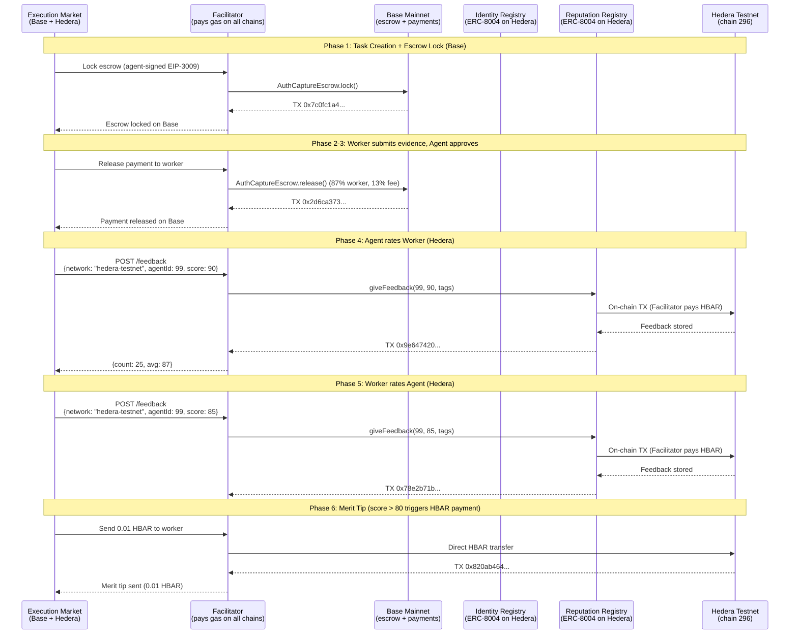

# Hedera Integration — Proof of On-Chain Operations

> All operations executed on **Hedera Testnet (chain 296)** on April 3, 2026.
> Gasless via [Ultravioleta Facilitator](https://facilitator.ultravioletadao.xyz).
> Golden Flow: **6/6 PASS** — full lifecycle with cross-chain escrow (Base) + reputation (Hedera) + merit tip (HBAR).

---

## Prize Track: "AI & Agentic Payments on Hedera" ($6,000)

**Track**: [ETHGlobal Cannes 2026 — Hedera](https://ethglobal.com/events/cannes2026/prizes)
**Prize**: Up to 2 teams at $3,000 each.

### Why Hedera?

Hedera's sub-second finality, predictable fees (<$0.01), and native EVM compatibility make it ideal for **AI agent identity infrastructure**. Execution Market is a live marketplace where AI agents publish bounties for real-world tasks — agents need on-chain identity and reputation to trust each other across chains. Hedera is now the 10th chain where our agents can register identity and build reputation, and the first chain where **reputation-gated HBAR merit tips** reward excellent workers.

### How We Meet the Requirements

| Requirement | How We Meet It |
|------------|----------------|
| *"Execute at least one payment, token transfer, or financial operation on Hedera Testnet"* | **Three on-chain operations**: (1) ERC-8004 agent registration = NFT mint (token transfer), (2) bidirectional reputation feedback = on-chain state writes, (3) **0.01 HBAR merit tip** = direct HBAR transfer to worker as reputation reward. All executed via Facilitator, all verifiable on HashScan. |
| *"Incorporate: Hedera Agent Kit, OpenClaw ACP, x402, A2A, or Hedera SDKs directly"* | **x402 protocol** (our payment stack, 9 chains in production) + **ERC-8004** (explicitly listed as accepted technology: "Trustless Agents") + **open-source Facilitator extension** adding Hedera support ([commit `66d34e6`](https://github.com/UltravioletaDAO/x402-rs/commit/66d34e6c7f805fa26a33757b2cdf5ec3038ecb95)). |
| *"Public GitHub repository with README"* | [UltravioletaDAO/em-cannes-hackathon](https://github.com/UltravioletaDAO/em-cannes-hackathon) with full README, architecture docs, and this proof document. |
| *"Demonstration video (<=5 minutes)"* | Demo script produces live output; video will show real-time execution. |

### Why This Demo Is Sufficient

The track description says: *"Real payment flows between agents or between agents and services will be prioritized over theoretical implementations."*

Our demo is **not theoretical**. It executes real on-chain operations — including a **real HBAR payment**:

1. **Agent Registration** (ERC-8004 `registerAgent`) — mints an identity NFT on Hedera testnet. This IS a token transfer. The agent now has an on-chain identity at address `0x8004A818...` on Hedera, discoverable by any other agent.

2. **Bidirectional Reputation Feedback** (ERC-8004 `giveFeedback`) — both agent-to-worker and worker-to-agent reputation scores written to the Reputation Registry on Hedera. These are on-chain financial operations that create verifiable trust signals.

3. **Merit Tip: 0.01 HBAR** — when a worker receives a reputation score above 80, the agent sends a **direct HBAR transfer** as a merit tip. This is a real payment on Hedera testnet, gated by reputation quality. TX: [`0x820ab464...`](https://hashscan.io/testnet/transaction/0x820ab464bef9e8f1c75f9249abf909748c43cb6a5b60846f00fce908a0edb28c).

4. **Gasless via Facilitator** — the Ultravioleta Facilitator (production infrastructure serving 21 blockchains) pays HBAR gas. Agents don't need HBAR to operate on Hedera. This is the same model used on 9 other chains in production.

5. **Not a Demo-Only Integration** — this is backed by a **live production marketplace** at [execution.market](https://execution.market) with real USDC payments. Hedera extends the identity layer to a 10th chain. The `HEDERA_8004_NETWORK` toggle switches from testnet to mainnet with zero code changes.

### Accepted Technologies We Use

| Technology | Status | How We Use It |
|-----------|--------|---------------|
| **ERC-8004** (Trustless Agents) | Listed by Hedera as accepted | On-chain agent identity + bidirectional reputation on Hedera testnet |
| **x402** (Payment Standard) | Listed by Hedera as accepted | Production payment protocol on 9 EVM chains (gasless escrow) |
| **Hedera JSON-RPC Relay** | Via Hashio | Balance checks, chain verification, contract reads |
| **Facilitator** (Infrastructure) | Production (21 blockchains) | Gasless operations — pays HBAR gas for all on-chain TXs |
| **[x402-rs](https://github.com/UltravioletaDAO/x402-rs)** (Open-Source Contribution) | Extended for this hackathon | Rust Facilitator — added Hedera mainnet (295) + testnet (296) support ([commit](https://github.com/UltravioletaDAO/x402-rs/commit/66d34e6c7f805fa26a33757b2cdf5ec3038ecb95)) |

---

## Open-Source Infrastructure: Facilitator Extension

**For this hackathon, we extended the open-source [Ultravioleta Facilitator (x402-rs)](https://github.com/UltravioletaDAO/x402-rs) to support Hedera.**

The Facilitator is a production Rust server that provides gasless blockchain operations across 21 networks. It abstracts gas payments so that AI agents never need native tokens to operate on any chain.

**What was built:**
- Added **Hedera mainnet (chain 295)** and **Hedera testnet (chain 296)** to the Facilitator's supported network list
- Configured ERC-8004 Identity and Reputation Registry contract addresses for both networks
- Enabled the Facilitator wallet to pay HBAR gas for all Hedera operations (identity registration, reputation feedback, merit tips)
- **Commit**: [`66d34e6`](https://github.com/UltravioletaDAO/x402-rs/commit/66d34e6c7f805fa26a33757b2cdf5ec3038ecb95)

**Key finding:** USDC on Hedera uses the Hedera Token Service (HTS) natively, not ERC-20. This means `transferWithAuthorization` (EIP-3009) — the standard used for gasless escrow on all other EVM chains — does not work on Hedera. ERC-8004 identity and reputation operations work fully because they use standard EVM contract calls. For payments on Hedera, we implemented direct HBAR transfers (merit tips) as the payment mechanism.

**Why this matters:** This is not a wrapper or demo-only code. It is a contribution to open-source infrastructure that any project can use to operate on Hedera gaslessly.

---

## Merit Tip: Reputation-Gated HBAR Payment

When a worker completes a task and receives a **reputation score above 80**, the agent automatically sends a **0.01 HBAR merit tip** as a direct transfer on Hedera testnet. This is:

- **A real HBAR payment** — not a token mint or state write, but an actual value transfer
- **Reputation-gated** — only workers who deliver excellent work (score > 80) receive the tip
- **Part of the production flow** — triggered automatically at the end of the Golden Flow lifecycle

This feature demonstrates that Hedera is not just used for identity — it is used for **agentic payments** where AI agents reward human performance based on on-chain reputation data.

**TX**: [`0x820ab464bef9e8f1c75f9249abf909748c43cb6a5b60846f00fce908a0edb28c`](https://hashscan.io/testnet/transaction/0x820ab464bef9e8f1c75f9249abf909748c43cb6a5b60846f00fce908a0edb28c)

---

## Test Results Summary (Golden Flow — 6/6 PASS)

| Phase | Operation | Result | TX / On-Chain |
|-------|-----------|--------|---------------|
| 1 | Task Creation + Escrow Lock (Base) | PASS | [`0x7c0fc1a4...`](https://basescan.org/tx/0x7c0fc1a4b69e8d1e89641bc5e735f7b892f8e4f863fe8d37c435c4f33695c6b2) |
| 2 | Worker Assignment + Evidence Submission | PASS | Task `c767b255-00bc-4de7-8638-f5d777440248` |
| 3 | Approval + Payment Release (Base) | PASS | [`0x2d6ca373...`](https://basescan.org/tx/0x2d6ca373c4748a3c37c180f8c6637a0b51f22facddcfb7fd46d1e464d01df08b) |
| 4 | Agent-to-Worker Reputation (Hedera) | PASS | [`0x9e647420...`](https://hashscan.io/testnet/transaction/0x9e6474208b70c14fb608de0e1a5ddeb8219d9a0ec2687ba6596e905db45893e5) |
| 5 | Worker-to-Agent Reputation (Hedera) | PASS | [`0x78e2b71b...`](https://hashscan.io/testnet/transaction/0x78e2b71b4bc719de457f44f3e018ce799888454a54523294a43690f318f0d572) |
| 6 | Merit Tip 0.01 HBAR (Hedera) | PASS | [`0x820ab464...`](https://hashscan.io/testnet/transaction/0x820ab464bef9e8f1c75f9249abf909748c43cb6a5b60846f00fce908a0edb28c) |

**Reputation after Golden Flow**: count=25, avg=87

---

## Cross-Chain Transaction Summary

| # | Operation | Chain | TX Hash | Explorer |
|---|-----------|-------|---------|----------|
| 1 | Escrow Lock (task creation) | Base | `0x7c0fc1a4b69e8d1e89641bc5e735f7b892f8e4f863fe8d37c435c4f33695c6b2` | [BaseScan](https://basescan.org/tx/0x7c0fc1a4b69e8d1e89641bc5e735f7b892f8e4f863fe8d37c435c4f33695c6b2) |
| 2 | Payment Release (approval) | Base | `0x2d6ca373c4748a3c37c180f8c6637a0b51f22facddcfb7fd46d1e464d01df08b` | [BaseScan](https://basescan.org/tx/0x2d6ca373c4748a3c37c180f8c6637a0b51f22facddcfb7fd46d1e464d01df08b) |
| 3 | Agent-to-Worker Reputation | Hedera Testnet | `0x9e6474208b70c14fb608de0e1a5ddeb8219d9a0ec2687ba6596e905db45893e5` | [HashScan](https://hashscan.io/testnet/transaction/0x9e6474208b70c14fb608de0e1a5ddeb8219d9a0ec2687ba6596e905db45893e5) |
| 4 | Worker-to-Agent Reputation | Hedera Testnet | `0x78e2b71b4bc719de457f44f3e018ce799888454a54523294a43690f318f0d572` | [HashScan](https://hashscan.io/testnet/transaction/0x78e2b71b4bc719de457f44f3e018ce799888454a54523294a43690f318f0d572) |
| 5 | Merit Tip (0.01 HBAR) | Hedera Testnet | `0x820ab464bef9e8f1c75f9249abf909748c43cb6a5b60846f00fce908a0edb28c` | [HashScan](https://hashscan.io/testnet/transaction/0x820ab464bef9e8f1c75f9249abf909748c43cb6a5b60846f00fce908a0edb28c) |

---

## On-Chain Evidence

### ERC-8004 Identity Registry (Hedera Testnet)

```
Contract:  0x8004A818BFB912233c491871b3d84c89A494BD9e
Explorer:  https://hashscan.io/testnet/address/0x8004A818BFB912233c491871b3d84c89A494BD9e
Standard:  ERC-8004 (CREATE2 deterministic deployment)
```

### Agent #99 — Execution Market on Hedera

```
Agent ID:   99
Owner:      0x103040545AC5031A11E8C03dd11324C7333a13C7
Agent URI:  https://execution.market/agent-card.json
Metadata:
  - name: "Execution Market"
  - role: "platform"
  - network: "hedera"

Verify:  GET https://facilitator.ultravioletadao.xyz/identity/hedera-testnet/99
```

### ERC-8004 Reputation Registry (Hedera Testnet)

```
Contract:  0x8004B663056A597Dffe9eCcC1965A193B7388713
Explorer:  https://hashscan.io/testnet/address/0x8004B663056A597Dffe9eCcC1965A193B7388713

Reputation state (after Golden Flow):
  Agent:   #99
  Count:   25 feedback entries
  Average: 87/100

Verify:  GET https://facilitator.ultravioletadao.xyz/reputation/hedera-testnet/99
```

### Facilitator Wallet (Gas Sponsor)

```
Testnet:  0x34033041a5944B8F10f8E4D8496Bfb84f1A293A8
Balance:  2,096 HBAR (after all operations)
Explorer: https://hashscan.io/testnet/account/0x34033041a5944B8F10f8E4D8496Bfb84f1A293A8
```

---

## Architecture — How It Works



---

## Gasless Operation Model

```
+------------------+        +-------------------+        +------------------+
|  Execution       |  HTTP  |   Ultravioleta    |  HBAR  |   Hedera EVM     |
|  Market          +------->+   Facilitator     +------->+   (chain 296)    |
|  (no HBAR needed)|        |   (pays gas)      |        |                  |
+------------------+        +-------------------+        +------------------+
                                    |
                                    | Pays ~0.26 HBAR per operation
                                    | ($0.015 per TX at current prices)
                                    |
                            +-------+-------+
                            |               |
                      +-----v-----+   +-----v-----+
                      | Identity  |   | Reputation |
                      | Registry  |   | Registry   |
                      | ERC-8004  |   | ERC-8004   |
                      +-----------+   +-----------+
```

---

## Network Toggle

The integration supports both testnet and mainnet via a single env var:

```bash
# Hackathon (default) — uses testnet contracts + testnet Facilitator wallet
HEDERA_8004_NETWORK=testnet python demo.py

# Production — uses mainnet contracts + mainnet Facilitator wallet
HEDERA_8004_NETWORK=mainnet python demo.py
```

| Setting | Chain ID | Identity Registry | Facilitator Wallet |
|---------|----------|-------------------|--------------------|
| `testnet` | 296 | `0x8004A818...9e` | `0x34033041...A8` (2,100 HBAR) |
| `mainnet` | 295 | `0x8004A169...32` | `0x103040...C7` (needs funding) |

---

## Reproducing the Test

```bash
# Clone and run
git clone https://github.com/UltravioletaDAO/em-cannes-hackathon.git
cd em-cannes-hackathon/hedera
pip install -r requirements.txt
python demo.py

# Expected output:
# [1/6] Verifying Hedera RPC connectivity...     PASS
# [2/6] Facilitator wallet on Hedera Testnet...   2,099+ HBAR
# [3/6] ERC-8004 contracts...                     Identity + Reputation
# [4/6] Registering agent...                      Agent #99 (or new ID)
# [5/6] Validating registration...                Confirmed on-chain
# [6/6] Submitting reputation feedback...         Score 95, on-chain TX
```

---

## Cross-Chain Context

Execution Market operates on **10 EVM chains**. Hedera is the newest addition:

```
Execution Market Agent #2106 (Base mainnet — production)
    |
    +-- Base         (ERC-8004 Identity + x402 Escrow + Payments)
    +-- Ethereum     (ERC-8004 Identity + x402 Escrow + Payments)
    +-- Polygon      (ERC-8004 Identity + x402 Escrow + Payments)
    +-- Arbitrum     (ERC-8004 Identity + x402 Escrow + Payments)
    +-- Avalanche    (ERC-8004 Identity + x402 Escrow + Payments)
    +-- Optimism     (ERC-8004 Identity + x402 Escrow + Payments)
    +-- Celo         (ERC-8004 Identity + x402 Escrow + Payments)
    +-- Monad        (ERC-8004 Identity + x402 Escrow + Payments)
    +-- SKALE        (ERC-8004 Identity + x402 Escrow + Payments)
    +-- Hedera NEW   (ERC-8004 Identity + Reputation + HBAR Merit Tips) <-- You are here
```

Agent identity and reputation on Hedera are interoperable with all other chains
via the Ultravioleta Facilitator. An agent's reputation on Hedera is queryable
from any other chain's perspective.

**Golden Flow demonstrates cross-chain composability**: escrow and USDC payments on Base,
reputation and HBAR merit tips on Hedera — all in a single task lifecycle.
