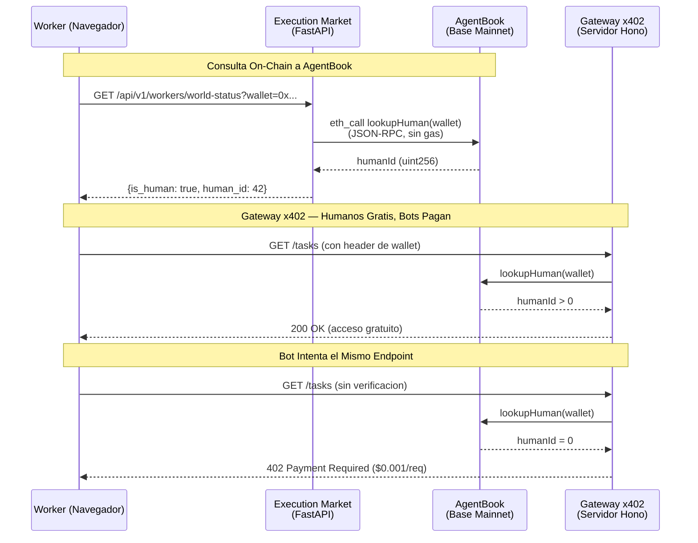
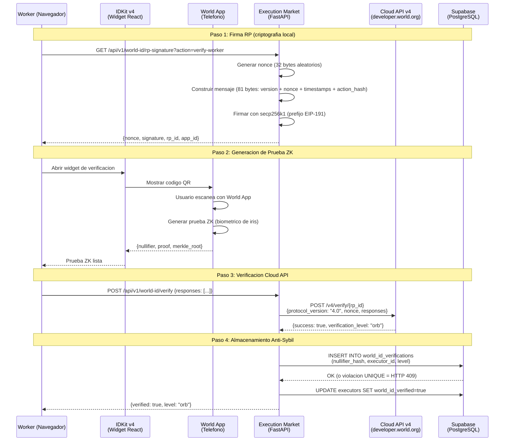

# Integracion World — Prueba de Operaciones en Produccion

> Todas las operaciones corriendo en **Base Mainnet (chain 8453)** en produccion desde abril 2026.
> En vivo en [execution.market](https://execution.market) | API en [api.execution.market](https://api.execution.market/docs).

---

## Prize Track: World ($20,000) — AgentKit + World ID 4.0

**Partner**: [World](https://world.org) | **Evento**: [ETHGlobal Cannes 2026](https://ethglobal.com/events/cannes2026/prizes)

| Track | Premio | Que Construimos |
|-------|--------|-----------------|
| **AgentKit** | $8,000 (hasta 2 equipos a $4K) | Verificacion humana on-chain via AgentBook + x402 gateway |
| **World ID 4.0** | $8,000 (hasta 4 equipos a $2K) | Prueba ZK de humanidad con RP signing, Cloud API v4, enforcement anti-sybil |

### Por que World?

Execution Market es un marketplace en vivo donde agentes de IA publican recompensas por tareas del mundo real y humanos verificados las ejecutan. El problema critico: **como evitar que los bots roben recompensas destinadas a humanos reales?** World resuelve esto con dos tecnologias complementarias — AgentKit para consulta de identidad on-chain y World ID 4.0 para prueba de humanidad con zero-knowledge. Sin World, el producto literalmente se rompe: los bots pueden registrarse como workers, enviar evidencia falsa generada por IA, y drenar las wallets de los agentes.

### Como Cumplimos los Requisitos

**Track 1 — AgentKit:**

| Requisito | Como lo Cumplimos |
|-----------|-------------------|
| *Usar AgentKit SDK o contrato AgentBook* | **Consulta on-chain a AgentBook** via `lookupHuman(address)` en Base. Sin gas, instantanea, solo lectura. |
| *Construir un agente que interactue con humanos verificados por World ID* | **Execution Market Agent #2106** (ERC-8004) verifica workers humanos via AgentBook antes de asignar tareas de alto valor. |
| *Integracion de pagos x402* | **Servidor gateway x402** que da acceso gratuito a humanos verificados; bots deben pagar $0.001/request. |
| *Repositorio publico en GitHub* | [UltravioletaDAO/em-cannes-hackathon](https://github.com/UltravioletaDAO/em-cannes-hackathon) — carpeta `world/`. |

**Track 2 — World ID 4.0:**

| Requisito | Como lo Cumplimos |
|-----------|-------------------|
| *Integrar World ID 4.0 (IDKit + Cloud API v4)* | **RP signing completo** (secp256k1 + EIP-191) + verificacion Cloud API v4. Endpoints en produccion activos. |
| *Usar niveles de verificacion de forma significativa* | **Orb requerido para tareas >= $5**. Nivel device solo puede acceder tareas de bajo valor. Enforcement server-side. |
| *Mecanismo anti-sybil* | **Unicidad de nullifier** a nivel de base de datos. Misma persona + misma app = mismo nullifier. Constraint UNIQUE bloquea multi-accounting. |
| *Repositorio publico en GitHub* | Mismo repo, carpeta `world/worldid/`. |

### Por que Esto Es Suficiente

Ambas descripciones de track priorizan **integraciones reales sobre implementaciones teoricas**. Nuestra integracion **no es teorica** — es un sistema en produccion con usuarios reales:

1. **AgentBook** se consulta en cada lookup de perfil de worker via `GET /api/v1/workers/world-status`. La insignia es visible en el dashboard en vivo.

2. **World ID 4.0** el flujo de verificacion esta accesible en `https://execution.market/profile` — click en "Verify with World ID", escanear QR con World App, la insignia aparece.

3. **El enforcement es real** — tareas con recompensas >= $5 USDC retornan HTTP 403 para workers sin verificacion Orb de World ID. No es un flag de demo; es el comportamiento por defecto en produccion.

4. **No es un prototipo de hackathon** — respaldado por un marketplace en vivo con pagos reales en USDC en 9 cadenas EVM, Agent #2106 registrado en Base ERC-8004 Identity Registry, y workers activos completando tareas.

---

## Vision General de Arquitectura por Track

```
Track 1: AgentKit                    Track 2: World ID 4.0
========================             ========================
Consulta de identidad on-chain       Prueba ZK de humanidad

Contrato AgentBook (Base)            Widget IDKit v4 (React)
  lookupHuman(address)                 Se abre en el navegador
         |                                   |
  Retorna humanId                    Worker escanea codigo QR
  (>0 = verificado)                  con World App
         |                                   |
  Insignia en perfil                 Prueba ZK generada
  + acceso gateway x402                      |
                                     Firma RP (secp256k1)
                                     + verificacion Cloud API v4
                                             |
                                     Nullifier almacenado (anti-sybil)
                                     + Enforcement Orb (>= $5)
```

---

## Evidencia On-Chain

### Contrato AgentBook (Base Mainnet)

```
Contract:  0xE1D1D3526A6FAa37eb36bD10B933C1b77f4561a4
Explorer:  https://basescan.org/address/0xE1D1D3526A6FAa37eb36bD10B933C1b77f4561a4
Method:    lookupHuman(address) -> uint256
Costo:     Gratuito (eth_call de solo lectura, sin gas)
```

### Identidad ERC-8004 — Agent #2106 (Base Mainnet)

```
Registry:  0x8004A169FB4a3325136EB29fA0ceB6D2e539a432
Explorer:  https://basescan.org/address/0x8004A169FB4a3325136EB29fA0ceB6D2e539a432
Agent ID:  2106
Agent URI: https://execution.market/agent-card.json

Verificar: GET https://facilitator.ultravioletadao.xyz/identity/base/2106
```

### Endpoints de API en Produccion

```
World ID RP Signature:   GET  https://api.execution.market/api/v1/world-id/rp-signature?action=verify-worker
World ID Verify:         POST https://api.execution.market/api/v1/world-id/verify
AgentBook Status:        GET  https://api.execution.market/api/v1/workers/world-status?wallet=0x...
Swagger Docs:            GET  https://api.execution.market/docs
```

---

## Arquitectura — Track 1: Flujo AgentKit



## Arquitectura — Track 2: Flujo World ID 4.0



---

## Comandos de Verificacion (Como Verificar)

### Track 1: AgentKit

```bash
# 1. Consulta on-chain a AgentBook (via API de produccion)
curl -s "https://api.execution.market/api/v1/workers/world-status?wallet=0x0000000000000000000000000000000000000000" | python -m json.tool
# Esperado: { "is_human": false, "human_id": 0 }

# 2. Llamada directa on-chain (Foundry)
cast call 0xE1D1D3526A6FAa37eb36bD10B933C1b77f4561a4 \
  "lookupHuman(address)(uint256)" \
  0x0000000000000000000000000000000000000000 \
  --rpc-url https://mainnet.base.org
# Esperado: 0

# 3. Servidor gateway (local)
cd world/agentkit && npm install && npx tsx gateway-server.ts
# Esperado: Listening on http://localhost:4021
```

### Track 2: World ID 4.0

```bash
# 1. Generacion de firma RP (prueba que la criptografia del backend funciona)
curl -s "https://api.execution.market/api/v1/world-id/rp-signature?action=verify-worker" | python -m json.tool
# Esperado: { "nonce": "00abc...", "signature": "def123...", "rp_id": "...", "app_id": "app_..." }

# 2. Flujo de verificacion completo (navegador)
# Abrir https://execution.market/profile
# Click en "Verify with World ID"
# Escanear QR con World App
# La insignia aparece en el perfil

# 3. Test anti-sybil
# Desconectar wallet, conectar una wallet diferente
# Intentar verificar con el mismo World ID
# Esperado: HTTP 409 "This World ID has already been used"

# 4. Test de enforcement
# Crear una tarea con recompensa >= $5
# Aplicar sin verificacion nivel Orb
# Esperado: HTTP 403 "world_id_orb_required"
```

### Health Check

```bash
# Salud de la API
curl -s "https://api.execution.market/api/v1/health" | python -m json.tool

# Agent card
curl -s "https://mcp.execution.market/.well-known/agent.json" | python -m json.tool
```

---

## Detalles Criptograficos

### RP Signing (Spec World ID v4)

```
message = 0x01                          // byte de version
        || nonce[32]                    // aleatorio, hasheado a campo BN254
        || created_at[8]               // uint64 big-endian (segundos)
        || expires_at[8]               // created_at + 300 (TTL 5 min)
        || keccak256(action)[32]        // hash de la accion
        = 81 bytes total

msg_hash = keccak256(EIP-191_prefix || message)

signature = secp256k1_sign_recoverable(msg_hash, signing_key)
          = 65 bytes (r[32] + s[32] + v[1])
```

### Payload Cloud API v4

```json
{
  "protocol_version": "4.0",
  "nonce": "00abcdef...",
  "action": "verify-worker",
  "responses": [
    {
      "nullifier": "0x...",
      "identifier": "0x...",
      "proof": "0x...",
      "merkle_root": "0x..."
    }
  ]
}
```

### Esquema de Base de Datos Anti-Sybil

```sql
CREATE TABLE world_id_verifications (
  id UUID PRIMARY KEY DEFAULT gen_random_uuid(),
  executor_id UUID REFERENCES executors(id) ON DELETE CASCADE,
  nullifier_hash TEXT NOT NULL,
  merkle_root TEXT,
  proof TEXT,
  verification_level TEXT CHECK (verification_level IN ('orb', 'device')),
  verified_at TIMESTAMPTZ DEFAULT NOW(),

  CONSTRAINT uq_world_id_nullifier UNIQUE (nullifier_hash),  -- un humano = una cuenta
  CONSTRAINT uq_world_id_executor UNIQUE (executor_id)        -- un executor = una verificacion
);

ALTER TABLE world_id_verifications ENABLE ROW LEVEL SECURITY;
```

---

## Mapa de Codigo Fuente

### Repositorio del Hackathon (`em-cannes-hackathon/world/`)

| Archivo | Proposito | Track |
|---------|-----------|-------|
| `agentkit/agentbook.py` | Consulta on-chain a AgentBook (Python, standalone, sin imports de EM) | AgentKit |
| `agentkit/gateway-server.ts` | Gateway x402 + AgentKit (TypeScript, Hono) | AgentKit |
| `agentkit/WorldHumanBadge.tsx` | Componente React de insignia para humanos verificados | AgentKit |
| `agentkit/package.json` | Dependencias del gateway (@worldcoin/agentkit, x402, hono) | AgentKit |
| `worldid/client.py` | RP signing (secp256k1) + verificacion Cloud API v4 (standalone) | World ID 4.0 |
| `worldid/router.py` | Endpoints FastAPI: GET /rp-signature, POST /verify | World ID 4.0 |
| `worldid/WorldIdVerification.tsx` | Widget IDKit v4 (React, basado en props) | World ID 4.0 |
| `migrations/001_world_id_verification.sql` | BD: tabla de verificaciones + constraints anti-sybil | World ID 4.0 |
| `migrations/002_world_id_rls.sql` | Politicas de Row-Level Security | World ID 4.0 |
| `migrations/003_world_agentkit.sql` | Esquema de BD para almacenamiento de humanId | AgentKit |
| `tests/test_agentbook.py` | Tests de integracion AgentBook | AgentKit |
| `tests/test_worldid.py` | Tests de cliente + router World ID | World ID 4.0 |
| `requirements.txt` | Dependencias Python (coincurve, httpx, pydantic) | Ambos |

### Integracion en Produccion (`execution-market/`)

| Archivo | Proposito |
|---------|-----------|
| `mcp_server/integrations/worldid/client.py` | World ID 4.0 RP signing + Cloud API v4 (produccion) |
| `mcp_server/api/routers/worldid.py` | Endpoints World ID en la API (produccion) |
| `dashboard/src/components/WorldIdVerification.tsx` | Widget IDKit v4 (produccion) |
| `mcp_server/integrations/erc8004/identity.py` | Identidad ERC-8004 de agentes (interop con AgentBook) |
| `mcp_server/integrations/erc8004/facilitator_client.py` | Cliente del Facilitator para operaciones gasless |
| `supabase/migrations/` | Esquema de base de datos en produccion |
| `mcp_server/api/routes.py` | REST API con endpoint de estado AgentBook |

---

## Modelo de Enforcement

### AgentBook (Track 1) — No Bloqueante, Informativo

```
Worker aplica a tarea:
  |
  +-- lookupHuman(wallet) via JSON-RPC
  |
  +-- humanId > 0? --> Insignia "Humano Verificado" en perfil
  |                    (agentes IA ven esto al revisar solicitudes)
  |
  +-- humanId == 0? --> Sin insignia, la solicitud continua normalmente
                        (senal de confianza menor para el agente)
```

La verificacion de AgentBook es **informativa, no bloqueante**. Los workers pueden aplicar sin ella. La insignia ayuda a los agentes de IA a priorizar humanos verificados al elegir a quien asignar tareas.

### World ID 4.0 (Track 2) — Bloqueante, Enforcement Server-Side

```
Worker aplica a tarea:
  |
  +-- recompensa < $5? --> World ID no requerido (bajo incentivo de sybil)
  |
  +-- recompensa >= $5? --> world_id_verified?
                            |
                            +-- NO --> HTTP 403 "world_id_orb_required"
                            |          "Tasks >= $5 require Orb verification"
                            |
                            +-- SI --> verification_level == "orb"?
                                       |
                                       +-- NO (device) --> HTTP 403
                                       +-- SI --> Solicitud aceptada
```

La verificacion de World ID es **bloqueante para tareas de alto valor**. El umbral de $5 es configurable via admin API. El enforcement es server-side — ni siquiera llamadas directas a la API pueden evitarlo.

---

## Modelo de Operacion Gasless

```
+------------------+        +-------------------+        +------------------+
|  Execution       |  HTTP  |   Ultravioleta    |  ETH   |   Base Mainnet   |
|  Market          +------->+   Facilitator     +------->+   (chain 8453)   |
|  (sin gas)       |        |   (paga gas)      |        |                  |
+------------------+        +-------------------+        +------------------+
                                    |
                                    | Operaciones ERC-8004 gasless
                                    | (identidad, reputacion, registro)
                                    |
                            +-------+-------+
                            |               |
                      +-----v-----+   +-----v-----+
                      | Identity  |   | Reputation |
                      | Registry  |   | Registry   |
                      | ERC-8004  |   | ERC-8004   |
                      +-----------+   +-----------+

Las consultas a AgentBook son gratuitas (eth_call, solo lectura, sin gas).
El RP signing de World ID es local (secp256k1, sin interaccion con la cadena).
La verificacion Cloud API v4 es una llamada HTTPS estandar (sin gas).
```

---

## Reproducir los Tests

```bash
# Clonar el repositorio del hackathon
git clone https://github.com/UltravioletaDAO/em-cannes-hackathon.git
cd em-cannes-hackathon/world

# Instalar dependencias Python
pip install -r requirements.txt

# Ejecutar tests de AgentBook
python -m pytest tests/test_agentbook.py -v

# Ejecutar tests de World ID
python -m pytest tests/test_worldid.py -v

# Ejecutar consulta on-chain a AgentBook (standalone)
python agentkit/agentbook.py

# Ejecutar servidor gateway (Track 1)
cd agentkit && npm install && npx tsx gateway-server.ts
```

---

## Contexto Cross-Chain

Execution Market opera en **9 cadenas EVM + Solana**. La integracion con World vive en Base:

```
Execution Market Agent #2106 (Base Mainnet — produccion)
    |
    +-- Base         (ERC-8004 + x402 Escrow + Pagos + AgentBook + World ID)  <-- Estas aqui
    +-- Ethereum     (ERC-8004 + x402 Escrow + Pagos)
    +-- Polygon      (ERC-8004 + x402 Escrow + Pagos)
    +-- Arbitrum     (ERC-8004 + x402 Escrow + Pagos)
    +-- Avalanche    (ERC-8004 + x402 Escrow + Pagos)
    +-- Optimism     (ERC-8004 + x402 Escrow + Pagos)
    +-- Celo         (ERC-8004 + x402 Escrow + Pagos)
    +-- Monad        (ERC-8004 + x402 Escrow + Pagos)
    +-- SKALE        (ERC-8004 + x402 Escrow + Pagos)
    +-- Solana       (Transferencias SPL, Fase 1)
```

El estado de verificacion World ID se propaga a los metadatos del agente ERC-8004 del
worker via Facilitator. Esto significa que la prueba de humanidad de un worker es
consultable on-chain desde cualquiera de las 9 cadenas EVM — no esta encerrada en
nuestra base de datos.

AgentBook vive en Base, que es tambien nuestra cadena principal de pagos. Esto no es
coincidencia — Base es donde World despliega su infraestructura, y donde liquidamos
la mayoria de los pagos de tareas.
