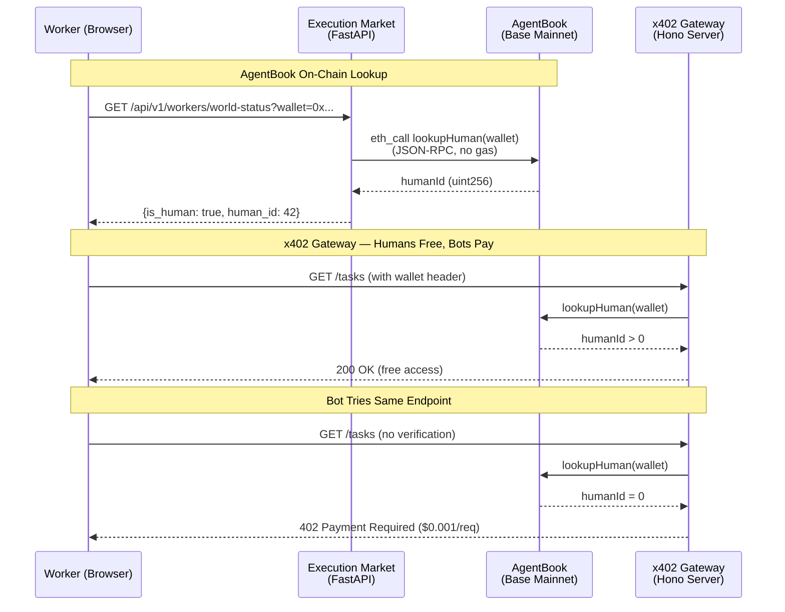
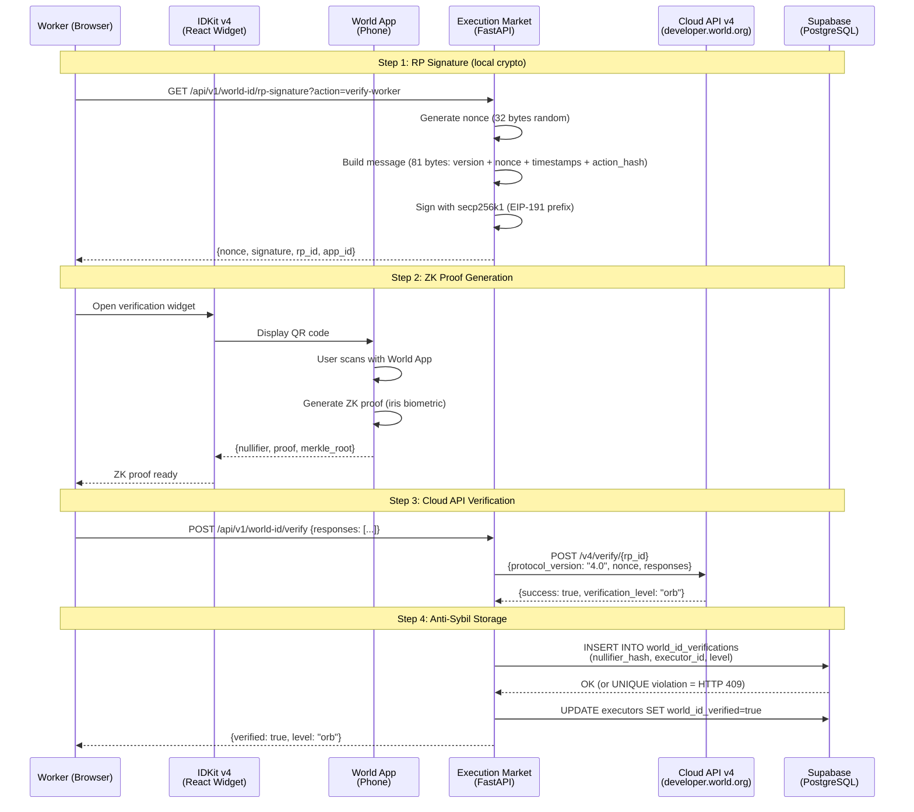

# World Integration — Proof of Production Operations

> All operations running on **Base Mainnet (chain 8453)** in production since April 2026.
> Live at [execution.market](https://execution.market) | API at [api.execution.market](https://api.execution.market/docs).

---

## Prize Track: World ($20,000) — AgentKit + World ID 4.0

**Partner**: [World](https://world.org) | **Event**: [ETHGlobal Cannes 2026](https://ethglobal.com/events/cannes2026/prizes)

| Track | Prize | What We Built |
|-------|-------|---------------|
| **AgentKit** | $8,000 (up to 2 teams at $4K) | On-chain human verification via AgentBook + x402 gateway |
| **World ID 4.0** | $8,000 (up to 4 teams at $2K) | ZK proof of humanity with RP signing, Cloud API v4, anti-sybil enforcement |

### Why World?

Execution Market is a live marketplace where AI agents publish bounties for real-world tasks and verified humans execute them. The critical problem: **how do you stop bots from stealing bounties meant for real humans?** World solves this with two complementary technologies — AgentKit for on-chain identity lookup and World ID 4.0 for zero-knowledge proof of humanity. Without World, the product literally breaks: bots can register as workers, submit AI-generated fake evidence, and drain agent wallets.

### How We Meet the Requirements

**Track 1 — AgentKit:**

| Requirement | How We Meet It |
|------------|----------------|
| *Use AgentKit SDK or AgentBook contract* | **AgentBook on-chain lookup** via `lookupHuman(address)` on Base. Zero gas, instant, read-only. |
| *Build an agent that interacts with World ID-verified humans* | **Execution Market Agent #2106** (ERC-8004) verifies human workers via AgentBook before assigning high-value tasks. |
| *x402 payment integration* | **x402 gateway server** that gives verified humans free API access; bots must pay $0.001/request. |
| *Public GitHub repository* | [UltravioletaDAO/em-cannes-hackathon](https://github.com/UltravioletaDAO/em-cannes-hackathon) — `world/` folder. |

**Track 2 — World ID 4.0:**

| Requirement | How We Meet It |
|------------|----------------|
| *Integrate World ID 4.0 (IDKit + Cloud API v4)* | **Full RP signing** (secp256k1 + EIP-191) + Cloud API v4 verification. Production endpoints live. |
| *Use verification levels meaningfully* | **Orb required for tasks >= $5**. Device-level can access low-value tasks only. Enforced server-side. |
| *Anti-sybil mechanism* | **Nullifier uniqueness** at database level. Same person + same app = same nullifier. UNIQUE constraint blocks multi-accounting. |
| *Public GitHub repository* | Same repo, `world/worldid/` folder. |

### Why This Is Sufficient

Both track descriptions prioritize **real integrations over theoretical implementations**. Our integration is **not theoretical** — it is a production system with real users:

1. **AgentBook** is called on every worker profile lookup via `GET /api/v1/workers/world-status`. The badge is visible on the live dashboard.

2. **World ID 4.0** verification flow is accessible at `https://execution.market/profile` — click "Verify with World ID", scan QR with World App, badge appears.

3. **Enforcement is real** — tasks with bounties >= $5 USDC return HTTP 403 for workers without Orb-level World ID verification. This is not a demo flag; it is the default production behavior.

4. **Not a hackathon prototype** — backed by a live marketplace with real USDC payments on 9 EVM chains, Agent #2106 registered on Base ERC-8004 Identity Registry, and active workers completing tasks.

---

## Track Architecture Overview

```
Track 1: AgentKit                    Track 2: World ID 4.0
========================             ========================
On-chain identity lookup             ZK proof of humanity

AgentBook contract (Base)            IDKit v4 widget (React)
  lookupHuman(address)                 Opens in browser
         |                                   |
  Returns humanId                    Worker scans QR code
  (>0 = verified)                    with World App
         |                                   |
  Badge on profile                   ZK proof generated
  + x402 gateway access                      |
                                     RP signature (secp256k1)
                                     + Cloud API v4 verify
                                             |
                                     Nullifier stored (anti-sybil)
                                     + Orb enforcement (>= $5)
```

---

## On-Chain Evidence

### AgentBook Contract (Base Mainnet)

```
Contract:  0xE1D1D3526A6FAa37eb36bD10B933C1b77f4561a4
Explorer:  https://basescan.org/address/0xE1D1D3526A6FAa37eb36bD10B933C1b77f4561a4
Method:    lookupHuman(address) -> uint256
Cost:      Free (read-only eth_call, no gas)
```

### ERC-8004 Identity — Agent #2106 (Base Mainnet)

```
Registry:  0x8004A169FB4a3325136EB29fA0ceB6D2e539a432
Explorer:  https://basescan.org/address/0x8004A169FB4a3325136EB29fA0ceB6D2e539a432
Agent ID:  2106
Agent URI: https://execution.market/agent-card.json

Verify:    GET https://facilitator.ultravioletadao.xyz/identity/base/2106
```

### Production API Endpoints

```
World ID RP Signature:   GET  https://api.execution.market/api/v1/world-id/rp-signature?action=verify-worker
World ID Verify:         POST https://api.execution.market/api/v1/world-id/verify
AgentBook Status:        GET  https://api.execution.market/api/v1/workers/world-status?wallet=0x...
Swagger Docs:            GET  https://api.execution.market/docs
```

---

## Architecture — Track 1: AgentKit Flow



## Architecture — Track 2: World ID 4.0 Flow



---

## Verification Commands (How to Verify)

### Track 1: AgentKit

```bash
# 1. AgentBook on-chain lookup (via production API)
curl -s "https://api.execution.market/api/v1/workers/world-status?wallet=0x0000000000000000000000000000000000000000" | python -m json.tool
# Expected: { "is_human": false, "human_id": 0 }

# 2. Direct on-chain call (Foundry)
cast call 0xE1D1D3526A6FAa37eb36bD10B933C1b77f4561a4 \
  "lookupHuman(address)(uint256)" \
  0x0000000000000000000000000000000000000000 \
  --rpc-url https://mainnet.base.org
# Expected: 0

# 3. Gateway server (local)
cd world/agentkit && npm install && npx tsx gateway-server.ts
# Expected: Listening on http://localhost:4021
```

### Track 2: World ID 4.0

```bash
# 1. RP signature generation (proves backend crypto works)
curl -s "https://api.execution.market/api/v1/world-id/rp-signature?action=verify-worker" | python -m json.tool
# Expected: { "nonce": "00abc...", "signature": "def123...", "rp_id": "...", "app_id": "app_..." }

# 2. Full verification flow (browser)
# Open https://execution.market/profile
# Click "Verify with World ID"
# Scan QR with World App
# Badge appears on profile

# 3. Anti-sybil test
# Disconnect wallet, connect a different wallet
# Try to verify with the same World ID
# Expected: HTTP 409 "This World ID has already been used"

# 4. Enforcement test
# Create a task with bounty >= $5
# Apply without Orb-level verification
# Expected: HTTP 403 "world_id_orb_required"
```

### Health Check

```bash
# API health
curl -s "https://api.execution.market/api/v1/health" | python -m json.tool

# Agent card
curl -s "https://mcp.execution.market/.well-known/agent.json" | python -m json.tool
```

---

## Cryptographic Details

### RP Signing (World ID v4 Spec)

```
message = 0x01                          // version byte
        || nonce[32]                    // random, hashed to BN254 field
        || created_at[8]               // uint64 big-endian (seconds)
        || expires_at[8]               // created_at + 300 (5 min TTL)
        || keccak256(action)[32]        // action hash
        = 81 bytes total

msg_hash = keccak256(EIP-191_prefix || message)

signature = secp256k1_sign_recoverable(msg_hash, signing_key)
          = 65 bytes (r[32] + s[32] + v[1])
```

### Cloud API v4 Payload

```json
{
  "protocol_version": "4.0",
  "nonce": "00abcdef...",
  "action": "verify-worker",
  "responses": [
    {
      "nullifier": "0x...",
      "identifier": "0x...",
      "proof": "0x...",
      "merkle_root": "0x..."
    }
  ]
}
```

### Anti-Sybil Database Schema

```sql
CREATE TABLE world_id_verifications (
  id UUID PRIMARY KEY DEFAULT gen_random_uuid(),
  executor_id UUID REFERENCES executors(id) ON DELETE CASCADE,
  nullifier_hash TEXT NOT NULL,
  merkle_root TEXT,
  proof TEXT,
  verification_level TEXT CHECK (verification_level IN ('orb', 'device')),
  verified_at TIMESTAMPTZ DEFAULT NOW(),

  CONSTRAINT uq_world_id_nullifier UNIQUE (nullifier_hash),  -- one human = one account
  CONSTRAINT uq_world_id_executor UNIQUE (executor_id)        -- one executor = one verification
);

ALTER TABLE world_id_verifications ENABLE ROW LEVEL SECURITY;
```

---

## Source Code Map

### Hackathon Repository (`em-cannes-hackathon/world/`)

| File | Purpose | Track |
|------|---------|-------|
| `agentkit/agentbook.py` | On-chain AgentBook lookup (Python, standalone, zero EM imports) | AgentKit |
| `agentkit/gateway-server.ts` | x402 + AgentKit gateway (TypeScript, Hono) | AgentKit |
| `agentkit/WorldHumanBadge.tsx` | React badge component for verified humans | AgentKit |
| `agentkit/package.json` | Gateway dependencies (@worldcoin/agentkit, x402, hono) | AgentKit |
| `worldid/client.py` | RP signing (secp256k1) + Cloud API v4 verify (standalone) | World ID 4.0 |
| `worldid/router.py` | FastAPI endpoints: GET /rp-signature, POST /verify | World ID 4.0 |
| `worldid/WorldIdVerification.tsx` | IDKit v4 widget (React, props-based) | World ID 4.0 |
| `migrations/001_world_id_verification.sql` | DB: verifications table + anti-sybil constraints | World ID 4.0 |
| `migrations/002_world_id_rls.sql` | Row-level security policies | World ID 4.0 |
| `migrations/003_world_agentkit.sql` | DB schema for humanId storage | AgentKit |
| `tests/test_agentbook.py` | AgentBook integration tests | AgentKit |
| `tests/test_worldid.py` | World ID client + router tests | World ID 4.0 |
| `requirements.txt` | Python dependencies (coincurve, httpx, pydantic) | Both |

### Production Integration (`execution-market/`)

| File | Purpose |
|------|---------|
| `mcp_server/integrations/worldid/client.py` | World ID 4.0 RP signing + Cloud API v4 (production) |
| `mcp_server/api/routers/worldid.py` | World ID API endpoints (production) |
| `dashboard/src/components/WorldIdVerification.tsx` | IDKit v4 widget (production) |
| `mcp_server/integrations/erc8004/identity.py` | ERC-8004 agent identity (interop with AgentBook) |
| `mcp_server/integrations/erc8004/facilitator_client.py` | Facilitator client for gasless operations |
| `supabase/migrations/` | Production database schema |
| `mcp_server/api/routes.py` | REST API with AgentBook status endpoint |

---

## Enforcement Model

### AgentBook (Track 1) — Non-Blocking, Informational

```
Worker applies to task:
  |
  +-- lookupHuman(wallet) via JSON-RPC
  |
  +-- humanId > 0? --> "Verified Human" badge on profile
  |                    (AI agents see this when reviewing applications)
  |
  +-- humanId == 0? --> No badge, application still proceeds
                        (lower trust signal for the agent)
```

AgentBook verification is **informational, not blocking**. Workers can apply without it. The badge helps AI agents prioritize verified humans when choosing who to assign tasks to.

### World ID 4.0 (Track 2) — Blocking, Enforced Server-Side

```
Worker applies to task:
  |
  +-- bounty < $5? --> No World ID required (low sybil incentive)
  |
  +-- bounty >= $5? --> world_id_verified?
                        |
                        +-- NO --> HTTP 403 "world_id_orb_required"
                        |          "Tasks >= $5 require Orb verification"
                        |
                        +-- YES --> verification_level == "orb"?
                                    |
                                    +-- NO (device) --> HTTP 403
                                    +-- YES --> Application accepted
```

World ID verification is **blocking for high-value tasks**. The $5 threshold is configurable via admin API. Enforcement is server-side — even direct API calls cannot bypass it.

---

## Gasless Operation Model

```
+------------------+        +-------------------+        +------------------+
|  Execution       |  HTTP  |   Ultravioleta    |  ETH   |   Base Mainnet   |
|  Market          +------->+   Facilitator     +------->+   (chain 8453)   |
|  (no gas needed) |        |   (pays gas)      |        |                  |
+------------------+        +-------------------+        +------------------+
                                    |
                                    | Gasless ERC-8004 operations
                                    | (identity, reputation, registration)
                                    |
                            +-------+-------+
                            |               |
                      +-----v-----+   +-----v-----+
                      | Identity  |   | Reputation |
                      | Registry  |   | Registry   |
                      | ERC-8004  |   | ERC-8004   |
                      +-----------+   +-----------+

AgentBook lookups are free (eth_call, read-only, no gas).
World ID RP signing is local (secp256k1, no chain interaction).
Cloud API v4 verification is a standard HTTPS call (no gas).
```

---

## Reproducing the Tests

```bash
# Clone the hackathon repo
git clone https://github.com/UltravioletaDAO/em-cannes-hackathon.git
cd em-cannes-hackathon/world

# Install Python dependencies
pip install -r requirements.txt

# Run AgentBook tests
python -m pytest tests/test_agentbook.py -v

# Run World ID tests
python -m pytest tests/test_worldid.py -v

# Run AgentBook on-chain lookup (standalone)
python agentkit/agentbook.py

# Run gateway server (Track 1)
cd agentkit && npm install && npx tsx gateway-server.ts
```

---

## Cross-Chain Context

Execution Market operates on **9 EVM chains + Solana**. World integration lives on Base:

```
Execution Market Agent #2106 (Base Mainnet — production)
    |
    +-- Base         (ERC-8004 + x402 Escrow + Payments + AgentBook + World ID)  <-- You are here
    +-- Ethereum     (ERC-8004 + x402 Escrow + Payments)
    +-- Polygon      (ERC-8004 + x402 Escrow + Payments)
    +-- Arbitrum     (ERC-8004 + x402 Escrow + Payments)
    +-- Avalanche    (ERC-8004 + x402 Escrow + Payments)
    +-- Optimism     (ERC-8004 + x402 Escrow + Payments)
    +-- Celo         (ERC-8004 + x402 Escrow + Payments)
    +-- Monad        (ERC-8004 + x402 Escrow + Payments)
    +-- SKALE        (ERC-8004 + x402 Escrow + Payments)
    +-- Solana       (SPL Transfers, Fase 1)
```

World ID verification status is propagated to the worker's ERC-8004 agent metadata
via Facilitator. This means a worker's proof of humanity is queryable on-chain from
any of the 9 EVM chains — it is not locked inside our database.

AgentBook lives on Base, which is also our primary payment chain. This is not a
coincidence — Base is where World deploys their infrastructure, and where we settle
the majority of task payments.
